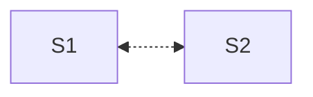
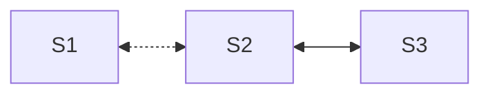
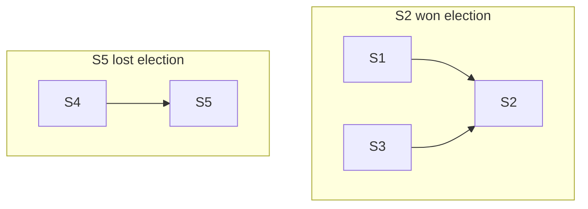
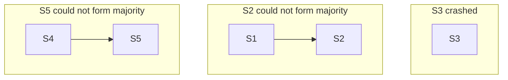
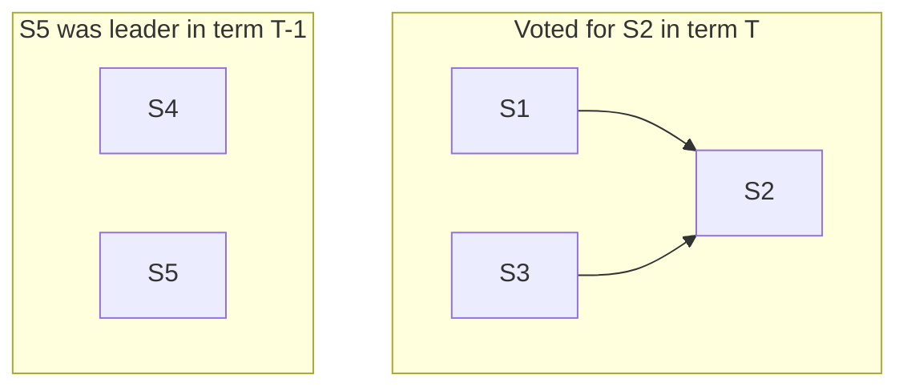

# Google file system

- [Google file system](#google-file-system)
	- [GFS goals](#gfs-goals)
	- [GFS design](#gfs-design)
		- [GFS consistency](#gfs-consistency)
		- [Fault tolerance of chunkservers](#fault-tolerance-of-chunkservers)
		- [Fault tolerance of master](#fault-tolerance-of-master)
	- [Summary](#summary)


We now switch gears to study distributed storage. As we saw in MapReduce and
Ray, fault-tolerant distributed storage is a key abstraction that simplifies
writing distributed applications. MapReduce used GFS files as inputs and
outputs.  Ray used a fault-tolerant Global Control Store to make everything
else, such as the global scheduler, stateless. 

The holy grail, in some sense, is similar to the one we had for distributed
computation: can we let the programmer pretend that they are talking to a single
reliable, very large, very fast storage? This simple goal implies many things: 

* Disks are *much* slower than CPUs and memory. CPUs execute one instruction in
~1ns, memory access time is ~100ns, a hard disk seek time is ~1ms making them ~1
million times slower than CPUs! Similarly, disk bandwidths are about 100k times 
less than memory bandwidth. (SSDs are much faster, but because of their low
cost, HDDs are still popular). In the OS course, we saw RAID (Redundant Array of
Inexpensive Disks) that provides an illusion of faster storage by exposing
multiple disks as a single disk to improve the aggregate throughput and to not
lose data in case of individual disk failures.

* However, this can be insufficient for two main reasons: data size
and fault tolerance. The total data we want to store exceeds the disk capacities
of a single system. Or we want the data to remain available for reads and writes
even after the single machine crashes. 

  > Again, this needs to be thought carefully for your application. If your
  application is ok with some downtime and if the data can fit comfortably in a
  single disk, it might be wise to avoid distributed storage.  Redundancy in
  RAID could be sufficient to avoid data loss.  In the paper, Google machines
  had 80GB disks but needed to store 152 TB of data (Table 2) containing
  crawler's output (used to compute PageRank), server logs, and MapReduce job
  outputs. 

* When data exceeds capacity of a single server, we need to *shard* the data
onto multiple servers. Sharding improves overall capacity as well as aggregate
bandwidth of reading/writing data. When we start managing multiple storage
servers, we start seeing *constant faults* due to which we need fault tolerance
strategies. To keep the data *available* during faults, the main things to do is
*replication*. But now, replicas might become *inconsistent* breaking the
*single* very large, very fast storage illusion. 

Ideal consistency is where we can maintain the illusion that the clients are
talking to a single server: the storage applies one write at a time (even if
they are concurrent) and reads return the latest write. Consistency is defined
in terms of "allowed histories": what read/write behaviours are clients allowed
to see.

For example, let us say we have 4 clients. C1 and C2 concurrently write to `x`, 
C3 and C4 later read `x`:

```
C1: |----Wx1-----|
C2: |----Wx2-----|
C3:                 |----Rx??-----|
C4:                 |----Rx??-----|
```

In this history, C3 and C4 can read 1 or 2, but they must be the same. Let us
see a bad design where this may not be the case. Here, C1 and C2 both send their
writes to S1 and S2. Last writer wins on each server. C3 and C4 just read from
S1. 


Now due to differing network delays, if S1 sees x=1 last and S2 see x=2 last, 
they may disagree on the value of x. Further, say C3 reads x=1 from S1, but then
S1 crashes, so C4 reads x=2 from S2. These sequence of events led to a history
that we would not expect from a single server.

We will later see very sophisticated algorithms in the course that ensure
consistent behaviour across arbitrary server crashes and network delays. We will
also see in the course that consistency and availability are generally at odds
with one another leading to super interesting distributed storage designs. 

## GFS goals
Academia had been thinking about distributed storage for a while. GFS was first
industrial large-scale distributed storage. It provided
* a familiar file system interface for easy sharing of data between applications
  (crawler and pagerank) running in the data center, 
* automatic fault tolerance against both silent disk corruptions and server
  failures,
* automatic load balancing across servers, and
* automatic sharding to increase aggregate performance and available capacity.

It differed from prior efforts in that 
* Academia believed it is pointless to build distributed storage that is not
strongly consistent (gold standard for consistency). GFS is not strongly
consistent but still useable.
* GFS focuses on sequential access to huge files, unlike databases that do small
random reads and writes. Imagine crawlers appending their logs in one multi-TB
file and then page rank application reading the crawler log file.
* The paper has masters and chunkservers (analogous to MapReduce workers). In
GFS, master is also FT. Unlike MapReduce, GFS puts efforts into making master
FT. The main reason is that GFS master is responsible for its files *forever*
whereas MapReduce master is only responsible only for the duration of the job.

## GFS design

Unlike regular OS file systems where most files are small (a few KBs), typical
GFS files are large (>100MB to multiple-GBs) with typical workloads being large
sequential reads and writes. Files are broken into chunks (analogous to disk
blocks (4KB)/extents in regular file systems) and GFS chooses a large chunk size
of 64MB. Each chunk has a unique identifier called *chunk handle*. Chunks are
spread across *chunkservers* which store each chunk as just a regular file in
their local file system. For each GFS file, master maintains a list of chunks
and the chunkservers holding each chunk. Large chunk size reduces master
metadata.

Applications are linked with a GFS client library. When an application wants to 
read/write a file, the library takes the file offset and asks master for the
appropriate chunk handle and their chunkservers. One of these chunkservers may
be *primary*: it is the one that will coordinate writes to the chunk. All other
chunkservers are *secondaries*. Client caches the response for future
reads/writes to the same chunk.


For a read request, client library just sends the chunk handle and the offset
within the chunk to the nearest chunkserver. Master is carefully kept on the 
control-plane: actual data never flows through the master. Large chunk sizes and
caching in clients, reduce client-master interactions. Clients can maintain
a persistent TCP connection with the chunkserver to read the complete chunk
sequentially before needing to ask master about the next chunk.

Writes are trickier since they may be concurrent and have to be replicated on
*all* the chunkservers for fault tolerance. GFS is more well-behaved for
record appends, e.g. multiple crawlers are appending their logs to a large GFS
file. GFS provide *atomic appends*: GFS picks different offsets for different
(possibly concurrent) appends.

The basic idea is simple (Figure 2 of the paper): client sends its record to
the nearest chunkserver which forwards it to the next nearest chunkserver and so
on. All chunkservers keep the record in an in-memory cache. Client asks primary
to commit the write. Primary picks the next offset, writes to the local chunk
file at the offset, and asks secondaries to also write at the same offset. If
everyone acknowledges the write to primary, primary replies the offset to
client, otherwise replies failure. Client retries writes in case of failures.

### GFS consistency

The consistency guarantee that GFS gives is that if a record append was
successful then all chunkservers will have written that record at the returned
offset. Chunks diverge for failed appends. For example, in the following figure,
for successful record appends, each chunkserver has the same record at the
returned offset.  However, appending B had failed once which was again retried
by C1. Due to this, the primary (P) and a secondary (S1) has duplicate Bs, but
the other secondary (S2) has only one B record and an empty portion in the file.
Therefore, if we read the chunk from two different replicas, we may see
different records (due to failures)!


The performance advantage of this design is that primary could commit "C"
without waiting for (the failed) "B" to commit. Therefore, primary is able to
initiate commits in-parallel from concurrent clients instead of committing
one-at-a-time. The disadvantage is (1) we wasted the disk space in the chunk and
(2) made reads deal with missing/duplicate records. We are not too worried about
(1) because hopefully such failures are not common. When master notices that it
is missing heartbeats from S2, it will remove S2 from its chunkserver list.

Paper makes two suggestions for reads:
* to identify missing records, make records *self-verifying*. Start each record
with a "magic header" to signal start of a record. Follow it with length of
record and then a fixed-length checksum to verify that the record is valid.
* to deal with duplicate records, writer puts a unique *record ID* which the
reader can use to de-duplicate. Another possibility is that the application
semantics are robust to small number of duplicates. For example, the page rank
will probably not change too much if we add a few duplicate links to the web
graph.

### Fault tolerance of chunkservers

Things get trickier when we consider failing chunkservers. Let us say (CS1*,
CS2, CS3) were chunkservers for a chunk "abc" with CS1 as primary. A client C1
has this information cached locally. 

Now, let us say master starts missing heartbeats from CS1, so, it copies "abc"
from CS2 to CS4 and makes CS2 as primary.  A new client C2 asks master about the
chunk "abc" and receives the chunkserver list as (CS2*, CS3, CS4). 

However, it is possible that CS1 had not actually crashed, it had just broken
network connection with the master. There is no way for master to know whether
the server has actually crashed or not. Because of this, now we have two
primaries (CS1 and CS2) in the system for the same chunk "abc". This bad
situation is called *split-brain*. Bad things can happen because of the
split-brain.

Let us say both C1 and C2 initiate an append. For C1's append, CS1 picks the
chunk offset as "23" and sends it to CS2, CS3; for C2's append, CS2 picks the
same chunk offset and sends it to CS3, CS4. If we allow both writes to happen,
some chunkservers would have written C1's record and some would have written
C2's record. This violates the desired consistency guarantee that for successful
appends *all* chunkservers have the same record on the returned offset.


To solve this, CS2 and CS3 *must reject* appends from CS1. But *how does CS3
know* if it should reject requests from CS1 or from CS2? The idea is that
whenever master wants to assign a new primary, it first increments a *chunk
version number*. This chunk version number is communicated to all the
chunkservers in the master's list (CS2, CS3, CS4) and is also returned to the
clients. Each chunkserver reject write requests with old version numbers. 

This safeguards our consistency guarantees but the poor client C1 is stuck with
an old primary CS1, unable to write anything. Maybe the master incorrectly
thought that CS1 is dead, but actually CS1 was alive and was in middle of doing
lots of writes with CS2 and CS3. If master assigns a new primary, all the
outstanding writes will be rejected.

The second idea is that master assigns primaries for a limited period of time
(default=60s) also called a *lease*. Master only assigns a new primary after the
lease of the old primary has expired (or has been explicitly revoked by the
master). This lets old primaries finish their inflight writes. Primaries need to
constantly refresh their leases with the master. In the above case, if CS1 is
finally able to talk to master after a few missed heartbeats, it will be unable
to refresh its lease since CS2 is already made the new primary. At this point, 
CS1 will tell C1 that its lease has expired and its version is old. C1 should go
check with the master about the new chunkservers of "abc".


Are version numbers still required if we are using lease? Yes! We shouldn't
assume anything about the network delays. It is possible that an older append
request from CS1 arrives at CS3 even after CS1's lease has expired.

### Fault tolerance of master

GFS master is maintaining the following state. Each state is marked with (v) for
volatile or (nv) for non-volatile.

Filename 
* array of chunk handles (nv)

Chunk handle 
* list of chunkservers (v)
* version number (nv)
* primary to coordinate writes (v)
* lease expiration time (v)

All mutations to the non-volatile state, such as creating new files, adding
chunk handles to a file, incrementing version number of a chunk handle, are
persistently written to a log *before* the master's in-memory state is mutated
and made visible to clients. The idea is same as the *write-ahead logging* we
are familiar with from file systems and databases.

The write-ahead log is persistently written to a local disk as well as to a
replica's disk. In case the master fails, a system outside GFS (or simply a
human administrator) promotes the replica as the new master. The replica plays
the log forward to recover the non-volatile states and continues as the new
master. Just like databases, this log can become very large over time, so once
in a while we also snapshot the master state and put it in replica's disk.
Replica can recover from the last snapshot and then play the remaining log
forward.

Clearly, filenames and each file's chunk handles need to be non-volatile as
otherwise we will forget which files we have and which chunks each file uses.
Let us now carefully check volatility of all the other states.

1. Chunk handle -> list of chunk servers (v). There is no point of keeping this
state persistent as chunkservers are the ones who anyways know the correct
information. For example, some disks may have crashed, chunk files may have
gotten corrupted. When new master starts, it asks all chunkservers about all 
their chunks.

2. Chunk handle -> primary, lease expiration time (v). Master just waits for the
max lease time (60s) to expire before giving out new leases.

3. Chunk handle -> version number (nv). Let us say the entire datacenter lost
power. Along with master, all the chunkservers are also slowly booting up. What
if for a chunk, only stale chunkservers have rebooted. If master starts giving
out lease from this version, we will lose all the writes that were made to a
newer version of the chunk!

Therefore, when master increases a version number, all the chunkservers as well
as the master must write the version number persistently to their disks. This is
necessary to differentiate between stale and up-to-date versions after reboot.

## Summary

Similar to how MapReduce got reincarnated as Hadoop in the open-source, GFS
lives on within Google and as Hadoop Distributed File System (HDFS) in the
open-source. HDFS is very widely used. The paper gives many interesting system
design lessons:

* A familiar abstraction that is able to effectively hide complexity can go a
  long way in the adoption of new systems: GFS provides the familiar file system
  interface, effectively hiding the complexity of data spread over thousands of
  disks, to share very large files between applications within the data center.
* Changing application behaviour often requires re-building systems from ground
  up: solving for large files and mostly sequential reads/writes led to
  unconventional design choices in GFS such its large chunk sizes, etc.
	* Rebuild only what is necessary; reuse battle-tested systems wherever
	possible. GFS relies on Linux file systems and stores chunks as regular OS
	files.

It also touched upon many fundamental problems and solutions that recur in
distributed storage designs:
* snapshotting and write-ahead logging;
* split-brain problem, version numbers, leases;
* if applications can live with weak consistency, it can provide better
  performance and simpler storage design.

---

# Chain Replication with Apportioned Queries

- [Chain Replication with Apportioned Queries](#chain-replication-with-apportioned-queries)
	- [Linearizability](#linearizability)
		- [Safety and liveness](#safety-and-liveness)
	- [Chain Replication](#chain-replication)
	- [CRAQ design](#craq-design)
	- [Performance](#performance)
- [Summary](#summary)


CRAQ's goals are different from GFS. Here, we are interested in building a
key-value store where all the data fits in memory of a single server. But of
course, we will do replication for fault-tolerance. Unlike GFS's large files
with sequential reads/writes, we are interestd in doing small random reads and
writes to keys. Again unlike GFS, we want to provide more "consistent" view of
storage to (possibly) concurrent clients.

CRAQ builds on top of chain replication. Let us first see CR and then
improvements made by CRAQ.

## Linearizability
Let us now formally define what we mean by consistency. When talking about
consistency, we don't want to talk about the internals of a storage system.  We
judge consistency by the behaviors that can be observed by the clients. In
strong consistency, we create an illusion of a single storage server even in the
presence of replication. We want that all execution histories are
*linearizable*, i.e, one can find a *total order* among all read-write
operations such that:
* the total order matches the real time order for non-overlapping histories; and
* reads see last writes.

In particular, we want to find *linearization points* for each request where the
storage must have serviced the operation. Linearization points define the total
order as above. Following shows a linearizable history:


Following shows a history that is *not* linearizable:


Note that linearizability does not force an order on concurrent requests. For
example in the following linearizable history, Wx2 started after Wx1 but it was
executed before Wx1.


The goal of Chain Replication is to only show linearizable histories. 

### Safety and liveness

Note that linearizability is a *safety* property. Safety properties mean "bad
things never happen". We want our storage system to never show non-linearizable
histories.  But safety by itself is trivial to achieve. For example, a useless
storage system that *never* services any reads or writes never shows
non-linearizable histories. 

Therefore, we typically also specify *liveness* properties which means "good
things eventually happen". For our storage system, we want that all read/write
requests are eventually serviced assuming some servers are still alive and
reachable from clients; clients are indefinitely retrying their requests.
Liveness, without safety, is also trivial to achieve. For example, in another
useless storage system, client libraries directly return ok to every write
request and 1 to every read request. The system is live but does not provide
linearizability.

Safety and liveness can be applied to many things. For example, *safety:* do not
fail any course; *liveness:* get the degree. When designing locks, *safety:*
provide mutual exclusion; *liveness:* each lock acquire request (assuming proper
lock releases in the application) is serviced.

## Chain Replication

Under CR, storage servers are organized in a chain. All the write requests go to
the head which forwards it down the chain. Write acknowledgements are sent up
the chain by the tail. All the read requests are serviced directly by the tail.


This design clearly provides linearizable histories since the times at which
reads and writes were serviced by the tail directly serve as the linearizable
points.

Fault tolerance is done in a straightforward manner. When a node fails, a system
outside the chain (like an administrator or a more sophisticated heartbeating
system) simply removes the node from the chain. The requests that were in-flight
are retried by the clients.

Why is this correct? Let us say initially x=0 and Wx1 was in-flight. It was seen
by the tail which responded to another client with Rx1 and crashed. After fault
recovery, can the system respond with Rx0 (without any other Wx in flight).

This is not possible. Since all writes are flowing from head to tail, any write
request that was received by the tail, such as Wx1 above, was seen by *all*
servers in the chain. If there are no other Wx in-flight, new tail is guaranteed
to reply with Rx1.

To tolerate `F` failures, chain replication needs `F+1` systems in the chain.
This is as good as it can get! 

Since tail is solely servicing all the read requests, it is more heavily loaded
than other servers. The overall system's read throughput is equal to that
provided by the tail. To improve system throughput, we can maintain different
chain topologies for different keys as shown below. For example, the follows
shows an example with three servers.

```
A-H: S1 -> S2 -> S3
I-Q: S3 -> S1 -> S2
R-Z: S2 -> S3 -> S1
```

In the above setup, reads to the key `M` will be serviced by S2; reads to the
key `R` will be serviced by S1.

## CRAQ design

The above sharding was possible only because we were providing a get/set
interface for just single keys: each key is being get/set independently.
However, we may be interested in setting multiple keys together in a
"mini-transaction" such as atomically write `M=10, R=20` like in a bank account
transfer. Both writes should be visible together. If `M` and `R` flow through
two different chains, it makes atomicity complicated.

The idea of CRAQ is that we can improve read throughput of a single chain by
allowing reads from *non-tail* servers. The difficulty is that we want to
preserve linearizability.

In CRAQ, for each key, each server maintains *multiple versions*. When a write
request flows through a server, it writes the key's value at the next version.
This value is currently *dirty*. We have not seen acknowledgement back from the
tail. When we see a write acknowledgement back from the tail, we can delete all
the older versions of the key and mark the acknowledged version *clean*. Tail
never has dirty version of keys. Following shows an example. Initial value 
`x=0` was recorded at version `39`. There are two inflight writes: `x=1` is
written at version `40`, and `x=2` is written at version `41`. When a server
receives an acknowledgement of version 40, it deletes version `39` and marks
version `40` as clean.


To service a read request, if a server only has one clean version (that means
there are no in-flight writes downstream), it can directly respond with the
clean version. In the above example, `C` can directly respond `x=1` to `C2`
since it only has version `40` for `x`. It is sure that tail has seen `x=1` and
that the tail can not have seen a newer value of `x`.

However, if the read request goes to say `B`; `B` does not know which version
has tail seen. What shall we do then?

Option 1: serve latest version? This can break linearizability. `C` has no idea
about `x=2` so it is still returning `x=1`.

```
C0 (inflight write): |-- Wx2 ---
C1 (served by B)   :   |-Rx2-|
C2 (served by C)   :          |-Rx1-|
```

Option 2: serve latest clean version? This can also break linearizability. 
`B` does not know that `D` have actually already seen `x=2`.

```
C0 (inflight write): |-- Wx2 ---
C1 (served by B)   :         |-Rx1-|
C2 (served by D)   :  |-Rx2-|
```

If a server has dirty versions at the time of reads, CRAQ's solution is to ask
the tail about its version. Then, reply to the client with that version.


It is still linearizable as when the tail applies writes, responds to
read/version requests forms linearizable points.

## Performance

The table in Figure 5 shows that the read throughput increases linearly with
increasing the chain size. This is because all servers are able to answer read
requests. Test-and-set is much slower since it can have only one outstanding
write for a given key. This shows that pipelining multiple writes (by keeping
versions) down the chain significantly improves write throughput.

Figure 6 interestingly shows that even when we increase writes, CRAQ is able to
provide better read throughput than CR. This is surprising since when we
increase writes, non-tail servers may always have dirty versions during reads,
requiring a version check with the tail. In other words, all read requests might
still involve the tail. The reason for improved throughput is that the tail is
only responding with *version numbers* and not with full objects. If objects 
were small, we would not see such a read throughput improvement.

# Summary

CR and CRAQ are simple techniques for providing linearizability.
Linearizability is strong consistency: the storage system behaves *as if* it was
running on a single server. CR/CRAQ are widely used by industry, e.g.,
[Facebook](https://engineering.fb.com/2022/05/04/data-infrastructure/delta/) and
[MongoDB](https://www.mongodb.com/docs/manual/tutorial/manage-chained-replication/).

If we think beyond key-value stores with just get/set operations, chain
replication is actually implementing *replicated state machines* where we treat
each server as a *deterministic* state machine. With chain replication, we are
ensuring that each server applies transformations in the *same order*. Since,
the state machine is deterministic, all servers will follow the same state
transitions (with later servers slightly lagging behind the earlier servers).

For example, if our storage servers were Redis servers, we could send all Redis
commands, such as Redis functions, through the chain. Doing so easily replicates
Redis servers. [Ray](compute-ray.md) uses CR for its Global Control Store, built
on top of Redis.

Later in the course, we will see Raft that also replicates a log to build 
replicated state machines. Raft will have automatic fault tolerance, unlike
CR/CRAQ where a third-party FT system needs to remove servers from the chain.

---

# Dynamo

- [Dynamo](#dynamo)
  - [Design Goals](#design-goals)
    - [CAP Theorem](#cap-theorem)
    - [Decentralization](#decentralization)
  - [Read-only decentralized highly available FT key-value storage](#read-only-decentralized-highly-available-ft-key-value-storage)
    - [Gossip protocol](#gossip-protocol)
  - [Writing to Dynamo](#writing-to-dynamo)
  - [Summary](#summary)

## Design Goals

Amazon's Dynamo is a key-value store that supports small reads and writes.  One
of the primary differentiating design goal is to provide *high availability*: 99.9%
of reads and writes should succeed in less than 300ms. The paper describes it
quite dramatically:

> customers should be able to view and add items to their shopping cart even if
disks are failing, network routes are flapping, or data centers are being
destroyed by tornados. Therefore, the service responsible for managing shopping
carts requires that it can always write to and read from its data store, and
that its data needs to be available across multiple data centers.

### CAP Theorem

Consistency and availability are typically at odds with each other. Let us say
there are two replicas holding value `v` for a key `k` and the replicas get
*partitioned*: they are not able to talk to one another because of network
issues. Now, if a write `k:v'` comes to replica-1 and a read of `k` comes to
replica-2, we have two choices:

* Replica-1 should reject the write and/or replica-2 should reject the read.
Otherwise, reads and writes will not be consistent. Such systems are called CP:
they prefer consistency during partition.
* Replica-1 allows the write and replica-2 allows the read. Reads and writes 
are inconsistent but the storage system is highly available. Such systems are
called AP: they prefer availability during partition.

This tradeoff above is called the CAP theorem: during network partitions, choose
availability or consistency. CR/CRAQ is CP. Dynamo is AP. To provide high
availability, Dynamo gives up on consistency.

A further trade-off typically comes without network partition. For consistency,
replica-1 may accept the write only after it has received acknowledgement from
others, like in Chain Replication. However, this increases the write latency.
Another possibility is to acknowledge the write first and then replicate in the
background to get low-latency.

This tradeoff is called PACELC theorem: an extension to the CAP theorem. During
partitions, choose availability or consistency; else choose low-latency or
consistency. Dynamo lets the programmer tune whether they want to prefer
low-latency or consistency during (non-partitioned) writes.

### Decentralization

Amazon is interested in storing userID -> shopping cart, userID -> session ID
etc. Because of lots of users, all the data does not fit in a single machine,
unlike CRAQ. Before designing Dynamo, Amazon used RDBMS. However, to get good
performance, RDBMS needs to be carefully managed and sharded. Amazon wanted
automated sharding, replication and fault tolerance, which DBs did not support
at the time. 

Amazon realized that it does not have complex queries, so query optimizers are
not required. Workloads do not involve joins, so a simple key-value store,
instead of DB's ACID (Atomicity, consistency, Isolation, Durability)
transactions works just fine.  Dynamo provides automated sharding, replication,
and fault tolerance. 

> Dealing with failures in an infrastructure comprised of millions of components
is our standard mode of operation; there are always a small but significant
number of server and network components that are failing at any given time. As
such Amazon’s software systems need to be constructed in a manner that treats
failure handling as the normal case without impacting availability or
performance.

Dynamo influenced many storage systems like Cassandra and Riak which were later
called BASE systems: Basically Available, Soft (inconsistent) state, Eventually
consistent, to contrast with DB's ACID transactions. We will later see what
eventually consistency means.

To get high availability, Dynamo is completely *decentralized*, i.e, there is no
special master worker. In a master based design, storage servers might be made
unavailable if they are unable to talk to a master.  Let us first see the design
of Dynamo for just serving reads.

## Read-only decentralized highly available FT key-value storage

GFS master had many responsibilities:
* Locating chunks: given a file offset, returns chunk handle, list of
  chunkservers.
* Load balancing: roughly equally spread chunks over chunkservers.
* Failure detection using heart beats. Create new replicas when some
  chunkservers go down.
* Maintain primary chunkserver. Give leases to primary. Ensure no split-brain.

Dynamo needs to do all of these functions *without* a master.  Let us say each
key is hashed to get a number less than $K$. Given a key $k<K$, we want to
identify list of its replicas. There can be millions of keys ($K$) and thousands
of servers ($S$). Directly storing replicas for every key will make the routing
tables very large.

Idea 1: static partitioning. Keys $[Ki/N, K(i+1)/N)$ are stored on server $i$.
This reduces the routing table. But if a new server joins, the transfer load is
imbalanced. Last worker needs to transfer lot more keys than others.


Idea 2: Close the range to form a ring. Keys and servers live on the ring. Key
is served by the next server in the counter-clockwise direction. Each server
lives in multiple places on the ring. A new server joins in multiple places on
the ring and steals keys from many servers.


Such an assignment need not be static. If there are some hot ranges/slow
workers, servers can move forward (backward) in the ring to steal (give up)
keys. 

Dynamo is worried that when servers steal an arbitrary portion of the key space,
the sending server may need to do a lot of random disk IO to locate the keys
falling in the portion. Therefore, Dynamo stores the keys in fixed-sized ranges.
Each range is stored as a separate file. Only a full range can be stolen/given
up. If there are $Q$ ranges, the worst-case routing table size is $O(Q)$: every
range may be with a different server. When a new worker joins, it can steal
$Q/S$ ranges.

Replication strategy is simple: each key is stored by next $N$ servers in the
ring. Note that these $N$ servers may be close on the ring, but will typically
be in different data centers so that they have uncorrelated failures.

### Gossip protocol

So far, we only understand the mechanism. But how should the coordination
happen? A read can come to any server; this server needs to forward the read to
the server holding the key. How should a server know about all the other servers
and their positions on the ring as they join/leave? How/when should it
steal/give up key ranges?  

GFS used its master for coordination, such as to do load balancing. One option
is that every server heartbeats with every other server to get to know about
dead servers/current load of servers/changes in ring positions. But such
continuous all-to-all communication causes too much network traffic.

We observe that having a stale view of the ring is ok. Let us say W5 does not
know that a key `k` has moved from [W1, W2, W3] to [W4, W1, W2]. If W5 asks W3
for `k`, W3 can forward the request to W4. 

To exchange updates, each server randomly chooses 1-3 servers every 1 second and
*gossips* with it. During a gossip, servers exchange what they know about
everyone else. Therefore, any update is known to everyone else in O(log N)
gossip rounds.

But how to gossip? Let us say W1 gets to know from W4 that W2 is handling A-B
key range and from W3 that W2 is handling A-C range. Who should W1 believe?  The
one it is hearing from last? W1 needs to believe whoever has the latest
information on W2. 

The following shows a gossip exchange between W1 and W2. Each server maintains
key range, current load, and the version of its information for every other
server. W1 first sends the versions of information it has for everyone. If W2 is
more updated for some servers (like for W3), it sends this information and
requests updates for servers (like for W1, W4) it is not updated on.  W1
responds with the information as per W2's request.


## Writing to Dynamo

Dynamo administrators can set `N`: number of replicas for each key, and `W`:
number of acknowledgements required for a successful write. Setting `N`=`W`=1,
means dynamo serves just as a cache where we do not care about losing our writes
when servers go down. A typical setup sets `N`=3 and `W`=2.

Unlike GFS and CRAQ, any replica can coordinate a write for high availability!
There is no primary/head to coordinate the write! For example, both of the
following writes to `k1` are accepted (`W`=2)!


Furthermore, if the server coordinating the writes is unable to send the writes
to the replicas, it skips over them and sends the writes to the next server(s)
in the token ring! As long as the coordinator can receive `W` acknowledgements,
writes are returned as successful. This is again done for high availability. 


Dynamo calls the next server that accepted the write as *hinted* replicas. It
gives back the writes to the real replicas after network heals.

Now that we accepted all kinds of writes, what happens when we read? Similar to
`W`, Dynamo administrator can set `R` (typically set to 2). Reads are again
coordinated by any replica. It collects key values from `R` replicas. But these
replicas may have different values! We now need to somehow reconcile these two
values.

This is the same problem that also happens in systems that allow disconnected
operations. For example, Google Docs and Apple Notes accept writes on offline
devices which need to be reconciled after network heals. General idea is same as
in git. Let the state diverge. Merge at some point.


Dynamo similarly maintains a version history using vector clocks. The server,
that coordinates the write, updates its part of the vector at the time of write.
Due to writes coordinated by different servers, versions can diverge.


Dynamo's `get(key)` API returns an opaque `context` containing the version
vector and a list of objects. The client is suppossed to merge the list of
returned objects and call `put(key, context, merged object)`. For the example
above, the `get(key)` will return `context=[Sx2, Sy1, Sz1]; objs=[D3, D4]`.
Client merges D3 and D4 into D5 and then calls `put(key, context=[Sx2, Sy1, Sz1], D5)`.

This option is called *semantic reconciliation*. Here, client can choose how to
merge divergent values. An example is that given two shopping carts (represented
as set of items) for the same user, we can merge them by taking a union. Dynamo
clients can also request *syntactic reconciliation*. Here, the client code never
sees two values; Dynamo internally just picks latest write. For example, if we
are storing user profile information like name and address in Dynamo, for
username keys, syntactic reconciliation makes more sense.

Dynamo is an *eventually consistent* storage system. After network partitions
heal and if clients stop writing, different value versions will *eventually* be
merged. Replicas shall *eventually* have identical values.

Notice that by simply taking a union for the semantic reconciliation of shopping
carts, the deletions may actually disappear as shown in the following example!
Amazon is probably not unhappy with this outcome since the user might now
buy onion :smirk:.


## Summary
Amazon sets a very high bar for itself in designing a storage system that can 
provide <300ms latency for >99.9% of reads and writes. Dynamo is a successful AP
system that lived up to its promise in handling critical services like Amazon's
Shopping Cart. It brings together lots of academic distributed systems ideas
like anti-entropy, gossip-based updates, token ring based distributed hash
tables, and eventual consistency. 

In engineering distributed hash table, it realizes the usefulness of having
fixed range token assignment to reduce random disk reads during transfers. For
high availability, (1) it builds a completely decentralized design that can
continue to operate under severe network partitions; (2) it lets any replica
coordinate reads and writes, i.e, no fixed primary; and (3) it does hinted
handoffs.

While eventual consistency provides high availability, reading becomes trickier.
Applications need to be prepared to get multiple values back and do semantic
reconciliations. Reconciliation approaches like taking a set union of shopping
carts may show unexpected behaviours to users. Dynamo inspired Cassandra, Riak,
and DynamoDB, widely used in the industry.

---

# Bayou/CRDT

- [Bayou/CRDT](#bayoucrdt)
  - [Conflict-free replicated data types (CRDTs)](#conflict-free-replicated-data-types-crdts)
    - [State-based CRDT (Convergent replicated data types)](#state-based-crdt-convergent-replicated-data-types)
    - [Operations-based CRDT (Commutative replicated data types)](#operations-based-crdt-commutative-replicated-data-types)
  - [Bayou goals and ideas](#bayou-goals-and-ideas)
    - [How to order operations?](#how-to-order-operations)
    - [How to commit?](#how-to-commit)
  - [Bayou implementation](#bayou-implementation)
    - [Anti-entropy](#anti-entropy)
    - [Invariants](#invariants)
- [Summary](#summary)

CP systems (consistent-under-partition) like [CRAQ](./storage-craq.md) reject
writes during network partitions. AP systems (available-under-partition) like
[Dynamo](./storage-dynamo.md) accept writes on replicas even under network
partitions. Replicas may diverge due to these writes. *Eventually*, when network
partitions heal, the replica states need to be *reconciled* such that all
replicas agree on their states. Such storage systems are called *eventually
consistent*. 

The simplest way to achieve eventual consistency is to implement
last-writer-wins (LWW), where every replica takes the state which was written
last. LWW makes sense for some use cases, but it is basically a euphemism for
everyone-except-last-writer-loses, i.e, it can lose a lot of writes. Imagine
three offline Google docs users editting different parts of the same document
in a flight. After landing, all edits of two users are lost. We would like to
*automatically* reconcile diverged replica states such that we do not lose
writes.

*Convergence* of diverged replicas after automatic reconciliation may not be
obvious. Let us say replica S1 accepted `x=1` and replica S2 accepted `x=2`.
After reconciliation, we may end up with S1 having `x=2` and S2 having `x=1`.

## Conflict-free replicated data types (CRDTs)

If the state and the operations allowed on state follow certain properties, then
we can get really good convergence guarantees. This state + ops can be exposed
to the programmer as special "replicated data types" where the programmer need
not explicitly do any reconciliation; the data type knows how to reconcile
itself.

We have two options to reconcile the states of diverged replicas:
1. State exchange: here each replica sends its state to the other replica; and
2. Operations exchange: here each replica sends a log of operations it has
applied to its state to the other replica.

### State-based CRDT (Convergent replicated data types)

1. States form a semi-lattice, i.e, states have a partial order and any two
states have a unique lowest upper bound, 
2. Operations are monotonic on this semi-lattice.

Then, we can merge the two states of diverged replicas by taking their lowest
upper bound.  Examples:

1. G-set (grow-only set). We are only allowed to insert elements into the set.
   To merge, take a union of the two sets.  
   
   
   
   Note that the allowed operations are monotonic on the semi-lattice: deletions
   are not allowed on G-sets. Deletions may be lost after merge!

2. U-set. Maintain two separate sets for additions and deletions. Insertions go
   into addition set; deletions go into deletion set. An element is in U-set if it
   is in (Additions - Deletions). U-set also clearly forms a semi-lattice. To
   merge, union corresponding addition sets and deletion sets.
    
   

	 Note that once an element is deleted, it cannot be reinserted. Can you try to
	 fix it?

### Operations-based CRDT (Commutative replicated data types)

If all operations are *commutative*, then the order in which they are
applied doesn't matter. In the following example, replica `S1` first inserts
`a`, then inserts `b` whereas replica `S2` first inserts `b`, then inserts `a`.
Because insertions are commutative, both replicas reach the same final state.


It can be shown that state-based CRDTs and operation-based CRDTs are equivalent.
If you have small states like Amazon's shopping carts, it makes sense to
exchange states. But if you have large states like full-fledged databases, it
makes more sense to exchange just the operations.

CRDTs require strict properties over allowed operations. The most general way
(without discussing the types of operations) to achieve convergence is to build
*replicated state machines*. As discussed in [Chain
replication](./storage-craq.md#summary), if all replicas can play the same log
of actions in the same *order* on a deterministic state machine, we can
replicate the state machine. Bayou takes the same idea to build a replicated
state machine using a replicated log in presence of network partitions.

## Bayou goals and ideas
In Bayou (1995), intermittent connectedness of mobile phones and laptops is the
norm (compared to intermittent disconnectedness nowadays). Bayou application
storage is writeable even when laptops are offline. Bayou can accept
*conflicting writes*, i.e, writes that do not *commute*. After replicas exchange
logs, everyone plays the log in the *same order* as follows:


Notice that the second replica had to *rollback* `-b`. It applies `+b` and then
again apply `-b` to reach identical state as the first replica. 

### How to order operations?
How shall we decide the global order, i.e, how does each replica know `+b`
should be applied *before* `-b`? Bayou applies a *timestamp* $TS=\{id: server,
t: clocktime\}$ to each operation.  Unlike vector timestamps, these operation
timestamps are *totally ordered*.

$TS1 < TS2$ if $TS1.t < TS2.t$ or if $TS1.t == TS2.t$ then $TS1.id < TS2.id$.
Therefore, `+b@S1:10` needs to be applied before `-b@S2:20`.

Because rollbacks can happen in Bayou, clients are made aware that writes are 
currently *tentative*. These writes are subject to change. The example Bayou
gives is of a meeting room booking system. Clients can see that their booking
requests are currently *tentative*. They may change if the system discovers
(during connectedness) that some other clients have already booked the same room
in an overlapping slot.

### How to commit?

But at some point, we would like to *commit* our writes, i.e, now the writes
cannot be rolled back! When can we say that? Let us say we have the following log:

```
op1@S1:10 | op2@S2:20
```

Since, both S1's and S2's times are beyond 10 already, we can be sure that `op1`
is committed. However, we may see more writes from S1 in times 10-20, thereby
requiring rollback of `op2`. Therefore, `op2` is only tentative. This works.

But unfortunately, any crashed/partitioned server can prevent commits.  For
example, in our log, we know S1 has moved to time 1000 but we only have log
entries from S2 till time 3. We cannot consider any writes in time 3-1000
committed since we may receive older writes from S2!

In Bayou, the common global order of writes is decided by the *primary* replica.
This works for the use cases they have in mind. For example, the lecture hall 
coordinator can be made primary, and all faculty laptops trying to book lecture
rooms are secondary. As long as a faculty laptop can connect to the lecture hall
coordinator, it will be able to commit. In the previous design, *all* faculty
laptops need to be up to get a lecture room.

Primary has no tentative writes; it commits as soon as it learns about a log
entry. The assumption everywhere in Bayou is that everyone learns about log
entries of any server *in timestamp order*. For example, if I have learned about
`op@S2:20`, it is not possible that I do not know about `op2@S2:10`.

Therefore, every server can maintain a vector *committed timestamp*: I have seen
and committed all writes before this timestamp. The following shows how primary
server `S0` commits a write from `S2`.


## Bayou implementation
The way Bayou is implemented is as follows. Each server maintains a log of
operations and two separate states: *committed* and *tentative*. A prefix of the
log, up until committed timestamp, is applied on to the committed state. All of 
the log is applied on to the tentative state. Uncommitted log entries may need
to be rolled back and re-applied (if we learn of an older log entry).


### Anti-entropy

Servers asynchronously do *anti-entropy* with each other, i.e, they exchange
portions of logs that they may not have. For doing anti-entropy, each server can
randomly pick another server and send it committed timestamp `c` and final
timestamp `f`. The other server responds with the committed log entries that are
ahead of `c` and tentative log entries that are ahead of `f`. Upon receiving
these log entries, the server rolls back its tentative logs, plays forward
received committed log entries, deletes already committed log entries from its 
tentative log, merges received tentative log entries with its tentative logs,
and plays forward tentative log entries. It updates `c`, `f`, committed state,
and tentative state while playing forward the logs.

The following shows several anti-entropy exchanges between three servers:


Notice that the write of `y` received by S2 already got committed by S3 when it
did anti-entropy exchange with S1. Therefore, servers can commit even if they
are themselves partitioned from the primary! 

We can see that after a few rounds of anti-entropy, all replicas shall have
identical states, i.e, *eventually*, they become *consistent*.

### Invariants

* For all servers, $c \leq f$.
* For primary, $c = f$.
* For any two servers, $c1 \leq c2 \vee c1 \geq c2$.
* For any two servers, it is possible that $f1 \not\leq f2 \wedge f1 \not\geq f2$.

# Summary

If all operations commute on state, replicas can exchange logs and apply logs
out-of-order or exchange states and merge to lowest upper bound to converge.
Commutativity can be encoded directly into the data type (CRDTs) that only
exposes methods that are commutative. Programmers can interact with these data
types and not worry about merging, commutativity, etc.

Bayou can handle conflicting operations, i.e, operations that do not commute. It
makes clients aware of tentative states that may be rolled back. Bayou has a
strong primary responsible for committing. If new writes stop coming, after a
few rounds of anti-entropy, replicas shall *eventually* come to the same state.
Bayou also implements *replicated state machines* like Chain Replication: each
replica plays the *same log* in the *same order* on a *deterministic state
machine*.

The paper has many other details: 
* maintenance of undo logs to undo tentative writes;
* de-duplicating tentative and committed states to reduce memory consumption;
* conflict-resolution and merging procedures; and
* dealing with clock drifts using Lamport clocks.

---

# Raft
- [Raft](#raft)
	- [Raft setup](#raft-setup)
	- [Electing a primary](#electing-a-primary)
	- [How to commit?](#how-to-commit)
	- [Leader replacement](#leader-replacement)
	- [What to do about diverging logs?](#what-to-do-about-diverging-logs)
	- [Subtletly](#subtletly)
	- [State and persistence](#state-and-persistence)
- [Summary](#summary)

[CR/CRAQ](./storage-craq.md) depended on an external FT system to manage the
chain configuration. How is this external system made FT? Does it need yet
another FT system? :-o

## Raft setup
Raft is a *self-sufficient* system that does not depend on any other system for
its FT. It realizes *replicated state machines* which as we saw in Bayou and CR
can be realized using *replicated log*. This brings us to the primary safety
property that Raft wants to uphold. 

***State machine safety:*** If a server has applied a log entry at a given index
to its state machine, no other server will ever apply a different log entry for
the same index.


[Bayou](./storage-ec.md)'s committed state followed *exactly* the same property.
Bayou's tentative state did not follow this property; tentative log entries
could be rolled back during anti-entropy. As in Bayou, Raft also has a *prefix*
of the log that is *committed*. The log may have extra entries that are not yet
committed. Raft servers do not maintain a separate tentative state. Tentative
entries may get rolled back. Like Bayou, committed entries shall *never* get
rolled back.

A replicated log with state machine safety can be used to easily realize a
*linearizable* storage system by putting all reads and writes in the replicated
log. Therefore, Raft is also an auto FT linearizable key-value storage system.


Bayou *statically* designated a primary. If the primary goes down, the system
cannot commit writes. This makes Bayou not self-sufficient for FT: a third-party
(like an administrator) will have to designate another replica as primary. In
Raft, we would like to design a *symmetric* system for self-sufficient FT: any
replica can be *elected* as the primary. 

Unlike Bayou, all reads and writes are served by the primary. In normal
operation (without failures), primary decides a global order of the log entries
and appends them to the followers. It also tells a *commitIndex*: a prefix of
the log that can be committed by the replicas.


## Electing a primary

How to elect a primary (a leader)? We must avoid a *split-brain situation*
similar to [GFS](./storage-gfs.md). If there are two leaders in the system and
both of them are able to commit two different log entries at the same log index,
it *will break* state machine safety. 

To avoid split-brain situations, Raft would like to uphold 
***election safety***: at most one leader can be elected in a given **term**. 
Term is similar to the version number in GFS. New leaders are assigned in a new
term to let servers distinguish new leader's messages from old leaders'
messages.

In GFS, a special master was assigning primaries for chunks. Master failures had
to be handled by another system that replaces master. We want Raft to be
self-sufficient, i.e., no special master. 

How to elect leaders without any special servers? Consider two replicas S1 and
S2. Both of them are alive but partitioned. From the point of view of S1, S2 is
down. Should it make itself leader? If yes, S2 might also similarly make itself
the leader breaking election safety. 



We created replicas for fault tolerance. When leader crashes, the system will be
unable to progress since the other server can not *know* if the leader has crashed
or is it only partitioned?  This was thought insurmountable for a long time. It
was believed that auto FT is not possible, i.e, we always need external
intervention to distinguish between the two situations (partitions or faults).

The **big idea**, also used in Raft, is to add another server. Now, the side
with the majority of the servers (S2, S3) can proceed. Adding another server
lets us distinguish between the two sides; both sides cannot simultaneously have
majority. 



This gives us the **liveness property** of Raft: as long as a *majority* of
servers are able to talk to each other within a bounded delay (say 100ms), the
system shall make progress. To handle `F` faults, Raft needs `2F+1` replicas;
`F+1` live servers will be able to form a majority given `2F+1` servers. This is
the price we are paying for automatic FT; CR/CRAQ could handle `F` faults with
just `F+1` servers.

To detect crash of the leader, the leader keeps heartbeating with everyone. If a
server does not receive the heartbeat of the leader within an *election
timeout*, it increases the term number, makes itself a *candidate*,  and starts
an election. Since multiple servers can simultaneously become candidates, 
electing a leader is the *classic consensus problem*. We need three properties
in consensus/leader election:

1. **Termination**: Every non-faulty server should eventually (after all network
partitions heal) learn about the leader.
2. **Agreement**: All non-faulty servers should agree on one leader.
3. **Validity**: The agreed-upon leader must be one of the candidates requesting
for votes.

Termination and agreement makes sense. Validity is added to remove non-sensical
solutions like "Always makes S1 the leader". There is a famous FLP impossibility
result that says if the network delays were unbounded then consensus is
impossible. Raft is only live if majority has *bounded delays* betwen them.

Doing an election is simple: candidates vote for themselves and then request
votes from all the servers. Each server just votes *once* in a given term. When
a candidate has received votes from a majority, it can make itself leader. This
trivially upholds election safety. Since in a given term, each server votes only
once, there can never be two majorities and hence two leaders.



But what about liveness? If no candidate is able to form a majority due to
split-votes, there will be another election timeout. (Potentially new)
Candidates will ask for votes in a new term. Can we not split votes forever? 



The idea is to *randomize* election timeouts. Hopefully, two servers will become
candidates at two different times. What is a good election timeout? Raft chooses
150-300ms. To summarize, Raft servers follow this state machine:


## How to commit?

All reads and writes are handled by the leader. Followers just tell clients to 
(1) send their requests to the leader. The leader (2) appends the entry into the
log and (3) sends AppendEntries request to all the followers. If a (4) majority
of servers (including the leader) append the log successfully, (5) leader
increments the commitIndex, applies the log entry on its state machine, and 
responds success to the client.


What if follower-2 is partitioned? Leader separately maintains `nextIndex` for
each server. Leader keeps attempting appends after `nextIndex` to each server.
`nextIndex` is incremented when the server successfully appends the sent log
entries. It is ok if follower-2 is partitioned, leader can increase
`commitIndex` (i.e, commit) given majority `nextIndex` are beyond `commitIndex`.

What if follower-2 was partitioned/dead for a long time? Wouldn't the log grow
too large? Once in a while, each server can independently snapshot the state and
purge the log older than what is applied to the state machine. When follower-2
finally comes up, leader can first send the snapshot and then start appending
the remaining log entries.

Election safety only guaranteed one leader *in a given term*, i.e, there can
simultaneously be two leaders in two different terms. Why is this not a problem?

Since a majority of the servers have elected the new leader, they know about the
new term. The old leader will not be able to form majority (servers reject
append entries from old term) and therefore will not be able to commit.



## Leader replacement

Can we miss committed entries during leader replacement? For example, in the
following figure, S1 was the leader in term 1 who committed three entries. After
S1 crashes, S3 finishes rebooting and becomes the leader in term 2. If it starts
appending term 2 entries into the log, we might break state machine safety.


If instead S2 becomes the leader, we don't have the same problem. We can do this
if S2 refuses to vote for S3 but S3 votes for S2. Therefore, at the time of
elections, Raft also wants to guarantee a *leader completeness* safety property
that says: if a log entry is committed in a given term, then that entry *will be
present* in the logs of the leaders of all higher terms.

How should we decide S2 should not vote for S3?

Idea 1: Servers with the longest log do not vote for servers with shorter logs.
This works for the original example. But in the following example, S3 will end
up becoming the leader for term 4 breaking the leader completeness property: S3
does not know about the committed entry in term 3!


Idea 2: Server with a higher commitIndex do not vote for servers with a lower
commitIndex. In the previous example, S2's commitIndex might be 4 (all of its
entries are committed) and S3's commitIndex might be 3 (only first three entries
are committed).

But S1 may have crashed *before* it could tell S2 about commitIndex=4. In that
case, both S2 and S3 will have a commitIndex=3.


We could avoid this situation if leader acks clients after advancing commitIndex
of majority. We don't want to do this since it is slower as requires two round
trips, one for original append and one for commitIndex. It might also complicate
the protocol: what if someone in the earlier majority crashes before knowing
about the commitIndex?

Raft idea: I am more caught up if 
* for my last log entry, my term number > their term number; and
* if last log entry term numbers are equal, my log length > their log length.


Therefore, candidates send (log length, term number of last log entry) while
requesting votes. Servers vote for candidates after applying the above rule.

One can try to prove using induction that the approach above, together with the
majority-based commit upholds leader completeness. Instead of looking at the
proof, we can just look at an example. Here, we have a random trace of 7 terms
with 6 servers. The trace upheld leader completeness property for the 7 terms.
The following shows leaders for each term:

For term 1, anyone.
For term 2 and 3, f.
For term 4, e.
For term 5, anyone in a, b, c.
For term 6, c.
For term 7, d.


We are looking to elect a leader in term 8 by seeing who can vote for who. We 
see that only a, c, and d can become leaders since they are able to gather
majority and they *are* the ones who have all the committed entries!

## What to do about diverging logs?

Because of arbitrary crashes and reboots, we may end up with diverging logs
as follows:


Raft has a *strong leader* who forces its logs onto others. After S2 is elected
leader for term 4, it forces its logs on to S3. In each append entry request,
leaders also send the (previous log index, previous term number). Append entries
are accepted only if the (previous log index, previous term number) matches.
Otherwise, leader keeps going backwards in the log trying to append the previous
log entry until appends can be accepted.

Why is this ok? Because of leader completeness property! Because the leader has
all the committed entries, it can safely force its logs! It knows that it will
only change uncommitted entries. 

Forcing logs would be bad in following situations. If S1 forces its logs of term
3 on S2 it will rollback a committed entry of term 2. However, this situation is
not possible. If "2" was a committed entry, S1 could not have become leader for 
term 3.


Why is checking only the last log entry sufficient? Can the following happen? The
last log entry matches but an earlier entry did not match?


No! We could not have appended the last entry (term 3), if the second last entry
did not match (term 2 vs term 3). This is what the paper calls the *log matching
property*.

Why is checking only the term number sufficient? Can the actual operations be 
different?


No! Term 3 leader decides the operation for each log entry. What if
AppendEntries came out-of-order to the followers? When appending (k=v) and
(k=v'), the previous log index sent by the term-3 leader must have been
different.

## Subtletly

Leader completeness property only says that the leader has *all* the committed
entries.  But, the leader may have *extra* log entries from an older term. 

Consider the following scenario. In (b) S1 is leader for term 2, it replicates
the entry to S2 and crashes. S5 becomes leader for term 3, it takes a log entry
and crashes. In (c) S1 again becomes leader for term 4, takes a log entry and
starts forcing its logs. 

If an older term log entry (term 2) is *committed* by S1, we may have a problem.
In (d), S5 again becomes leader for term 5 and forces its logs. This overwrites
a committed entry and breaks the state machine safety!

Therefore, leaders must not commit entries from an older term! S1 can just
append entries of term 2 but it advances commitIndex only after building
majority for some entries in the latest term, as in (e). In (c), S1 *does not*
increment commitIndex.


## State and persistence

Each server must persistently remember

1. Log: I might become the leader after I restart and may need to catch up followers.
2. currentTerm: I must reject AppendEntries and RequestVotes from old leaders.
Otherwise, they will be able to build a majority and commit leading to split-brain
situations!
3. votedFor: I must remember that I already voted in the current term so I don't 
vote again after a restart.

# Summary

Raft is a self-sufficient consensus protocol for building replicated state
machines using a replicated log. The main property that we need to uphold is
state machine safety. This is the same property also upheld by chain replication
and committed state of Bayou. 

Replicated state machines can be used to build linearizable key-value stores.
Raft is now used by many real-world systems like
[Redis](https://redis.io/blog/redisraft-new-strong-consistency-deployment-option/)
and  [etcd](https://github.com/etcd-io/raft): a key-value store used by
Kubernetes.

To become self-sufficient, Raft holds elections to replace a crashed leader.
The idea of majority provides election safety: only one election in a given
term. Since logs can diverge, Raft leaders force their logs. Forcing is safe to
do as it is guaranteed to never overwrite committed entries due to the leader
completeness property.

But automated FT does not come for free. Raft needs `2F+1` servers to
accommodate `F` faults. Therefore, a typical setup nowadays is to only keep the
"control layer" in Raft and the "data layer" in chain replication. Raft (or a
similar system like Zookeeper) manages the chain configuration.

---

# Zookeeper

- [Zookeeper](#zookeeper)
  - [Relaxed consistency](#relaxed-consistency)
  - [Zookeeper implementation in terms of Raft](#zookeeper-implementation-in-terms-of-raft)
  - [Zookeeper APIs and usecases](#zookeeper-apis-and-usecases)
  - [Distributed locking](#distributed-locking)
  - [Ephemeral znodes, watches, and failovers](#ephemeral-znodes-watches-and-failovers)
- [Summary](#summary)


## Relaxed consistency
We saw that linearizability can be easily realized via Raft's replicated log by
throwing all reads and writes into the log.


To recover from more failures, we have to increase servers; `2f+1` servers are
required to handle `f` faults. However, adding servers slows down reads and
writes. More server => More network chit-chat. Each log entry can be applied as
fast as the fastest `f+1` servers.

Can we skip putting reads in the logs as reads do not modify the state machine?
Replicating entries in the log is a *heavy* operation requiring persistence and
consensus. Skipping putting reads into the log will help performance since
typical workloads tend to be read-heavy. Following shows the read/write
operations done by a Yahoo's crawler service (Figure 2 of the paper).


Can we allow reads directly from followers without breaking linearizability?
No. The follower may be in the minority and may not know about the latest write.

Can we allow reads from leader directly? Without replicating read in the log and
without breaking linearizability? No! What if the new leader accepted a write
and the old leader serviced the read.


One way to fix the above situation is by using *leases*. Old leader keeps
renewing its lease via building majority quorum in every heartbeat. New leader
cannot be elected until the lease expires: any given server does not vote until
the lease extension it allowed to the old leader has expired. Therefore, the
above situation cannot happen. Old leader safely services local reads until
lease timeout. New leader cannot apply the problematic Wx1 above within the
lease timeout.  Therefore, we *can* service reads without replicating reads in
the log!

Can we further improve read throughput by sending reads to followers? Ideally,
Nx servers should give Nx throughput. Zookeeper does this by relaxing
consistency. Stale reads shown above are allowed! A useless storage system shows
all reads as initial values (say 0). Zookeeper places restrictions on how stale
can reads be:

1. Writes are linearizable, i.e, they follow a total order. Reads are
*monotonic*. In the below history, if a client has read `y=4`, then it must read
`x=2`. If another client has only read `y=3`, then it is ok for it to read
`x=1`. In other words, stale reads are allowed but by reading a write, all
previous writes become *visible*.
   
   

2. Clients always see their own writes. When reading after a write, all previous
   writes become visible.

   

Zookeeper uses another consensus protocol called Zab, but we can see how it
can work on top of Raft.

## Zookeeper implementation in terms of Raft

In Zookeeper, clients are talking to the closest server. Writes are forwarded to
the leader as they have to go through the log for replicated state machine, i.e,
build consensus. Reads are served locally by the server without forming a
consensus. Let us say a client C4 is connected to a follower S3 doing Wx1
followed by Rx. C4 must read back Rx1 if there is no other Wx from other
clients. 


When should S3 service the read? It cannot allow the read *as soon as* it sees
ok for Wx1. S1 may have formed majority with S2; S3 may not have applied Wx1 in
its local state machine and may therefore read an old value of x. S3 should
service the read after it has *applied* Wx1.

How to maintain the consistency guarantee across failovers? Let us say C4 sent
the write to Wx1 and got back ok => S1 and S3 have committed Wx1. Before it
sends Rx, S3 crashes. So client sends Rx to S2. When should S2 service this
read? S2 can only service it after it has also *applied* Wx1.

In Zookeeper, each read request and each write response contains `commitIndex`
(that they call zxid). Reads can be serviced only if `lastApplied` is greater
than the request's `commitIndex`. Therefore, Zookeeper is also unavailable
during partitions. Servers in the minority partition will not be able to apply
new writes. They may continue to serve stale reads as long as the client does
not invoke a write.


Do read responses also need to return zxid? Yes! Reads are *monotonic*: all
previous writes need to become visible after a read. In the following example,
if Rx2 does not return a zxid, Ry may go to another server after a failover.
That server needs to become as caught up as Rx otherwise it might service a
stale value of y.


With this, Zookeeper is able to scale the read throughput as we increase
servers. Writes become slower as we increase servers. More servers => more
network chit chat. Writes are as fast as the fastest `f+1` servers.


Read performance improvement is welcome. But is this storage system useful? How?

## Zookeeper APIs and usecases

Before we see some usecases of Zookeeper, let us see its APIs and how they are
implemented. Zookeeper provides hierarchical "znodes". Unlike typical
filesystems, intermediate znodes in the hierarchy can also store data. Again
unlike filesystems, clients directly send a write to a znode by specifying their
full path in each request; there are no open/close/chdir APIs.

* create(path, data, flags)

The most interesting flag is EPHEMERAL. It means auto-delete this path if client
session is disconnected. We will see later how it helps us realize group
membership, distributed locks, etc.

Just like CRAQ, each znode has a version number that is incremented at every
write to the znode. This allows us to implement test-and-set: perform this
operation iff the version of znode is xyz.

* delete(path, version)
* setData(path, data, version)

Clients can "watch" changes to a path; Zookeeper notifies the client upon a
change. This turns out to be a powerful pattern in decoupling writers from
readers. Writers need not send separate messages to readers for updating their
configuration; they just write to Zookeeper. Zookeeper will notify readers about
the change.

* exists(path, watch)
* getData(path, watch)
* getChildren(path, watch)

Configuration management: An administrator can write a new configuration (such 
as who is GFS master, what is the chain layout in chain replication) to a znode
like `/gfs/config`. Other servers can watch this znode and get notified whenever
configuration changes. The admin need not tell each server *individually* about
this change.

Rendezvous: When data center reboots, workers like GFS chunkservers may boot up
*before* the master. Master can create an ephemeral `/gfs/config` znode that
gets deleted whenever master dies. Chunkservers can put an exists watch on the
`/gfs/config` znode after reboot. Upon rebooting, master recovers itself by
playing its WAL, then writes `/gfs/config`. Chunkservers will get a watch
notification from `/gfs/config` that master is ready.

What if master needs to share many separate details or make many changes to
`/gfs/config`? Master can create a `/gfs/ready` file after it is done making all
the changes to `/gfs/config`. Chunkservers can watch `/gfs/ready`. Upon 
receiving a notification from `/gfs/ready`, they can read `/gfs/config`. Due to 
Zookeeper's *monotonic reads*, they will definitely see (at least) the latest
`/gfs/config` written before `/gfs/ready`. 

Note that if `/gfs/config` was changed again, then they may see a later
`/gfs/config/`. getData also returns a version number to let clients discover
such scenarios. Master can write the version of `/gfs/config` to `/gfs/ready`
znode. Client would know that config is changing again and wait for another 
ready notification.

Group membership: Chunkservers can create ephemeral child znodes `/gfs/cs/1`,
`/gfs/cs/2`, etc. with their IP and port information. A Sequential flag in
create API ensures that a znode gets the next ID. Any administrator (maybe
including master) can easily get to know the chunkservers by just doing
`getChildren(/gfs/cs`). They can set a watch on `getChildren(/gfs/cs)` to get
notified about chunkservers joining/leaving.

## Distributed locking

For coordination, it is useful to have locks. A typical lock has the following
safety and liveness properties:

* Safety: No two processes acquire the lock at the same time
* Liveness: All requesters eventually get to acquire the lock assuming all
acquirers eventually release the lock.

Since machines can crash at any point of time, a crash must be treated as a
*release*. Otherwise, if a machine crashes with the lock, the system may halt:
everyone blocks on acquire forever. 

In Zookeeper, clients just create an ephemeral znode at the time of acquire. To
release (or when client crashes), the znode is deleted. Other clients may have
an exist watch notification on the znode. When znode no longer exists, another
client creates the same ephemeral znode to acquire the lock.

But this has the problem of herd effect: all clients get the watch notification,
all of them race to create the new znode, only one of them succeeds. This is all
wasteful for the failed clients. Such locks may also not be fair. Slower
clients/clients talking to followers have lower chances of getting the lock than
faster clients/clients talking to leader.

To avoid herd effect and starvation of slow clients, clients can create
ephemeral child znodes with sequential flag. If the client has the lowest ID, it
has the lock. Otherwise, client sets a watch notification on the previous ID.


If I receive a watch notification, can I assume I have the lock? No! Previous
client may just have crashed! I need to re-check if I have the lowest ID!

How good is this lock? What if the client who had the lock had not crashed?  It
was only partitioned from Zookeeper. Now, two clients will have locks!

Let us say the clients are doing the following critical task:

```py
def critical():
   lock.acquire()
   data = storage.read(filename)
   storage.write(filename, update(data))
   lock.release()
```

Client 1 takes the lock, reads, gets partitioned from Zookeeper. Client 2 is
able to take the lock, reads, writes. Client 1 writes to the file overwriting
client 2 contents!


By treating crashes as lock release to bring liveness, we broke the safety
property of the locks! Clients therefore cannot assume mutual exclusion in
distributed locking and the system needs to be prepared for this situation!

To handle the above scenario, the storage system needs to play a more active
role. When client 1 got the lock, it got the lowest ID from Zookeeper (say 33).
When client 2 gets the lock, it got next ID (say 34). Storage needs to reject
the write with lock ID 33 if it has already accepted writes from lock ID 34!
These lock IDs are also called *fencing tokens*.


## Ephemeral znodes, watches, and failovers

Zookeeper has a session timeout of `s` ms; we assume that the client is dead if
we have not heard from the client in last `s` ms. Clients send a heartbeat to
their session server every `s/3` ms. They reconnect to a different Zookeeper
server if they could not connect in `2s/3` ms. 

Session servers tell leaders about alive clients in each heartbeat. Leader
maintains ephemeral znode timeout > session timeout. Ephemeral znodes are
deleted if we did not learn about alive client beyond ephemeral znode timeout.

What happens to the watched requests if the session server dies? Zookeeper
client library remembers all the watch requests and the version number of znode
when it was watched. Every write to znode increases its version number. When the
client connects to a new server, it sends all the watch requests to the new
server. The new server immediately sends back notifications for the watch
requests whose version numbers are now older than the version numbers of the
znode.

# Summary 
Zookeeper is a very widely used storage system for doing coordination. It 
relaxes linearizability and allows stale reads to improve read throughput.
Watches help decoupling writers from readers; writers just write to Zookeeper,
readers are notified by Zookeeper. Due to monotonic reads, when a client gets
notified, it can confidently read other znodes too without worrying about stale
reads.

Ephemeral, sequential znodes are powerful for implementing group membership and
distributed locks without the herd effect. Distributed locking can be
implemented with Zookeeper but programmers need extreme care using such locks,
since they do not provide the regular safety guarantees we are accustomed to.

---

# Spanner

- [Spanner](#spanner)
	- [Strict serializability / external consistency](#strict-serializability--external-consistency)
		- [Optimistic concurrency control](#optimistic-concurrency-control)
		- [Pessimistic concurrency control](#pessimistic-concurrency-control)
			- [Two-phase commit](#two-phase-commit)
	- [Snapshot reads](#snapshot-reads)
		- [Multi-version concurrency control](#multi-version-concurrency-control)
	- [Troubles due to clock skew](#troubles-due-to-clock-skew)
- [Summary](#summary)

## Strict serializability / external consistency
In Zookeeper, Raft, CR/CRAQ, we have been assuming that the entire-key value
store fits within the memory/storage of a single machine. In Dynamo, we sharded
the objects, but there we assumed that all keys are being read/written
independently.

These storage systems cannot service applications such as banking.  Here, all
bank account information cannot fit into a single machine, therefore requiring
sharding of accounts. We might want to modify multiple bank account balances
together in *transactions*.

We focus on two ACID properties: 
* Atomicity: Either all writes happen or none of them happen
* Isolation: Execute like no other transactions were running

Assume x=y=$100 and we are doing the following two transactions:

| T1: transfer | T2: audit   |
| ------------ | ----------- |
| x = get_x()  | x = get_x() |
| y = get_y()  | y = get_y() |
| put_x(x+10)  | print(x+y)  |
| put_y(y-10)  |

Atomicity is broken if T1 crashes after put_x(x+10). We magically created $10 in
our bank. Isolation is broken if T2 executes between T1's `put_x(x+10)` and
`put_y(y-10)`. T2 will then print 210. If T1 executes between T2's `get_x()` and
`get_y()`, T2 will print 190.

To get isolation, what we want is *serializabilty*. Observed effect of
transaction executions can be rearranged in a serial order: T1 before T2 or T2
before T1.  For the example above, in both rearrangements, x=110, y=90, and 200
is printed.

Note that serializability is different from linearizability. Linearizability
only talks about operations on a *single* object whereas serializability is about
transactions: multiple operations on multiple objects.


Serializability does not say anything about real-time order. For example, no
matter when T2 is run, let us say if it just reads initial values of `x` and
`y`, we can still arrange transactions into a serial order. *Strict
serializability* additionally enforces *real-time order*: if T2 *started* after
T1 *committed*, only T1 before T2 is strictly serializable.

If a system can realize strict serializability, it can easily realize
linearizability: make all transactions do just one operation (read or write) on
just one object. Strict serializability is easy to realize in Raft/chain
replication by throwing entire transactions into the replicated log. Systems
ensure that they will run one transaction at a time; the log forces the
real-time order.

However, this may not perform very well. Non-conflicting transactions, such as a
bank transfer from x to y, is unnecessarily serialized with another bank
transfer from p to q. Moreover, all bank accounts do not fit in a single
machine; e.g. x and y bank accounts can be sharded on two different machines.

### Optimistic concurrency control

OCC assumes most transactions do not conflict with each other. Transactions
setup watch for different variables. If any variable changes before transaction
could commit, the transaction is aborted. For example in the following, if T1
gets to exec first, T2 is aborted and retried. If T2 gets to exec first, T1 is
*not* aborted since T2 did not change x, y.

| T1: transfer | T2: audit   |
| ------------ | ----------- |
| watch x      | watch x     |
| watch y      | watch y     |
| multi        | multi       |
| x = get_x()  | x = get_x() |
| y = get_y()  | y = get_y() |
| put_x(x+10)  | exec        |
| put_y(y-10)  | print(x+y)  |
| exec         |

### Pessimistic concurrency control

PCC assumes most transactions conflict with each other, so they upfront lock
variables. If transactions were not conflicting, we unnecessarily pay the
locking overhead.

| T1: transfer | T2: audit   |
| ------------ | ----------- |
| rlock(x)     | rlock(x)    |
| rlock(y)     | rlock(y)    |
| x = get_x()  | x = get_x() |
| y = get_y()  | y = get_y() |
| wlock(x)     | release(x)  |
| wlock(y)     | release(y)  |
| put_x(x+10)  | print(x+y)  |
| put_y(y-10)  |
| release(x)   |
| release(y)   |

We can easily get into deadlocks with multiple ongoing transactions. For
example, if one transaction is transfering from x to y and another is
transfering from y to x then both of them may have taken read locks and no-one
is able to take the write locks.

PCC typically have some mechanisms for breaking deadlocks. For example, in
wound-wait deadlock avoidance scheme, the transaction that reaches wlock first
aborts the other transaction that is deadlocking with it.

Now let us see how to do PCC when x and y are distributed on multiple machines.

#### Two-phase commit

In two-phase commits, RW transactions are executed in two phases. Transaction
coordinator (TC) asks all shards to return all relevant values and *prepare* to write
by taking the write locks. The values are sent back to the client.  The client
sends back the new values to write. TC asks all shards to commit the values and
release all locks.


How does it give atomicity? TC says prepare is complete iff *all* shards said
YES to prepare phase. If shard B couldn't get the lock, for example, it replies
NO. TC will abort the transaction.

What if B crashes *before* it could send YES? TC will timeout the prepare and
abort the transaction. It will send abort to A, A will release the locks without
writing anything.

What if B crashes *after* it already sent YES? TC may have sent commit to A!
TC will keep retrying commit(T1) forever with B.  When B reboots, it must
*remember* that it was in the middle of transaction T1, and must re-acquire
wlock(y). It must not say YES to another conflicting transaction! Therefore,
shards must do write-ahead-logging of prepare(T1, YES) before replying to TC. 

What if TC crashes? If participants replied YES, they are blocked. They must
keep waiting for commit/abort! After restart, TC must commit/abort all pending
transactions. Therefore, TC does write-ahead logging of 
* transaction details,
* sent prepare message for transaction T to shard X, 
* sent commit/abort message for transaction T to shard X, 
* received second phase ACK for transaction T from shard X.

Why is it ok to not log prepare responses from shards? TC can unilaterally abort
if it has not committed/aborted a transaction. 

Spanner does two-phase commits of RW transactions. However, each shard and TC is
a Paxos group (like a Raft group). Instead of doing write-ahead logging to disk,
to handle restarts, the write-ahead logging is done in the replicated log (and
the disk) so that majority within a given shard knows which transactions have we
prepared for.

## Snapshot reads

Pessimistic concurrency control is not great for large read-only transactions.
For example, if we are auditting all bank accounts, we will have to
simultaneously acquire read locks on all bank accounts! It may take a long time
to take these locks and further, it prevents all writes while the locks are
held! We would like to execute such read-only transactions without taking any
locks.

| T0: transfer | T1: transfer | T2: audit   |
| ------------ | ------------ | ----------- |
| rlock(x)     | rlock(x)     | x = get_x() |
| rlock(y)     | rlock(y)     | y = get_y() |
| x = get_x()  | x = get_x()  | print(x+y)  |
| y = get_y()  | y = get_y()  |
| wlock(x)     | wlock(x)     |
| wlock(y)     | wlock(y)     |
| put_x(x-3)   | put_x(x+10)  |
| put_y(y+3)   | put_y(y-10)  |
| release(x)   | release(x)   |
| release(y)   | release(y)   |

Even though, read-only transactions are executed without locks, we still want to
uphold strict serializability! It is unacceptable to run T2 in between `put_x`
and `put_y` of T1 thereby getting wrong total account balance!

### Multi-version concurrency control

The idea to support snapshot reads is to keep multiple *timestamped versions* of
each value. Each RW transaction is given a *commit timestamp* and all the values
written by it are written at this timestamp version. Each RO transaction is
given a *start timestamp*, it reads latest values at this timestamp. 

Even though there may be other ongoing RW transactions, their writes do not
interfere with what an earlier RO transaction is reading! This allows lock-free
reads in RO transactions without giving up strict serializability: timestamps
create the serial order among transactions.

For example in the following, T1 is committed at time 2, T2 starts at time 5 and
reads the values written by T1. If T0 was ongoing, it does not affect the reads
of T2.


However, there is a problem. Commit timestamp is decided by TC. What if the
shard has not yet written the value at committed timestamp. In the following
example, `y@2=120` is written *after* `Ry@5` request came to the shard Y.  If
shard Y responds with the latest value of y (y@0 = 100), we broke strict
serializability!


Y must not serve y@0 at Ry@5. Once a shard has taken a wlock, it may be
committed with a future timestamp at any time in the future. Shards must not
service reads at a future time until they release the wlock via commit/abort.
Notice that this is a problem only because we are doing *lock-free* reads. This
is managed by *safe time*: only reads *before* safe time can be serviced, reads
*after* safe time are *blocked*.

In the following example, shards X and Y pause their safe time to time 1 when
they take the wlock. When shard X sees the commit and unlocks, it can advance
its safe time to the clock time and service Rx@5. When shard Y gets Ry@5, its
safe time is still stuck at 1. Therefore, this request is blocked! Finally, when
shard Y commits, it advances its safe time and services Ry@5 with y@2=120.


## Troubles due to clock skew

However, servers' local clocks may not reflect "true" real-time with each other.

Let us say, an RO transaction T3, reading x and y, starts at true real-time 2.
Further, say two RW transactions, T1 writing x, and T2 writing y, commit at true
real-time 1. Since T3 starts *after* RW transactions T1 and T2, it must read
both the writes: from T1 and T2. However, let us say T1's TC clock was running
*ahead* and it sets the commit timestamp as 3 (the true real-time is only 1).
Therefore, T3 will read the new value from T2 but *not* from T1, thereby
breaking strict serializability!


The *big idea* in spanner is to *expose* the clock uncertainty interval to
servers. Spanner guarantees that the true real-time falls within this
uncertainty interval.


Google servers have access to a `TrueTime` API:
* TrueTime.earliest: earliest in the uncertainty interval (0 in above example)
* TrueTime.latest: latest in the uncertainty interval (4 in above example)

Google measured worst-case clock drifts in their servers as 200us per second.
They put *time masters* in each data center equipped with atomic clocks/GPS
receivers which do not have such clock drifts. Each server in the data center
gets the time from time servers every 30 seconds. After every 30 seconds, the
uncertainty interval shrinks to RTT (~1ms), and then it again grows at the rate
of 200us per second to ~7ms until the next sync with time master.


Equipped with TrueTime API, the commit timestamps of RW transactions and the
start timestamps of RO transactions can be set to TrueTime.latest. This
guarantees that by the time commit is applied/read happens the true real time is
indeed that much (since true real time is guaranteed to be *before*
TrueTime.latest).

When a RW transactions comes to TC, TC starts the prepare phase of two-phase
commit. When everyone is prepared, TC picks TrueTime.latest as the commit
timestamp. It then *waits* until its TrueTime.earliest is beyond the commit
timestamp. This is what the paper calls *commit-wait*. After commit wait, TC is
sure that the true real-time has surpassed commit timestamp. It responds to the
client that the transaction was committed at the commit timestamp and starts the
second phase of the two-phase commit asking everyone to commit at the commit
timestamp. Other shards run the second phase of two-phase commit normally: apply
the writes, release all the locks, and advance safe time.

# Summary
Spanner is a geo-distributed sharded database supporting atomic cross-shard
transactions with strict serializability while allowing snapshot reads, i.e,
lock-free read-only transactions. Read-write transactions are done atomically
using two-phase commits (pessimistic concurrency control).  Snapshot reads are
done by putting a monotonic timestamp version on every update (multi-version
concurrency control). Network delays between deciding the commit timestamp and
writing the committed value is handled by blocking lock-free reads at timestamps
after *safe time*. 

Clock skew across different servers is handled by exposing clock uncertainty to
each server using the TrueTime API. Each RW transaction is given TrueTime.latest
timestamp; transaction coordinator does a *commit wait* to ensure real time has
indeed passed commit timestamp before replying to client/actually committing.
Commit-wait duration directly depends on time uncertainty interval. Time
uncertainty is controlled using per-datacenter time masters equipped with atomic
clocks and GPS receivers that do not drift as such. 

Two-phase commits can block for a long time if transaction coordinator crashes
after the participants have said YES for a prepare. Spanner makes all the
shards, including transaction coordinators for RW transactions, replicated state
machines on top of Paxos (consensus protocol like [Raft](./storage-raft.md)).
All the cross shard communication is driven by Paxos leaders. If Paxos leader
crashes, another follower becomes the leader and continues the transaction. This
largely relieves the blocked two-phase commit due to crashed transaction
coordinator.

Spanner actually allows lock-free reads from Paxos followers as well to improve
read-throughput. Followers also maintain safe time. Follower safe time can never
go beyond leader's safe time. Follower's safe time is similar, in principle, to
blocking reads in [zookeeper](./storage-zookeeper.md) until the server has
caught up on the request's zxid.

The paper talks about many other interesting details such as how to ensure
uncorrelated failures in time masters, what to do about clock skew at the time
of leader replacement since leaders also given [leases](./storage-zookeeper.md),
how leases help in keeping timestamp of writes in replicated log monotonic, how
two-phase commits are completed after a new Paxos leader is elected, how data is
sharded across Paxos groups, how can we provide an earlier timestamp than
TrueTime.latest in some cases, etc.

Spanner has a popular open-source incarnation called CockroachDB that provides
the same guarantees (strict serializability and snapshot reads) without
requiring time masters! They use *hybrid logical clocks*.


---


---

# Virtualization
Virtualization is the enabling technology for the cloud movement. Instead of
renting physical machines, cloud providers could let users rent *virtual
machines*. 

A typical view is shown on the left with multiple processes running on top of an
OS which is running on top of the hardware. VMs sit on top of hypervisors also
called virtual machine monitors (VMMs) which sits on top of the hardware. Each
VM contains its own OS and its own processes.

```
                       │ ┌───────────────────────┐┌───────────┐
┌─────────┐┌─────────┐ │ │┌─────────┐ ┌─────────┐││┌─────────┐│
│Process-1││Process-2│ │ ││Process-1│ │Process-2││││Process-2││
└─────────┘└─────────┘ │ │└─────────┘ └─────────┘││└─────────┘│
      ┌──────┐         │ │      ┌──────┐         ││    ┌────┐ │
      │  OS  │         │ │      │ OS-1 │   VM1   ││VM2 │OS-2│ │
      └──────┘         │ │      └──────┘         ││    └────┘ │
      ┌────────┐       │ └───────────────────────┘└───────────┘
      │Hardware│       │     ┌──────────────────┐      
      └────────┘       │     │  Hypervisor/VMM  │      
                       │     └──────────────────┘      
                       │     ┌──────────────────┐      
                       │     │     Hardware     │      
                       │     └──────────────────┘      
```                    
                       
By renting VMs, cloud providers' physical machines are not *locked up* with
customers.  Cloud providers can snapshot VMs and restore them elsewhere to do
maintenance on physical machines. VMs can also be *live migrated*, i.e, moved to
another machine with minimal downtime. Further, cloud providers can profit by
overprovisioning their physical machines by renting out more VMs than physical
machines. They can snapshot idle VMs and run them as required.

Users get good isolation both in terms of security and performance. Two
competing cloud customers, e.g, Uber and Ola, could be running VMs
simultaneously on the same physical machine in AWS with peace-of-mind of
security. This isolation is stronger than the isolation processes receive from
the OS. If Uber and Ola start with one process each, but then Uber's process
forks many more processes, OS' (default) scheduling will start giving more CPU
time to Uber than to Ola.

Further, because operating systems are typically complex and large, bugs in the
OS can accidentally break isolation. Hypervisors are comparatively much smaller
thereby reducing the *trusted computing base* (TCB). [Research
efforts](https://www.cs.columbia.edu/~nieh/pubs/ieeesp2021_kvm.pdf) are formally
verifying correctness of commodity hypervisors.

## CPU virtualization 

Let us briefly review relevant OS background and then talk about the history of
CPU virtualization, all-the-way to the present hardware-assisted virtualization.
We will focus our discussion on x86-32 bit which was the dominant architecture
when cloud revolution started.

### OS background
Virtualization is magic. OS lets processes *believe* that they *own* the
hardware but keeps the control with itself at all times. For virtualizing CPU,
OS does *limited direct execution*. It presets a hardware timer to generate an
interrupt after a scheduling quantum (~10ms) and gives the control of CPU to the
process. It also fills an interrupt descriptor table (IDT) and registers it
with the CPU by running LIDT instruction. IDT tells CPU where to jump the
instruction pointer when an interrupt happens.

Processes can *directly* run instructions to manipulate CPU registers like eax,
ebx, eip, esp, etc. without any involvement of the OS. When the timer (or any 
other device) raises an interrupt, CPU saves the old eip and changes eip based
on the IDT entry. OS code at this eip saves the process *context* that contains
the values of all the CPU registers. It can then invoke its scheduler to pick
another process to run. It restores CPU registers of this other process and
finally gives control to the process by restoring the process' instruction
pointer.

Clearly, processes are not allowed to directly talk to devices. What if a
process is allowed to disable/modify timer interrupt? What if a process is
allowed to run LIDT such that interrupts make instruction pointer jump inside
the process and not inside the OS? If we allow such behaviors, OS may not get
the control of the CPU back.

Therefore, such changes need to "privileged". But, CPU has no understanding of
what is a process and what is an OS. CPU is just doing fetch-decode-execute:
running one instruction after another. CPU exposes two bits in a "code segment"
(cs) register that tells the CPU which "ring" (privilege level) are we currently
running in. OS typically runs in ring-0 (most privileged, also called kernel
mode) and processes are made to run in ring-3 (least privileged, also called
user mode).

When OS gives control to the process, it also changes the two bits in cs to 3.
When interrupt occurs, hardware changes the two bits in cs back to 0 before
jumping into the OS code. If a process (running in ring 3) tries to do
privileged instructions like configuring the timer device or running LIDT, CPU
will raise a trap into the OS; OS will typically kill the process.

But if processes are not allowed to talk to devices, how will they do IO such as
reading/writing files? OS exposes *system calls* which are handled very much
like interrupts. Processes run the INT instruction, to invoke a system call,
which traps into the OS. OS goes through the whole procedure of saving process
context, services the system call, and finally restores the process context. It
may write to memory and registers of the process, such as putting file contents
when process wants to read a file and providing the return value of the system
call.

## Trap and emulate hypervisor
Hypervisors/VMMs want to play the same trick on the OS that the OS plays on its
processes. VMM wants to let the OS *believe* that it *owns* the hardware while
keeping the control with itself. However, things are more difficult here because
OS believes that it is allowed to run privileged instructions like changing the
IDT and configuring devices. Processes were simply killed if they ran such
privileged instructions; VMM cannot kill the OS for such instructions.

To keep control of the hardware, we must run the VMM at a higher privilege level
than the OS. Let us say we move the OS to ring 1 (typically unused) and keep the
VMM in ring 0. VMM lets the OS maintain its IDT but the IDT is not registered
with the CPU; VMM registers its own IDT with the CPU.

So now all the traps, including hardware interrupts, like expired timer,
software interrupts, like system calls, and attempts to run privileged
instructions, like configuring timer device, come to VMM. When OS tries to
configure its IDT using LIDT instruction, it is also trapped into the VMM. VMM
just takes note of where the OS is keeping its IDT, but does not register this
IDT with the CPU.

VMM handles traps and *emulates* them. For example, if a process makes a system
call, hardware makes the eip jump into the VMM code as per VMM's IDT registered
with the hardware. VMM then jumps into the OS code as per the OS' IDT. The OS
handles the system call and returns back into VMM, VMM returns back to the
process. OS continues to think that it owns the hardware. But VMM is emulating
hardware for the OS.

### x86 breaks Popek-Goldberg Theorem

Whenever OS is trying to do something *sensitive* like enabling/disabling
interrupts, changing IDT, reconfiguring timer, etc. if CPU traps it to ring 0
where VMM is running, then we can effectively build a trap-and-emulate
hypervisor.

**Popek-Goldberg theorem**: Trap-and-emulate hypervisors work if all sensitive
instructions are privileged instructions. 

This theorem was known since 1972! People were thinking about virtualization
when researchers shared computers. However, in 1980s, personal computing
revolution happened and the need for virtualization diminished as everyone could
just get their own computer. Again in mid 1990s, interest in virtualization was
renewed and by then we realize that the dominant architecture of the time x86-32
bit does not follow Popek Goldberg theorem!

17 problematic x86 instructions were identified that were sensitive but
unprivileged :o. Let's look at one example instruction: `popf`. `popf` restores
EFLAGS register from the top of the stack which contains the interrupt
enable/disable (IF) bit. If `popf` is run in ring 0, it restores the EFLAGS
register correctly. If `popf` is run in ring 1, it restores the EFLAGS register
but silently skips restoring the IF flag without trapping into ring 0! So if an
OS wants to disable interrupts, it might run `popf`. But VMM does not get to
know that the OS does not want to be served interrupts because `popf` didn't
trap into the VMM!

### Getting around broken Popek-goldberg theorem

Because x86 did not follow Popek-Goldberg theorem, it was largely believed that
x86 cannot be virtualized. But, there was a research group at Stanford working
on emulators, e.g. running x86 code on ARM architecture, that showed that
emulation techniques can be used to get around the broken Popek-Goldberg theorem
in x86. The group later founded VMWare!

#### Full virtualization 
The main trick is to do Dynamic Binary Translation (DBT). As an analogy we can
think of VMM as an interpreter interpreting the OS program. However, the OS
program is not presented in an interpreted language (e.g., Python) but as a
binary containing raw x86 instructions. However, the idea of DBT and interpreter
is similar; DBT is interpreting the binary.

Let us say the OS we want to interpret is this program written in C:


Upon compilation, the C program generates the following assembly:


Which is finally available to us as a binary:


VMM does not have the OS source code in C or in assembly available for its use. 
The goal of DBT is to execute this binary. The binary may have the problematic
17 instructions: sensitive but unprivileged. We can't easily know from the
binary where those problematic instructions are located. 

The idea is similar to an interpreter. The Python interpreter can *never* point
the CPU's instruction pointer directly on the Python code. CPU has no idea about
Python syntax. Similarly, VMM *never* points the instruction pointer directly on
the OS binary. When it has to run a new basic block, it translates the
instructions into a *compiled code fragment* and keeps them in a *translation
cache*.

For example, when the above program needs to be run, the DBT compiles just the
first basic block. Since, the original basic block does not contain the
problematic 17 instructions, they are just copied identically. At the end of the
basic block, the translator adds a jump back into the translator for translating
the next basic block.


If the original basic block had problematic instructions, the translator
replaces it with an explicit INT instruction to trap into the VMM.

#### Paravirtualization 
Full virtualization can cause slowdowns due to runtime
overheads of dynamic binary translation. Paravirtualization, popularized by the
Xen hypervisor, assumes access to the OS source code. The idea is to directly
modify the OS and make it virtualization-friendly. We can (1) remove the
problematic 17 instructions from the OS source code, and (2) reduce OS to VMM
traps, also called VM exits, by rewriting OS code.

For example, if the OS is doing multiple `out` instructions to configure a
device (each of which will individually cause a trap into the VMM), the code can
be re-written to ship all the configurations to the VMM through a single
*hypercall*. Hypercalls are similar to syscalls. Under paravirtualization, OS
*knows* that it is being virtualized, so it can directly ask hypervisor for some
services.

Clearly, such paravirtualization does not work for arbitrary closed-source OS
since we need to modify the OS source code.

### Hardware-assisted virtualization
Once the cloud business started booming, Intel started an effort to make x86
follow Popek-Goldberg Theorem using its virtualization extensions (VT-x). They
did not want to change the semantics of existing instructions for backward
compatibility, so they introduce a new *mode* called VMX mode. CPU boots up in
*root mode* containing our usual 4 rings. Ring 0 in root mode is the most
powerful; here is where hypervisor runs. VM is run in VMX mode: the OS is run in
ring 0 and processes are run in VMX mode ring 3.

```
        Root mode                   VMX mode             
       ┌─────────┐┌─────────┐  ┌─────────┐┌─────────┐
Ring 3 │Process 1││Processs2│  │Process 1││Process 2│
       └─────────┘└─────────┘  └─────────┘└─────────┘
       ┌────────────────────┐  ┌────────────────────┐            
Ring 0 │Hypervisor/Host OS  │  │     Guest OS       │            
       └────────────────────┘  └────────────────────┘            
```

Intel added special commands like VMLAUNCH/VMRESUME to go from root mode to VMX
mode and VMEXIT to go from VMX mode to root mode. Running VMEXIT or running a
sensitive/privileged instruction, in VMX mode exits to root mode. The VM context
(CPU registers) are saved by the hardware into a VM control structure (VMCS);
hypervisor can read VMCS to see why VM exitted and then emulate. VMRESUME
resumes VM from VMCS.

The common design pattern nowadays is that of *type-2* hypervisors: where the
hypervisor is just part of an OS. This is beneficial since the hypervisor
anyways needs to manage physical devices which the OS already has drivers for.
Otherwise, if hypervisor is a standalone ring-0 software, we will again need to 
rewrite all the drivers. Therefore, hypervisor is also called *host OS* and the
OS running inside VM is called the *guest OS*. Linux has the KVM kernel module
that uses hardware-assisted virtualization.

---

# Memory virtualization
To virtualize memory, hypervisor needs to play the same trick on the OS that OS
plays on its processes. Processes are made to believe that they *own* the
memory; they can read/write any memory address while being unaffected by other
processes simultaneously reading/writing memory in the system. 

The memory addresses are virtualized together by OS+hardware. Processes only
read/write to virtual addresses. Unless they explicitly share memory, different
processes have completely different virtual address space, providing strong
memory isolation to processes.

The hypervisor wants to play the same trick on the OS. OS is made to think that
it *owns* the physical memory. It can read/write any memory address. However,
again, the hypervisor will provide a virtual address space to the OS. The grand
challenge was to support *two dimensions* of address translation using a
*one dimension* page table: process address, also called Guest Virtual
Address (GVA), to OS address, also called Guest Physical Address (GPA), to the
real physical address, also called Host Physical Address (HPA).

We will briefly review relevant OS+paging hardware background on how the OS
virtualizes memory. Then, we look at the solutions for the grand challenge with
its history in shadow paging to the new hardware support for two-dimensional
page tables. 

## OS background

To read or write memory, CPU generates a *virtual address*. This virtual address
is translated into a physical address by the memory management unit (MMU).  MMU
hardware is told the physical address of page table base using the CR3 CPU
register. On x86, a virtual address is 32-bit. To save space spent in storing
page table pages, the page table is two-level. CR3 points to a page directory
page containing page directory entries (PDEs). Valid page directory entry points
to a page table page holding page table entries (PTE). Each page table entry and
page directory entry is 32 bits.


Since PTE/PDE are 4 bytes, a page table page and a page directory page
(size=4KB) can hold 1024 ($2^{10}$) entries. The first 10 bits of the 32-bit
virtual address are used to index into the $2^{10}$ PDEs to find the appropriate
page-table page. The next 10 bits are used to index into the $2^{10}$ PTEs to
find the appropriate page. The last 12 bits of the address form the offset
within the 4KB (=$2^{12}$) page. 


This address translation is done by the hardware itself. The role of the OS is
to manage the page tables. When OS switches between processes, it changes CR3 to
point to the process' page table. Due to the hardware enforced address
translation, a process can only access its own *virtual address space*, i.e,
whatever addresses are mapped into the process' page table. Page table pages are
of course not in the process' virtual address space. Changing CR3 is a privileged
instruction which requires CPU to be running in ring 0.

However, now every load/store requires 3 memory accesses: 2 in page table + 1
actual access. Hardware therefore caches virtual page number to physical page
number mapping in TLB. Whenever the OS changes CR3, TLB is flushed (modern
tagged TLBs avoid these flushes).

PTEs/PDEs have flags such as 
1. Present: Is this page table entry currently present in memory?
2. Read/write: Can the page be written?
3. Accessed: Has the page been accessed (read or written)?
4. Dirty: Has the page been written to?
5. User/Supervisor: If CPU is running in ring 3, can the page be accessed?

OS manages and uses these flags. One example is to do demand paging. If we are
about to run out of physical memory, the OS may swap some pages out to disk. The
OS marks the corresponding page table entry as not present. Later when the
process tries to access the page, the hardware will raise a page fault which
jumps into the OS page fault handler. OS copies the page back from disk into a
free location in memory; updates the page table entry and its present flag; and
retries the faulting instruction.

To make hardware jump during faults and traps into the OS code, OS needs to map
(at least) its instruction service routines and the interrupt descriptor table
in each process' virtual address space. This is because the CPU just sees the
interrupt descriptor table entry corresponding to the trap/fault vector and
updates to ring 0 before jumping the instruction pointer. OS protects IDT and OS
code from the process by not setting the User/supervisor bit. For example, the
following shows the virtual address space layout of xv6 processes. OS kernel is
mapped at `KERNBASE + 0x100000` without the user flag.


Due to demand paging, OS can overprovision memory. It can start many more
processes than possible without demand paging. OS can transparently throw out 
unused pages to disk to improve memory utilization.

## Two-dimensional page tables

Hypervisor wants to play the same trick on the OS that the OS played on its
processes. OS relied on hardware to do the address translation using page
tables. However, the hardware was only capable of working with one page table at
a given time. But, here we are interested in *two-dimensional* address
translations: from guest virtual address (GVA) to guest physical address (GPA)
to host physical address (HPA). There was an ingenious approach of using *shadow
page tables*. We will instead just look at the modern hardware support for 
two-dimensional page tables.

### Extended page tables 

Let us say we are interested in doing the following translation from Guest
Virtual Address (GVA) to Guest Physical Address (GPA) to Host Physical Address
(HPA):


Modern x86 hardware added support for two-dimensional page table. The CR3 points
to the first dimension page table, completely managed by the (guest) OS. The
second dimension page table is maintained by VMM to fool the OS. It looks
similar to the first dimension; now EPTP (extended page table pointer) register
points to the base of second dimension page table. The following shows how the
address above will be mapped in the 2-D page tables:


To resolve GVA=0x5123, the hardware learns GPA using first page table which it
needs to resolve into HPA using the second page table. It needs to do this
recursively.


## Memory management

Now that we have two level page tables, VMM can manage and isolate multiple
Guest OSes. Guest OS switches CR3 on context switching between processes. VMM 
switches EPTP on switching between Guest VMs. VMM can advertise a certain
physical memory to the Guest VM at the time of its boot up. Just like OS does
with processes, VMM might overprovision memory. For example, it may advertise
that 2 GB of physical memory is available to each of the 5 VMs when there is a
total of only 8GB of physical memory.

### Demand paging with memory ballooning

Overprovisioning improves utilization, but we may now run out of physical
memory. How to reclaim memory if we are running out of overall physical memory?
One approach is to let both the VMM and the OS to decide independently. However,
this leads to a *double paging problem* where the OS tries to swap out a page
that VMM has already swapped out. This is completely wasteful. It unnecessarily
reads in a page from disk and writes it back to the disk without saving any
physical memory.


VMM would like to decide *when* it wants to swap out pages since it has the
visibility into the real physical memory usage. But it would like the OS to
decide *which* page to swap out since the OS has better visibility into which
page is holding what and can better make such policy decisions. 

VMMs follow a paravirtualization approach to achieve this. They install a
*memory balloon driver* in the Guest OS. Whenever VMM wants memory, it "inflates
the ballon", i.e, the driver asks for pages from the OS; the OS may have to swap
out some pages to disk to give to the driver. Using memory balloon, VMM is able
to trigger requirement of pages, OS can decide which pages to swap out.

### Same page merging
Multiple guest VMs may have identical pages, for example, the OS code may be
identical. VMMs do content-based page sharing. They randomly scan a page and
note down its hash. If the hashes of two pages match then VMM matches the page
contents to avoid hash collisions. If the page matches fully, the page is marked
as read-only (for doing copy-on-write) in the GPA->HPA page table and is backed
up by the same physical page. Of course, this is completely transparent to the 
Guest VMs. Content-based page sharing could save 7-32% of physical memory,
depending on the Guest VM OS.

Interesting trivia: Content-based page sharing was described in a paper by
VMWare in 2002. Linux implemented it using a similar hash-table based
implementation in Nov'08 which would infringe a [VMWare
patent](https://lwn.net/Articles/330589/). Linux reimplemented it using a
red-black tree implementation in Apr'09 to avoid patent infringement. :-)

# Summary
Hypervisors fool the OS in the same manner as OS fools processes into believing 
that they *own* the memory. Modern hardware supports 2D address translations
using extended page tables. 2D translations was done over 1D page table hardware
using shadow paging (not covered here). Shadow paging remains relevant if
two-level page tables are not available, such as on embedded devices, or if we
want to do nested hypervisors: Hardware -> VMM -> VMM -> OS, where we have to do
3D translations on a 2D page table hardware support. For manage memory, VMM lets
the OS decide which pages to swap by installing a memory balloon driver, and
does content-based page sharing to deduplicate pages.

---

# IO virtualization
Let us review the relevant backgroud on how an OS does IO on x86. 

## Background
Devices either support port-based IO (PIO) or memory-mapped IO (MMIO). For PIO,
x86 has special `in` and `out` instructions to read and write data respectively
from/to ports.  For example, the PS/2 keyboard/mice driver talks to the device
on ports 0x6000-0x6004. 

For MMIO, the devices are mapped into the physical memory. To talk to MMIO
devices, programs just run the regular load/store memory instructions. For
example, physical memory addresses 0xA000-0xA7FF are mapped to the video
controller hardware; 0x9000-0x90FF is mapped to sound controller.  Load/stores
generated by the CPU within the range of devices are forwarded to the
appropriate device by the hardware's address decoding circuitry. Device
specifications declare the meaning of different memory addresses. For example,
the following shows the specification for the e1000 network card. Each device
register is an offset from Base Address Register (e.g, BAR=0xF0000):

| Name   | BAR Offset | Purpose                                                           |
| ------ | ---------- | ----------------------------------------------------------------- |
| STATUS | 0x00008    | Read to find if device is ready                                   |
| ICR    | 0x000C0    | Interrupt Cause Read: read to find why device generated interrupt |
| IMS    | 0x000D0    | Interrupt Mask Set: write to enable interrupts                    |
| IMC    | 0x000D8    | Interrupt Mask Clear: write to disable interrupts                 |

Note that the MMIO addresses are *physical addresses*. Processes typically
cannot directly talk to devices: (1) for PIO, `in` and `out` are ring-0
instructions, and (2) the OS does not map device addresses into process' virtual
address space.

Devices typically do direct-memory access (DMA) to free up CPU from copying data
between DRAM and device. For example, to transmit a lot of network data, the
device driver can set up a ring of pointers pointing to buffers that need to be
sent. This ring is told to the device, and the driver keeps adding buffers to
the ring. If there are buffers to be sent, the device can directly reads buffers
from DRAM to send them over the network. For example, again for the e1000
network card, the following shows the Tx ring management:

| Name  | BAR Offset | Purpose                                                                 |
| ----- | ---------- | ----------------------------------------------------------------------- |
| TDBAH | 0x03800    | Base address of the Tx ring. Initialized by the OS.                     |
| TDLEN | 0x03808    | Tx ring size. Initialized by the OS                                     |
| TDH   | 0x03810    | Pointer to head of ring. Updated by the device after consuming a buffer |
| TDT   | 0x03818    | Pointer to tail of ring. Updated by the OS after adding a new buffer    |

If the ring is full, the driver might enable device interrupts and get an
interrupt when there is more space in the ring. Interrupts are handled via IDT
as [discussed here](./virt-cpu.md).

## IO emulation (Full virtualization)
IO devices can be emulated by trap-and-emulate hypervisors. Since OS is no
longer running in ring-0 of root-mode, its port IO instructions (`in` and `out`)
will trap into VMM. Similarly, VMM can setup the GPA->HPA page table (e.g., mark
corresponding PTEs as not present or read-only) such that when the OS is trying
to do MMIO, it generates a GPA which again traps into the VMM.

KVM forwards these traps to user-level programs, such as QEMU, to emulate the
device. For example, if the Guest was trying read e1000 device ICR, QEMU
might respond in a manner identical to how e1000 NIC responds: e1000 responds
with ICR and clears ICR to zero.

To actually send/receive data over the network, QEMU emulated device would make
regular network system calls into the Host OS. The advantage of emulation is
that the actual hardware may have a completely different NIC; the Guest OS need
not know, nor have drivers for the real NIC.

However, IO emulation can cause too many VM exits. This is because the physical
devices were not designed with virtualization in mind. For example, to send one
packet, e1000 drivers need to read the status twice. But even though status is
read-only, its page has to be mapped as not present. This is because status and
ICR are on the same page. We cannot allow reading ICR without trapping into VMM
since reading ICR also clears ICR! We need to uphold the illusion that the OS is
talking to the real e1000 device.

## IO paravirtualization

To reduce unnecessary VM exits, IO paravirtualization breaks the transparency;
Guest OS knows that it is talking to a "virtual device". Luckily, this does not
require changes in all over the OS; rather just a device driver for the virtual
device needs to be added into the OS. This virtual device interface is designed
carefully to minimize VM exits under the virtio standard.

virtio-net device exposes Rx/Tx rings (called virtqueues) similar to e1000's
Rx/Tx rings. When e1000 driver was adding one buffer to the Tx ring, it had to
undergo 4 VM exits: read STATUS, read TDT, write TDH, again read STATUS.
virtio-net driver can add a bunch of buffers and finally do an explicit exit
"virtio-kick" to ask VMM to transmit. VMM can tell driver "I am already
transmitting, don't kick me again" using NO_NOTIFY. Guest can tell VMM "I have 
many empty slots in the ring, don't interrupt me after you have sent a buffer"
using NO_INTERRUPT.

virtio-net device was shown to provide 22x higher throughput than e1000 NIC on a
NetPerf benchmark.

## Hardware-assisted IO virtualization
Modern devices provide advanced capabilities to remove hypervisor altogether
from the guest VM<>device path. VMMs can ask modern single-root IO
virtualization (SRIOV) devices to create "virtual devices" on demand, also
called virtual functions (VFs); VMMs then directly assigns a VF to a guest VM.
Removing hypervisor from data exchange between Guest VM and the device was shown
to provide 1.31x to 1.78x higher throughput than the virtio-net device.

Physical device presents an isolated view of itself to the VM. However, with 
hypervisor out of the data transfer path, guest can only provide GPAs to the
virtual devices for doing DMA. x86 VT-d extensions add IOMMU; virtual devices
use IOMMU to translate GPAs to HPAs for DMA.