# Introduction

## What is cloud?

Cloud is a collection of resources like storage, network, and compute; and
services like pre-built applications, frameworks, and libraries like Google
photos and databases. Cloud offer a flexible "pay-as-you-go" model to its users.

### Why cloud?

As software developers, we just want to focus on developing software. We don't 
want to **manage resources** since managing resources is extremely boring. Let
us say your laptop crashes after 5 years, i.e, ~1800 days. If you were running
your application on 200 laptops, one of them is crashing every 9 days on
average.  Every 9 days, you're forced to do the boring tasks of recovering your
crashed laptop.

Crashed laptops and servers is not just boring; it is also very expensive. Let
us say Amazon's servers crash for an hour during prime day. Within 1 hour,
Amazon loses millions of dollars. Loss of data can severely break user trust:
imagine a bank that loses last 100 transactions of an account.

There are a variety of reasons why servers crash: overheating, broken CPU fan,
disk motor gives up, etc. There can be a variety of reasons beyond the server
such as disconnected network or electricity; tornadoes and earthquakes.

Cloud tries to provide **fault tolerance**. A cloud provider typically maintains
multiple geo-distributed data centers to shield itself from natural disasters
like tornadoes and earthquakes. When some servers crash or become unreachable,
cloud providers can seamlessly move your resources to another server within the
same data center or across data centers. Using the techniques shown in this
course, the software layers ensure that you do not lose your data or your
computation when such moves happen.

For example, [AWS EC2 SLA](https://aws.amazon.com/compute/sla/) promises the 
following:

Instance-Level Uptime Percentage | Service Credit Percentage
---------------------------------|--------------------------
Less than 99.5% but equal to or greater than 99.0% | 10%
Less than 99.0% but equal to or greater than 95.0% | 30%
Less than 95.0% | 100%

In other words, AWS will give all your money back if your "instance" was down
for >5% of the time during each month. Companies buying lots of instances
typically negotiate stronger SLAs.

Cloud also provides **elasticity**. Let us say your web app gets posted on
Hacker News and suddenly your daily average users spike from 100 to 100k.  But
because of this load, your laptop hosting the web app crashed and you missed the
chance of gaining traffic. We could have purchased 1,000 laptops anticipating
this traffic but then we have paid a huge upfront cost for an imaginary traffic
while bearing the resource management pain. With cloud's pay-as-you-go model,
you can pay for 1000 servers when you actually have increased traffic to your
web app.

Let us say you are trying to target users in Canada. But your laptop is located 
in India giving an RTT of >1 second. In a study from Google, they found that
with every 100 ms increase in page load time, you lose ~7% of your users. With
cloud, you can rent a VM in close **promity** to the users reducing the RTT.
See [region-wise ping times](https://cloudpingtest.com/aws) for a comparison of
RTTs.

So, why take this course?
1. We will study real systems deployed in real companies serving millions of
customers 24x7.
2. You will work with these cloud systems at some point. 
   1. If you are building a startup or doing other personal projects, there is a
   high chance that you will use cloud infrastructure.
	 2. If you work at AWS, Google Cloud, Microsoft Azure, you might be managing
	 data centers and providing cloud services.
	 3. If you work at large companies with private data centers, you will again be
	 doing the same as above; just that your users are internal to the company.
	 4. If you are an ML researcher, you might want to run large ML experiments on
	 cloud.
	 5. If you enter research, you will find many interesting problems in this area.
3. The course is hands-on. We will recreate some systems from scratch that we study
in the course.

There are three topics that we cover
* Distributed computation
* Virtualization
* Distributed storage

## Why distributed computation?

You might want to spread your program onto multiple machines if you require
lower runtime than what is possible with one machine. Programs on a single
machine have higher-than-required runtimes because:
1. Data does not fit in memory and therefore we need to keep going to disk
(local or remote) to fetch data, or
2. We are bottlenecked by computational units available on a single machine.

One needs to carefully think about these requirements. It might be easier to buy
a bigger server with more memory and more powerful GPUs/CPUs. Today, you can buy
very powerful servers with 12TB of DRAM! *If possible, avoid distributed
computation altogether*.

The holy grail of distributed computation is to **build abstractions** such that
the programmer is only thinking about their own program logic to solve their
business problem. Ideally, the programmer writes a (serial?) program, tests it
on their computer with toy datasets, and just gives to cloud to run with larger
datasets. Such abstractions are super important because otherwise the programmer
has to deal with a number of difficult issues:

1. **Parallelization, scalability, resource utilization, and load balancing.** There
   can be thousands of machines available to the programmer, but using all of
   them efficiently is not trivial. Hopefully, you've realized this in your
   parallel programming course. The program needs to scale. 
   
   Scalability is formally captured using *speedup*, $S= T_s/T_p$ and
   *efficiency* $E= T_s/pT_p$ where $T_s$ is the serial runtime of the program,
   and $T_p$ is the parallel runtime of the program running on $p$ processors. A
   perfect program has $E=1$ i.e, it achieves linear speedups: doubling the
   number of processors halves the runtime.

2. **Straggler mitigation.** Data center environments are typically
   heterogenous. Different machines can be bought at different points-of-time so
   some machines may have older CPUs, HDDs instead of SSDs, etc. These machines
   may run slower than all the other machines. Even in a homogenous environment,
   machines may become slow over time because of having full disks, faulty
   configurations, or OS bugs. Finally, machines may be slow only intermittently
   due to being overloaded. We club all of these situations together and call
   slow machines as *stragglers*. Stragglers can severely elongate job
   completion times:
	```mermaid
	gantt
	    title A running program
	    dateFormat HH:mm
	    axisFormat %H:%M
	    section Machine 1
	        Task          : 18:00, 2m
	    section Machine 2
	        Task          : 18:00, 1.5m
	    section Straggler
	        Task          : 18:00, 5m
	```
   A good abstraction completes programs quickly even in the presence of stragglers.

3. **Fault tolerance.** When a program is spread across 100s of machines, it 
   becomes more likely that some machines will crash, or become unreachable due 
	 to crashes in network, etc.  Since these programs can be long-running, we do
	 not want to start all over again when things crash. We would like to somehow
	 continue running the program keeping the programmer oblivious to these
	 crashes. 

	 There are three primary approaches for fault tolerance:
	 1. Checkpoint regularly and recover from checkpoint. Checkpointing too
	 frequently may hurt performance. Checkpointing less frequently will lose too
	 much program progress; we will have to rollback to much older point in the 
	 program after a crash.
	 2. Replicated state machines. Multiple machines simultaneously run the same
	 program. This is costly in the common case- when nothing is crashing, and
	 therefore should be avoided whenever possible.
	 3. Rerun tasks. Break the program into small idempotent deterministic tasks.
	 The fastest approach is to just rerun the failed tasks.
	 
   We will discuss these approaches in the course.

## Virtualization

Virtualization is an act of virtualizing physical resources and is the driving
technology that enabled the cloud revolution. Virtualization is hard to define
without being circular so let us understand it with an example instead. 

Let us say that we want to invest into gold, so we buy 10 grams of gold which we
plan to sell 20 years later. However, this brings management and security
overhead. We now need to keep it safe to avoid theft, protect it from severe
temperature, pressure, and humidity. So instead of buying and managing physical
gold, we can buy "virtual gold" in the form of "gold bonds". A gold bond is just
a certificate validated by the government. The government promises that this 
bond can be sold at any time at the same rate as physical gold. Buying virtual
gold takes away all the management overhead of physical gold.

In similar terms, renting virtual machines takes away management overhead of
buying physical machines such as power outages, earthquakes, protecting from
DDoS attacks, etc. There is little upfront cost due to pay-as-you-go model: rent
more VMs as required. Cloud provider SLAs guarantee that we can use VMs whenever
we want them.

From sellers perspective, we can now **overprovision** our physical resources.
Let's say we had 10kg of gold reserves. If we are selling physical gold, we can
only sell 10kg worth of gold. But with gold bonds, we can actually sell 100kg of
gold bonds with the hope that not everyone will want to trade virtual gold for
physical gold at the same time. Of course, these ratios have to be carefully
controlled and regulated.

Large companies like Amazon and Google are anyways buying physical machines for
themselves. Buying more machines brings incremental management overhead for
them. They rent out unused physical machines by providing cloud services,
supported by VMs, to third-parties.

Virtualization brings several management advantages:

1. **Snapshot**: VMs can be snapshotted into a file. The snapshot includes the
application and the OS state. The VM can be later recovered from the snapshot at
the same or different physical machine. This helps cloud providers in
overprovisioning: they can snapshot and pause instances when they are not being
used.
2. **Migration**: A running VM can be moved from one physical machine to another
with almost zero downtime seen by the client. Migration helps with load
balancing, planned maintenance, and consolidation for power saving.
3. **Isolation**: Cloud providers can run VMs from competitor businesses on the
same physical machine. This is because VMs are isolated from each other. This
isolation tends to be stronger than the isolation provided to processes by the
OS.

Cloud providers write logic to overprovision their physical machines without 
violaiting SLAs. This logic manages VMs: where to place VMs, when to migrate,
where to migrate, etc. To the best of our knowledge, details of this is not
fully open so we do not cover these aspects.

Virtualization is supported by hypervisors also called virtual machine monitors
(VMM). VMM sits between OS and the hardware. Operating systems fool apps into 
thinking that they own the hardware. Apps can directly manipulate (a limited set
of) CPU registers and have full control over (virtual address space) memory.
Similarly, VMMs fool OS into thinking that they own the hardware. OS believes
that it can directly manipulate all CPU registers and have full control over
physical memory. However, of course, the VMM virtualizes the physical memory and
virtualizes key registers and hardware data structures without causing too much
performance overhead.

## Distributed storage

Storage is a key abstraction for building stateful applications. We will spend
majority of our time with storage. Distributed storage is hard to build because:

* For high performance, we shard our data into multiple disks over multiple server
* Due to multiple servers, we get constant faults
* For fault tolerance, we need to do replication
* Replication can lead to inconsistent replicas
* For consistency between replicas, we need to do network chit chat
* Network chit-chat lowers performance

Various definitions of consistency are explored while designing distributed
storage.  The most obvious one is where our distributed storage behaves just
like a single server. The storage applies one write at a time (even if they are
concurrent) and reads return the latest write.

For example, let us say we have 4 clients. C1 and C2 concurrently write to `x`, 
C3 and C4 later read `x`:

```
C1: |----Wx10-----|
C2: |----Wx10-----|
C3:                 |----Rx??-----|
C4:                 |----Rx??-----|
```

In this history, C3 and C4 can read 10 or 20, but they must be the same. This is
trivial behavior for single server, but single server has poor fault tolerance 
and can not fit large states.
# Scalability in computation

In this note, we try to define when can we say that a program is scalable.  Is
it when it can support 1 million users? Or when it is able to run on 10k
machines? But, the nature of different programs can be quite different from one
another and so such definitions do not quite work. What is a scalable program is
similar to asking what is a fast program? It's better to define things
analytically.

But, the real hardware is quite messy. Cache access times are must faster than
DRAM. Integer operations are faster than flops. CPUs can be undergoing frequency
modulations while the program is running. A program that was slower compared to
another program 10 years ago may now be faster because the cache sizes are now 
larger. Hardware's messiness makes it hard to understand and analyze program
behavior.

## Simplifying assumptions for analyzing programs

What algorithm folks did is to make simplifying assumptions that are independent
from the hardware characteristics to reason about the "fast"ness of programs.
For example, we assume that all basic operations like +, <, *, etc take constant
time. Secondly, memory access is free. There is no notion of memory hierarchy.
With these simplifying assumptions, we can easily analyze programs and claim
things like worst-case time complexity of bubble sort is $O(N^2)$ which is
slower than merge sort's $O(NlogN)$.

We would like to do something similar to talk about whether a program scales.
Note that distributed hardware is messier than a single machine. There is
* network topology: some machines might be closer to one another than others;
* contention: multiple CPUs might be sending the request at the same time causing
  contention on various busses;
* network conditions: network routers might temporarily get busy slowing down
  traffic;
* stragglers: some CPUs might be slower than others;
* and so on.

We need to similarly make some simplifying assumptions to not get bogged down by
the messiness of real-world hardware. We assume that all basic operations take
same constant time on all processors. To account for the overhead of
*communication*, we further assume that sending 1 byte from one processor to
another takes a constant time. Note that this is a huge over-simplification. It
disregards stragglers, network topology, and network conditions. If two threads
are running on the same CPU, their communication overhead is assumed to be the
same as two threads running on two different data centers!

## Speedup, efficiency, iso-efficiency, scalability
Now with this simplification, we can start analyzing algorithms. Let us say we
are adding N numbers on N processors. Serial time $T_s$ of doing this
computation on a single processor is $\Theta(N)$. To compute the same sum on N
processors, we can apply the following algorithm. In first round, processor
$2i+1$ sends its data to processor $2i$ and processor $2i$ adds them up. In
second round, processor $4i+2$ sends data to processor $4i$, and so on.

This process completes in $\Theta(logN)$ steps and in each step we are doing
constant communication and constant computation so parallel time $T_p =
\Theta(logN)$. This gives us an overall speed up of $S = T_s / T_p =
\Theta(N/logN)$. If $N$ is large, $S$ is a big number! Looks like we have a good
parallel algorithm! Or do we?

Ideal speedup with $N$ processors = $N$ and $N/logN < N$. This means that most
processors are not "efficiently" utilized. We can come up with another
definition to directly measure efficiency $E = S / p = T_s / p*T_p$ where $p$ is
the number of processors. Efficiency captures fraction of time where processors 
are utilized. For the above algorithm, $E = 1 / logN$. For large $N, E
\rightarrow 0$, i.e, most processors are idle!

This really is the case. Following shows a timeline of the computation. After
sending their numbers in first step, processors $2i+1$ sit idle throughout the
algorithm. Processors $4j+2$ sit idle forever after second step, and so on.


Can we do better? Let's try again with $P < N$ processors. Here, we bootstrap 
each processor with $N/P$ numbers. So first they compute the sum locally which 
takes $\Theta(N/P)$ and then follow the previous algorithm that takes $\Theta(log P)$
time.  So, we get $S = N / (N/P + logP) = P / (1 + PlogP/N)$ and $E = 1 / (1 +
PlogP/N)$.

If we fix the amount of work and keep adding processors, the efficiency will
keep going down tending towards zero. This is because there is not enough work
to do so processors have to sit idle. This behaviour is seen in *all parallel
programs*.

Conversely, if we fix the number of processors, and keep increasing the problem
size, the efficiency increases tending towards 1. This is the behaviour we
expect from scalable programs. Not all parallel programs (unscalable) behave in
this manner.


Another way to talk about scalability is to measure iso-efficiency $W$.
Iso-efficiency is defined as the rate at which the problem size needs to grow,
when we add new processors, to maintain efficiency. Lower the rate of growth of
the problem size, the more scalable is the program. For additions, $T_s = N =
\Theta(PlogP) = W$, i.e, if we go from $P$ to $P'$ processors, we need to
increase problem size by a factor of $P'logP' / P logP$ to maintain efficiency.

For completely unscalable program, like non-parallelizable code, $W = \infty$,
i.e, there is no way increase the problem size to maintain efficiency when
adding another processor. For embarrasingly parallel programs, $W = \Theta(P)$,
i.e, we need to double the problem size when we are doubling the number of
processors.

## Task DAGs

Parallel algorithms can also be represented as task DAGs. The following shows
three tasks. Task T3 can be run as soon as tasks $T1$ and $T2$ complete. Task
$T1$, $T2$, $T3$ take time units 5, 7, and 8 to complete respectively. It takes 
3 time units to send $T1$'s output to $T3$ and 4 time units to send $T2$'s
output to $T3$. If $T1$ and $T3$ are run on the same processor, then it would
take zero time to send $T1$'s output to $T3$.

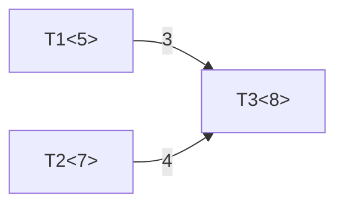

Let's now see a bad task graph with $N$ tasks. Assume all tasks take 1 unit of
time.

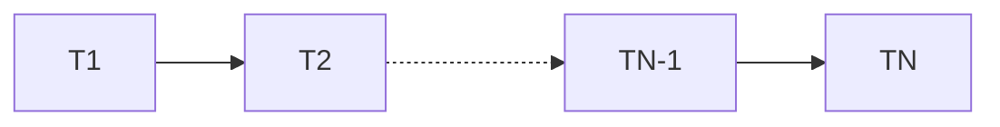

Here, $T_s = N$ and $T_p = N$; $S = 1$ and $E = 1/p$. There is no way to
increase the problem size $N$ while adding another processor to keep constant
efficiency! This program is completely unscalable.

For a balanced binary tree of tasks with depth N i.e, $2^N - 1$ tasks and $2^k$
processors:


## Function-as-a-service

The analysis so far is for standard parallel programs. Recently, cloud providers
have started providing "function-as-a-service" (FaaS). [AWS
Lambda](https://aws.amazon.com/lambda/pricing/) shows the pricing model for
FaaS.

> Duration is calculated from the time your code begins executing until it
returns or otherwise terminates, rounded up to the nearest 1 ms.

Basically in FaaS, user does not pay for resources if the CPU is no longer being
used measured in granularities as small as 1ms! Let's see if measuring
efficiency still makes sense. $E = T_s / p*T_p$. $T_s$ is essentially the cost
we are paying for using 1 processor for $T_s$ time. Similarly, $p*T_p$ was
assumed to be the cost we are paying for using $p$ processors for $T_p$ time.

$pT_p$ = real computation work + communication overhead + idle time. But under
FaaS, we do not pay anything for idle time!


So instead of optimizing for iso-efficiency, we are now trying to find task
graphs, number of workers, placement, etc. such that 

* $min(T_p)$ where $cost < T_s + \Delta$ (budget sensitive jobs)
* $min(cost)$ where $T_p < T_s / \alpha$ (latency sensitive jobs)

Budget sensitive job specifies a cost and tries to finish the work as quickly as
possible. Latency sensitive job specifies a deadline and tries to finish the 
work in lowest cost.
# Distributed shared memory

DSM implementations were the early attempts to do distributed computation as we
realized that Moore's law will not be forever. We could pack multiple CPUs
within a single machine but the number of CPUs we can pack will be limited as
the memory bus will start becoming a bottleneck. Distributed computations run a
program over multiple independent machines containing their own private CPUs,
caches, and DRAMs. These machines are connected to each other over a network.

The idea of DSM is to expose a unified logical view of memory to threads running
across multiple machines. There are many proposed DSM realizations that are
hardware-based, compiler-based, and OS-based. Let us look at a typical OS-based
realizations of DSM: paging-based DSM. The cool thing about this is that it can
be implemented very easily without requiring any new hardware support and
without modifying existing programs. Some of you can implement it as a course
project :-)

### A quick primer on demand paging

Read-write requests originating from CPUs contain virtual addresses. Virtual
addresses are of the form [virtual page number, offset]. Virtual page number is
first looked up in Translation Look-aside Buffer (TLB). TLB is just a table,
implemented in hardware, that maps virtual page numbers (VPNs) to physical page
numbers (PPNs). If the VPN is not present in the TLB, the hardware walks over
the page table to locate PPN for the VPN.

Page table is just a hierarchical in-memory data structure to again map VPNs to
PPNs. Each VPN is associated with a page table entry (PTE). A PTE contains the
PPN and many bits. The one of interest is the present bit. If the present bit is
not set, the hardware raises a page fault. The execution jumps into operating
system's page fault handler. The OS may have previously swapped out the page
from memory to disk. It would have typically saved the location on disk within
the PTE itself. At page fault, the OS copies the page back from disk to memory
and updates PTE. When we return from the page fault handler, the hardware retries
the faulting instruction and this time it finds the present bit set and can find
the PPN to translate the virtual address.

### Paging-based DSM

We can easily extend demand paging to realize a paging-based DSM: page fault 
handler can bring the page from a remote machine instead of from disk. To bring
the page, it can interrupt the remote CPU to service the page or, with modern
hardware, use RDMA to get the page by directly talking to the remote network
controller.

So essentially, we have the following view. Our program is just a regular
multi-threaded program. But, the threads of the program are spread across
different CPUs in different machines. When a thread tries to read a variable
`x`, the OS page fault handler brings the page containing `x`.


DSM is quite nice because we were able to take existing multi-threaded programs
and run them in a distributed manner! The programmer is completely oblivious of
distributed computation. From their point of view, the number of available CPUs,
and aggregate cache+memory, just grows when we run the same program on a
distributed setup.

Because of the identical virtual address space visible to all threads, migrating
threads from one machine to another is straightforward. We can just migrate the
thread's context (registers) and that's it! Easy migration is helpful for load
balancing and planned shutting down of machines for maintenance. The system can
also decide to sometimes move computation closer to data instead of moving data
closer to computation.

Unfortunately, there are serious issues with DSM.

# Problems with DSM

### Memory coherence

Some pages like code and global variables may be required by almost all threads.
If we keep just one copy of each page, such heavily shared pages keep bouncing
around the system and the overall performance will be significantly slower than
when the program is run on a single machine.

For such pages, we can create multiple copies spread on many workers. For code
pages, this is probably ok since code is typically read-only. But, if there are
writeable pages for global variables, we need a memory coherence protocol.
Broadly, there are two coherence protocols:

1. Write-update: A write is not complete until all copies have been written to.
This substantially slows down writes: all writes are remote writes.

2. Write-invalidate: If there are other copies in the system, they are first
invalidated. Subsequent writes (when their are no other copies) are local writes.

Coherence slows things down, but programmer probably expects writing to shared
global memory to be slow (since they have to typically take locks and locks can
be slow).

### False sharing

But DSM program may run slower in unexpected ways. Let us say two threads
running on workers W1 and W2 are respectively modifying two independent
variables `x` and `y` which happen to be on the same physical page, initially
present with W2. 

When W1 tries to rw `x`, it generates a page-fault. The page-fault handler
snatches the page from W2 and continues. When W2 tries to rw `y`, it similarly
generates a page-fault. W2's page-fault handler again snatches the page from W1
and continues. So, at almost each rw of `x` and `y`, we are getting a page fault
and snatching the page. This is called ping-pong effect where page is
ping-ponging between workers.

While using multiple CPUs on a single machine, we also see false sharing among
cache lines and a similar ping-pong effect over cache lines. However, pages are
much bigger than cache lines so the probability of false sharing is much higher
in DSM.  An attempt to solve ping-pong effect was to lock a page on the worker
for a fixed time period after it gets downloaded. The worker who got it can
continue to make progress without page faults while the page is locked. However,
if this timeout is high and if the worker is no longer using the page, the other
worker is unnecessarily stalled. Another approach to reduce false sharing is to
reduce the size of the pages. This creates issues in locating the page.

### Locating the page

Page fault handler needs to locate the page corresponding to the faulting
address. The most straightforward approach is to statically map VPNs to workers
by using a hashing function. But this makes dynamically adding and removing
workers difficult. It also makes load balancing difficult. Different programs
memory access patterns may be different and hence different hashing functions
are expected to be required for proper load balancing.  It also makes most reads
and writes remotes since we are no longer downloading the page; we get page
fault on each access.

Another design choice is to tell the owner that we are locking the page,
download the page locally, do reads and writes, and send the page back when
done. At this point, owner unlocks the page. How does OS know that the program
is done with the page?

Another option is to let pages move around freely in the system. Page fault
handlers can query a central server about the current location of a page. It can
then download the page from the owner and update the central server about the
new page location. 

If we reduce page size to reduce false sharing, we end up with too many pages.
The central server itself might start becoming a bottleneck. At this point, we 
might want to shard the page location servers.


## Fault and stragglers

The key difficulty in DSM comes from faults and stragglers. If one of the page
location server crashes, we might not be able to get a subset of pages.  This
can be solved via replication; in distributed storage section, we will see how
one can make fault tolerant key-value stores.

But if one of the worker crashes, we might lose its pages and its threads
forever. Or if the worker is slow in handing out its pages, it will slow down
all other workers.

### Checkpointing
To get fault tolerance, we can create checkpoints.  Periodically, a program
"controller" (also called a "master") can ask all workers to stop whatever they
are doing. After all workers are stopped, the controller asks them to create
checkpoints.  Each worker writes all its pages and the register states of all
its threads to other workers' disk.  If one worker crashes, its checkpointed
pages and threads can be recovered from other workers' disk.  When all workers
have finished creating the checkpoint, the controller can resume all the
workers. 

After a crash, can we resume the pages and threads of only the crashed worker,
say W1, and rerun these threads on a new worker W1'? Unfortunately not! Other
threads on other workers may have already used the values in pages of W1 to
write to new pages. Upon rerunning crashed threads on W1', the values in pages
of W1' may diverge from what was there in W1 and we may end up with impossible
program states.


Stopping all work on all workers synchronously and then waiting for all workers
to create a checkpoint is slow. Can we create a checkpoint *asynchronously*? Can
the program controller ask all workers to create a checkpoint and we let workers
create a checkpoint at their own pace whenever they hear from the controller?
When a worker is done creating its own checkpoint, it resumes execution without
waiting for other workers to finish creating their checkpoints. In other words,
can we create a checkpoint without stopping the whole program?

Unfortunately, this also does not work. We demonstrate a simple example where we
are running just a single thread and asynchronously checkpointing two pages
while the thread is running. Here, an older value `x=1` and a newer value `y=3`
got saved into the checkpoint. When the program resumes running the loop, we get
`x=2` and `y=5` which was not a possible program state!  We call this an
*inconsistent checkpoint*.


### Replication
Since checkpointing and recovering from checkpointing is slow, we can also do 
replication. Whenever a worker writes, the writes are sent to all the copies to
keep all copies up-to-date. The advantage is that we never lose a page and hence
may not need to rollback to an older state. However, this significantly slows
down all writes. 

The bigger problem is how to recover the thread contexts? Shall we replicate
thread context after every instruction? That will be even slower :( We don't
want to do that. Can we just restart the thread after a crash? Let us say the
thread was simply doing `x++; y--`. After incrementing `x` it crashes.  If we
restart the thread from beginning on another worker and start using another copy
of pages holding `x` and `y`, we will end up incrementing `x` twice and
decrementing `y` only once!

There are two ways to get around this:
* The execution is somehow made *idempotent*. If `x++` is done already, then
re-executing it should be a no-op. Idempotence in this context means that the
effect of running something N times is the same as the effect of running it
once.
* The execution is somehow made *transactional*. We shouldn't have been able to 
increment `x++` without doing `y--` in the first crashed execution. Transactions
are atomic: "all-or-nothing", i.e, either all writes succeed or none succeed.

## Summary
DSM is a very attractive programming model since (at least in theory), it can
take existing multi-threaded programs and run them in a distributed manner. The
programmer can remain completely oblivious to distributed computation. Workers
can be managed since threads can be easily migrated in and out of workers.

However, there are significant hurdles like false sharing, locating the page, 
fault tolerance, and straggler mitigation. Last two are particular killers. For
fault tolerance, we are forced to create synchronous checkpoints otherwise we
end up with inconsistent checkpoints. We are also forced to restart all threads
from the last checkpoint after any crash. Another approach to FT is replication
that does not lose pages. But replication slows down writes. Under the
replication scheme, how to restructure threads so that they can be restarted?
Their execution needs to be idempotent or transactional.

Synchronous checkpointing and restarting everything from the last checkpoint is
easiest to think about and is under use in many systems like [PyTorch
training](https://pytorch.org/tutorials/beginner/ddp_series_fault_tolerance.html).
Other systems that we will study will improve upon these limitations. We will
give up supporting general-purpose programs and build different abstractions
more suitable for distributed computing.
# MapReduce

### Context
POSIX threads became a standard in 1995; OpenMP became a standard in 1997. But
doing parallel programming remained hard. Programmer has to worry about
efficiently using available processors, locking to prevent race conditions,
deadlocks and so on. 

For Google, input data size (TBs) grew well beyond the memory (4GB) and disk
(16GB) of a single commodity computer. One approach to work with such large
inputs was to buy and use a supercomputer. For example in early 2000, the
fastest supercomputer in the world was Intel's ASCI RED which costed ~10M USD
and had 1.2 TB of aggregate DRAM and 9298 processors. But, relying on a
supercomputer would lock you in with a vendor; it is difficult to purchase one
since not everyone is buying/selling; upgrading needs another big investment 
into a larger supercomputer; moving programs from one supercomputer to another
will be extremely disruptive. Google rejected the approach of using a
supercomputer and built a cluster of commodity computers. 


Since now they need 1000s of commodity computers to process terrabytes of data,
faults become common.

> Most such computations are conceptually straightforward. However, the input
data is usually large and the computations have to be distributed across
hundreds or thousands of machines in order to finish in a reasonable amount of
time. The issues of how to parallelize the computation, distribute the data, and
handle failures conspire to obscure the original simple computation with large
amounts of complex code to deal with these issues.

This paper tries to take away all this headache away from the programmer by
providing a different programming model.

## MapReduce

MapReduce takes just two functions from the programmer: a `map` and a `reduce`.
For example, to count the occurence of each word in a large number of webpages
(documents), the programmer can write:

```
map(String key, String value): 
	// key: document name 
	// value: document contents 
	for each word w in value: 
		EmitIntermediate(w, "1"); 
		
reduce(String key, Iterator values): 
	// key: a word 
	// values: a list of counts 
	int result = 0; 
	for each v in values: 
	result += ParseInt(v); 
	Emit(AsString(result));
```

It will execute in the following manner. There are a number of map tasks. Each
task takes a document and emits "1" for each occurence of each word in the
document. The word is hashed to find its appropriate reduce task; reduce task
sums up all the occurences for each word.


MapReduce is interesting because it could solve a large number of problems for
Google such as counting access frequencies of URLs using the word count above,
grepping in large files, (map: output matching lines, reduce: identity), and
finding reverse web-link graphs, i.e, find which documents point to me. For
this, map parses each website (document) to find all outgoing links and emits
"target, source" tuple. target is hashed to find its reduce task which just
appends all the sources to find "target, list of sources".

## Execution

When user submits a program, it forks a master worker (or program controller),
and a number of workers. The job of controller is to monitor and orchestrate the
execution of the program, i.e, it will assign the `M` map and `R` reduce tasks to
appropriate workers.

The input is typically taken from Google File system (GFS), which we will study
later in the course. GFS stores very large files (e.g, log files from the entire
cluster) as 64MB chunks spread across different servers. Each chunk is
replicated 3 times for tolerating disk failures. These chunks are shown as
"split 0", "split 1" etc in the figure 1. Typically, there would be one map task
for one chunk.


The controller remembers the status of each task and does locality-aware
mapping. It tries to assign a map task for a chunk on the same worker that holds
the chunk in its local disk.  After getting a map task, the worker runs the task
and lets the controller know that it is done with the task. When done, the map
task stores `R` output files in its local file system. These `R` output files
will be pulled and used by the `R` reducer tasks.

Task | Status | Intermediate files
-----|--------|--------------------
M1 | in-progress on worker W1 | 
M2 | completed on W2 | R file locations and sizes
M3 | waiting to be scheduled | 
.. | .. | ..
R1 | in-progress on W2 |
R2 | waiting to be scheduled |
.. | .. | ..

When reduce tasks have pulled all their inputs, they can proceed and run the
user-defined reduce function. The output of the reduce is written back to the
Google File system.

Note that there is a very careful separation of the "data plane" and the
"control plane". Data never flows through the program controller. This way the
controller itself never becomes the bottleneck.

## Analysis

MapReduce program with `M` map tasks and `R` reduce tasks shows the following
timeline across `p` workers. Under ideal conditions, there is a "map phase"
where each worker is busy doing `M/p` map tasks. Then in the "shuffle phase",
each worker needs to download files corresponding to `R/p` reduce tasks that
they will be running. Each worker has to download `M/p` intermediate files from 
each of the other workers. This "all-to-all communication" can be done in `p-1`
rounds. After shuffle phase finishes, workers can start the "reduce phase" where
each worker runs `R/p` reduce tasks.


We see that in ideal conditions and with `M, R >> p`, MapReduce has no idling
workers! Doing the scalability analysis, shows that under ideal conditions,
MapReduce has a good iso-efficiency `W = O(p*p)`.


MapReduce design takes locality and load-balancing into account. Controller does
best-effort scheduling to assign map tasks on workers that are close to the
chunk for the map task. It also assigns tasks only to idle workers to achieve
load balancing. 

Since, `M, R >> p`, we get good opportunities to do dynamic load balancing and 
use workers effectively. Consider the case where `W2` is much faster than `W1`
which is faster than `W3`. In such a scenario, `W2` will naturally be made to 
finish lot more tasks than `W1` and `W3`.

```mermaid
gantt
		title Dynamic load balancing
		dateFormat HH:mm
		axisFormat %H:%M
		section W1
				M1          : 18:00, 2m
				M2          : 18:02, 2m
		section W2
				M3          : M3, 18:00, 1m
				M4          : M4, after M3, 1m
				M5          : M5, after M4, 1m
				M6          : after M5, 1m
		section W3 
				M7          : 18:00, 5m
```

But when we are coming close to completion of the job, some final tasks can
remain stuck on slow workers elongating the job completion times.

```mermaid
gantt
		title Stragglers elongate job completion times
		dateFormat HH:mm
		axisFormat %H:%M
		section W1
				R1          : 18:30, 2m
		section W2
				R3          : R3, 18:30, 1m
				R4          : after R3, 1m
		section W3 
				R2          : 18:30, 5m
```

To deal with such situations, the program controller runs *backup tasks*, i.e,
it starts the slow task on another worker, such as task `R2` on worker `W2`.
Both workers are made to race with each other; the task is marked completed when
either has finished.

## Fault tolerance

The approach to fault tolerance is similar to that of straggler mitigation. Upon
detecting a crashed worker, the controller re-executes the worker's tasks. The
controller keeps periodically pinging all the workers. These pings are also
called *heartbeats* and are used in most distributed systems to detect crashes.
If the worker misses a few consecutive heartbeats, the controller thinks that
the worker is dead and marks all done, in-progress map tasks as waiting to be
scheduled. This is because the output of map tasks were in the local disks of
the crashed workers. The reduce tasks completed by crashed worker need not be
re-executed as their output is in the fault-tolerant GFS.

Let us say a map task `M` had finished on worker `W1` and wrote two files
`W1R1.txt` and `W1R2.txt` corresponding to two reduce tasks. `R1` working on
`W3` is able to pull its file and complete the task `R1`. `R2` working on `W4`
could not pull its file since `W1` crashed. Now, `M` will be re-executed on a
new worker, on say `W2` which again writes `W2R1.txt` and `W2R2.txt`. `W4` will
pull `W2R2.txt` to complete `R2`.

If map tasks are *deterministic*, `W1R2.txt` and `W2R2.txt` will be identical.
Otherwise, the two files may be different. So `R1` worked on `W1R1.txt` and `R2`
worked on `W2R2.txt` which were two different diverging map task executions.
Programmer needs to be aware of this possibility and should write
**deterministic** tasks.

Since map and reduce tasks may get executed multiple times due to faults and
stragglers, side-effects made by the tasks should be made **idempotent**. For
example, if a task was adding some rows to a database, programmer needs to
ensure that the task does not add the same rows twice when the task is run
twice. Idempotence in this context means running a task N times has the same
effect as running it once.

When reduce tasks write to GFS, they first write to a temporary file and then do
an atomic rename of the file to ensure idempotence. If the file already exists,
the rename fails. If reduce tasks were instead directly appending to the output
file, we would see duplicate values from duplicate executions.

## Evaluation
The paper shows an evaluation on 1764 workers! Table 1 shows that worker deaths
are actually quite common in large-scale jobs. Figure 3a shows pipelining
between map tasks and shuffle tasks. While map tasks are running, shuffle has
already started. Reading of the input is from local disks, so we see higher
aggregate bandwidths. Shuffle is an all-to-all communication operation over
network. Output is writing to GFS which creates 2 replicas in the experiment, so
the aggregate bandwidth is lower than shuffle phase. 

Figure 3b shows that if we do not use backup tasks, then job completion times
are 44% longer. Figure 3c shows that when we randomly restart 200 workers, the
job completion time is elongated only by 5%. The lost map tasks quickly get
re-scheduled on live workers. 

# Summary
The programmer just writes a map and a reduce function, tests it locally, and
then gives it to the MapReduce system to run in a distributed manner. MapReduce
takes care of locality, load balancing, straggler mitigation, and fault
tolerance.  Last two are done by re-execution of lost/slow tasks. Due to the
possibility of duplicate task executions, it is recommended for tasks to be
deterministic and idempotent to get sensible outputs.
# Map-reduce style computation

In this lab, we will build a distributed word count application. But for
simplicity, we will pretend that our multi-core system is a distributed system
in itself.

We will start stateless python processes to act as distributed workers. These
workers will co-ordinate with each other through [Redis](https://redis.io/).
Redis behaves like the master (or driver program) in contemporary systems.  For
further simplicity, we do not create control plane/data plane separation which
is crucial for performance! Workers take tasks from Redis and push word counts 
back to Redis.

All workers have access to a shared file system for reading and writing large
inputs. This is again trivially true on our single system. In a real setup,
workers would additionally use a distributed file system like HDFS or a blob
store like S3.

## Part 0
Familiarize yourself with [Redis](./redis). You need `docker` and
`redis` installed for this.

```
docker run -d -p 6379:6379 -v /home/baadalvm/redis:/data --name redis --rm redis:7.4
```

Learn sending commands to redis using `redis-cli` and from python programs using
the [redis-py](https://github.com/redis/redis-py) library. Especially
familiarize yourself with [sorted sets](https://redis.io/commands/zadd/). You
will use them to maintain word counts. You should also read about [redis
streams](https://redis.io/docs/data-types/streams-tutorial/). You need the
following redis stream commands for the first part: `xadd`, `xreadgroup`,
`xcreate_group` and `xack`. Understand what they do. Finally, you will need to
write a Redis function for making your tasks idempotent.


## Part 1: Parallel execution

We will first make the word count application run end-to-end using Redis.  But
before that, download the starter code.

Update `DATA_PATH` in `config.json` to point to your `data` folder.  Run 
`python3 client.py`. In this lab, you have to modify `worker.py` and `myrds.py`.

The basic structure is as follows: 

* `client.py` iterates over the folder with the text files to add the file paths
  into a redis stream using `xadd`. It then starts the worker processes.
* Worker processes do `xreadgroup` to read one file name from the Redis stream.
  Call `xreadgroup` such that each worker gets a different file name.
* Worker process reads the file it is supposed to work on and counts
  each word's frequency. 
* When done, the worker process can use `zincrby` to increment each word's count
  in a redis sorted set. And finally `xack` the message containing the filename.
* Then it reads another file by again calling `xreadgroup`. If there are no 
  more files to process, it exits.

## Part 2: Fault tolerance of workers

Now we wish to ensure that our system is tolerant to worker failures. Since,
workers are stateless, we should be ok with losing worker state. But, we still
have to ensure two things:

* Updates to redis should be made atomic. If a worker crashes after incrementing
  counts of only a few words, then we will end up with incorrect counts. See
  [Redis fcall](https://redis.io/commands/fcall/) to `xack` a file and to
  increment word counts as one atomic operation.
* Consumer groups in Redis streams ensure that each worker gets a unique file 
  name. But, if a worker crashes after getting a file name from Redis stream, 
  that file's words may never get counted. Therefore, other workers will 
  have to steal filenames that have not been `xack`ed till a timeout.
  See [xautoclaim](https://redis.io/commands/xautoclaim/) to do so.

> * You may add crash points in the worker process to control where and how
>   workers crash. For instance, after the worker reads a filename from
>   `xreadgroup`, it may call `sys.exit()` if a certain worker flag is set. 
>   Configure different flags for different workers at the time of their creation 
>   to verify fault tolerance.
> * Workers can not exit until all the other workers are done with their files.
>   Use [xpending](https://redis.io/commands/xpending/) to verify this before 
>   exiting from workers.
> * `xack` returns the number of Redis stream messages that were actually
>   acknowledged. Verify that `xack` returns 1 before writing to the word count
>   sorted set to get idempotence.

## Part 3: Redis FT using checkpoints

We would like to now ensure that our system tolerates Redis failures. We
need not change the worker code for this part. To reason about correctness, note
that a Redis instance handles one command after another in a single thread.

In this part, we will periodically create a checkpoint using
the [BGSAVE](https://redis.io/docs/management/persistence/#snapshotting)
command. Redis starts periodically storing a `dump.rdb` file on disk.

You can run `CONFIG GET dir` from `redis-cli` to find the directory where
`dump.rdb` gets stored. You may try to crash the Redis instance and then start a
new Redis instance. Redis should automatically read `dump.rdb` file and restore
from it. Verify that this new instance have the keys from the old instance by 
running `keys *` using `redis-cli`.

Now while the job is running, try crashing the Redis instance and restarting
another one. From a correctness standpoint, checkpoints are consistent because
Redis has a single event loop and because all our edits were made atomic in the
previous part. 

In other words, let us say that a file `foo` was processed after the checkpoint.
Now after a failover, the new Redis instance (recovered from the checkpoint)
will remember that the file has NOT yet been `xack`ed. Therefore, a worker will
again receive the file for processing and it will again `xack` + increment word
counts in one atomic operation. Since our workers are stateless and file counts 
are deterministic, recomputing a file's word counts are ok.

> Ensure that you set up the new instance in an identical manner, i.e, listen on 
> the same port, set up the same password, and insert the same lua functions.
# Resilient Distributed Datasets in Spark

## Overview
Spark will do *asynchronous checkpointing* of its state, i.e, create a
checkpoint without pausing the program for fault tolerance. It will also try to
not re-execute entire computation from the last checkpoint. It will try to only
re-execute the program *partially* to recover just the lost state.

In [DSM](compute-dsm), we saw how asynchronous checkpointing led to
inconsistent checkpoints. Let us revisit *why* we ended up with inconsistent
checkpoints. We saw a simple `for` loop with the initial state as $x=0$ and
$y=0$:
 
```py
for ..:
  x += 1
  y = y+x
```

When we asynchronously create checkpoint, we might capture $x=1$ after the first
iteration of the loop and $y=3$ after the second iteration of the loop. If we
restore from this state and continue executing the `for` loop, we will reach
$x=2$ and $y=5$ which could not have been reached in a fault-free execution.

The main problem is that our checkpointing and restore mechanism got confused
between multiple *instances* of $x$ and $y$. We checkpointed $x$ from the
first iteration and $y$ from the second iteration. And then after recovery, 
we didn't know that they are from two different iterations. 

The first idea of Spark is that let us make our variables **immutable**. In our
toy example, it means that $x$ in the first iteration *is not the same as* $x$
in the second iteration. Let us refer to variables in different iterations as
$x_0, y_0$; $x_1, y_1$ etc. The immutability of variables also helps in
replicating and checkpointing them: due to immutability, we need not worry about
*consistency* during replication. We can easily create multiple replicas of each
variable while the program is running, since the program is guaranteed to not
modify variables further.

Now, even with separate naming convention and immutability of variables, let us 
say we still capture, in our asynchronous checkpoint, different variable
versions, i.e, $x_0=1$ and $y_1=3$. The second idea is to remember the
**lineage** and recover the program state using it. For example, the following
shows the lineage between program variables in our toy program:


To come to the latest loop iteration, we can just follow the lineage to recover
$x_1$ and then continue the loop from there to compute $x_2, y_2$. Notice that
we *need not* recover $y_0=1$ since we already have $y_1=3$ in our checkpoint.
For recovering variables using lineage, we re-execute the task on the lineage
edge; tasks must be **deterministic** and **idempotent**. 

For example, let us say we change the toy program to do `x+=random()`. In the
original execution, $x_1=2, y_1=3$. Now when we recover $x_1$ from the
checkpoint, we re-execute `x+=random()` and get $x_1=6$. Note that $x_1=6,
y_1=3$ is an inconsistent state: it cannot be reached from $x_0=1, y_0=1$ in a
fault-free execution.


Of course if we apply these ideas to regular programs, we will end up with
humongous lineage graphs. To reduce the size of lineage graphs, the idea of
Spark is that 

1. Our immutable variables will be large collections instead of small scalar
values;
2. We will only allow coarse-grained transformation, such as filter, map,
reduce, etc.  that take one collection to another collection. Roughly speaking,
a coarse-grained transformation applies the same function to each element in the
collection.

Therefore, the lineage graph will be small. A node in the lineage graph is a 
large collection. An edge in the lineage graph takes one large collection to
another large collection using a deterministic coarse-grained transformation.

## Resilient distributed datasets

These ideas are exposed to programmers using an "RDD" abstraction. An RDD
appears to programmer as a single object, but it is actually distributed across
machines. For example, in the following Spark program, both `lines` and `errors`
are RDDs.

```py
lines = spark.textFile("hdfs://...") 
errors = lines.filter(_.startsWith("ERROR")) 
errors.persist()
```

In the following figure for example, there are three *partitions* of `lines` 
resident on three workers. The user-defined `filter` is applied on each
partition independently and locally by each worker to get three partitions of
`error`. Each RDD partition, once written, is immutable. The following figure
shows the lineage graph.


## Execution

Execution is similar to [MapReduce](./compute-mr). There is a driver machine
that manages other worker machines. The driver is keeping track of RDDs. For
each RDD, driver knows its 
* number of partitions, 
* partition function: may be simple hash-based or could be user-specified.
* where are its partitions: partitions may be replicated for FT,
* list of dependencies i.e, lineage: which other partitions does this partition
  depend upon and the task to execute to get this partition from them.

Let us see an example execution of a [PageRank](./demos/spark.md)
program written using Spark. PageRank measures the popularity of pages. 
Given the following graph, one would expect 
* u1 and u3 to have equal ranks,
* u2 to have a higher rank than u1 and u3
* u4 to have a higher rank than u2 (a popular page u2 thinks u4 is popular, but
  u4 does not consider u2 to be popular).

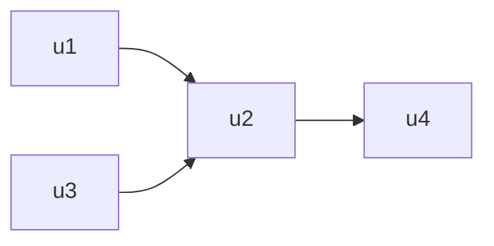

The algorithm estimates the probability that a user will visit the page. It
starts with assigning equal rank of 1 to each page and simulates a user at each
step: with 0.85 probability the user clicks a link at random, and with 0.15
probability the user visits a random page.

```py
# Loads in input file. It should be in format of:
#     URL         neighbor URL
#     URL         neighbor URL
#     URL         neighbor URL
#     ...
lines = spark.read.text(sys.argv[1]).rdd.map(lambda r: r[0])

# Loads all URLs from input file and initialize their neighbors.
links = lines.map(lambda urls: parseNeighbors(urls)).distinct().groupByKey().cache()

# Loads all URLs with other URL(s) link to from input file and initialize ranks of them to one.
ranks = links.map(lambda url_neighbors: (url_neighbors[0], 1.0))

# Calculates and updates URL ranks continuously using PageRank algorithm.
for iteration in range(int(sys.argv[2])):
	# Calculates URL contributions to the rank of other URLs.
  contribs = links.join(ranks).flatMap(lambda url_urls_rank: computeContribs(
    url_urls_rank[1][0], url_urls_rank[1][1]
  ))

  # Re-calculates URL ranks based on neighbor contributions.
  ranks = contribs.reduceByKey(add).mapValues(lambda rank: rank * 0.85 + 0.15)
```

In the following, we see how Pagerank executes. The graph is stored in HDFS
partitions. It is parsed to find `links`. Each link contributes a ratio to every
other URL. These contributions are added up together for each URL, multiplied by
0.85, and we finally add 0.15 to get the `ranks`. We repeat this process for
multple iterations.  Observe that `links` is cached since it is used in every
iteration. PageRank builds the following lineage graph when it is running on two
workers.

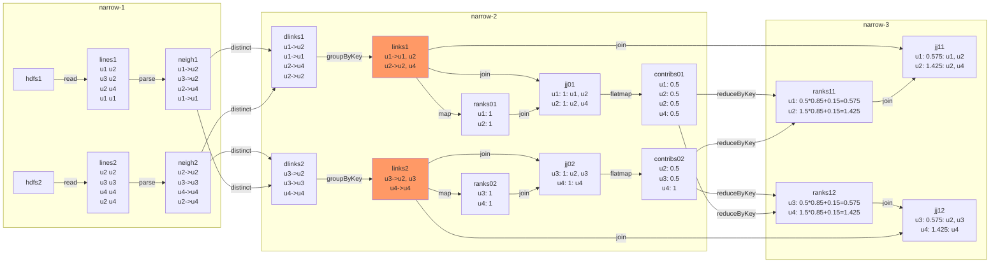

All the ..1 partitions such as `hdfs1`, `lines1`, `neigh1`, `ranks01`, etc. are
resident on worker-1 and all the ..2 partitions such as `hdfs2`, `lines2`,
`neigh2`, `ranks02`,  etc.  are resident on worker-2. Spark classifies all
transformations into narrow and wide. *Narrow dependencies* are executed
locally. *Wide dependencies* require a shuffle between workers. The figure above
shows all the narrow dependencies.  `distinct` and `reduceByKey` are wide
dependencies.


Note that `dlinks` -> `groupByKey` -> `links` is a narrow dependency since the 
RDDs are already partitioned by URLs. `links`, `ranks0` -> `join` -> `jj0` is also
a narrow dependency since `links` and `ranks0` are "co-partitioned", i.e, same
source URLs (which determine the join condition) are in the same partition.
Narrow dependencies are preferred over wide-dependencies since 
* transformations can pipeline data within a worker, whereas wide dependencies
require data to be available on all parent partitions; and
* at a crash, we just need to recover one parent partition, whereas for wide 
dependency, we need to recover all parent partitions.

We could do the same computation using a series of MapReduce jobs. A sequence of
narrow dependencies can be written as a `map` task, and a wide-dependency can be
written as a `reduce` task. But, each MapReduce job writes its output to GFS.
Therefore, each PageRank iteration will necessarily write to GFS. Spark can
choose to persist every few iterations to reduce disk overhead.

The approach to fault tolerance is simple: recompute lost partitions by
following the lineage backwards upto the checkpoint, then re-execute tasks on
the graph edges forward. To avoid ending up with long lineage chains, we should
checkpoint occasionally. We can be smart in doing this checkpointing. For
example in the PageRank program, `ranks` is O(number of URLs) and `contribs` is
O(number of web links); so checkpointing `ranks` should be preferred. 

A checkpoint can be made asynchronously since partitions will not get modified
while we are checkpointing them. Checkpointing an RDD involves workers
replicating all of the RDD partitions into each other's memory. If worker memory
is getting full, it can spill some RDD partitions to disk. Users can provide a
"persistence priority" to RDDs to guide Spark.

The approach to straggler mitigation is similar to MapReduce: start backup tasks
and let two workers race with each other to compute RDD partitions. Since, the
transformations are deterministic and inputs are immutable, both racing workers
should end up computing the same RDD partition.

### Evaluation
Figure 7 shows that later iterations of Spark are much faster than in Hadoop
(an open-source clone of MapReduce) since the data is already present in memory.
In Figure 11, authors inject a fault in iteration 6. Iteration 6 takes longer
time than other iterations due to the recovery via lineage-based reexecution.

## Summary

DSM allows arbitrary fine-grained updates. It has to deal with consistency
issues stemming from multiple readers and writers. The checkpoints are expensive
since it has to checkpoint the complete program state. Checkpoints had to be
made synchronously, i.e, stop the program execution while checkpointing, as
otherwise we may end up with inconsistent checkpoints. We had to restart all the
threads from the checkpoint to recover the program state. DSM transparently
placed threads on workers which may not be locality-aware.

In contrast, RDDs allow only deterministic coarse-grained transformations.
Because RDDs are immutable, we can easily create multiple replicas without
worrying about consistency. These checkpoint replicas can be made asynchronously
as the program is guaranteed to not modify once-written RDDs. Checkpointing is
cheaper than a full checkpoint. We can smartly choose to checkpoint slower to
compute and faster to checkpoint RDDs. After crashes, we need not rollback entire
program back to the last checkpoint. Only the lost partitions can be recovered
using its lineage. To overcome stragglers, backup workers can race to compute
RDD partitions. Because of deterministic tasks, both racing workers shall end up
with the same contents in the RDD partition. Narrow dependencies can be executed
completely locally on workers; users are given control on how they want to
partition RDDs.

The design is quite similar to MapReduce. Spark supports more database-like
operators, such as `join` and `groupBy`, and especially wins on iterative
computations since MapReduce had to go to cluster file system after every
iteration.
# Streaming computation

So far, we have learned "batch computation" where we had lots of data that we
wanted to process quicker than the runtimes possible with a single machine.
Batch jobs typically run for hours before producing a result. There is interest
in another class of computations called *streaming computation* where data keeps
coming in forever and we want to gather insights out of this data.  Some
examples are:

* real-time decision making: is this credit card transaction fraud?
* live analytics: 
  * what are the trending topics in Twitter?
  * how many visitors are there on my web page right now?
  * how may cars are on each traffic junction?

In addition to the concerns of scalability, fault tolerance, and straggler
mitigation, we are concerned about freshness: time from data in to results out.
If we tell users what was trending on twitter last week, it is no longer
interesting.

Let us see why mapreduce/spark do not obviously translate into good streaming
systems. Let us say we are interested in finding trending topics on twitter.  We
will implement it using a streaming word-count: if a word appears in more
tweets, it is trending.


The issue with implementing it in MapReduce is that because the input is
infinite, tokenizer (map) never finishes and therefore the aggregator (reduce)
can never start. Another approach is the pipeline model, also called continuous
operator model.  Each tokenizer / aggregator task is pinned to a worker;
tokenizer forwards words to aggregators. Now, aggregator can keep the counts and
emit the counts at user-defined intervals, e.g, every 5 minutes.

However now, the aggregator has become *stateful*. Our fault tolerance/straggler
mitigation approach was to *rerun* failed/slow tasks on a different worker. We
assumed that tasks were stateless, i.e, they just depended on their inputs, and
that tasks were deterministic and idempotent. However, now we cannot simply
restart aggregator at a new worker since the new worker will not know the
existing word-counts.

## Some approaches to handle stateful tasks

One idea for fault tolerance is to keep the aggregator's state as a *replicated
state machine*. There is a primary worker and a replica worker with
*uncorrelated failures*, i.e, they are on different racks with different power
supply, network switches, etc. Because of uncorrelated failures, hopefully,
both workers will not fail at the same time.

The general idea of replicated state machine is that the *state machine* is
maintained in-sync on both primary and replica. Let us say both primary and
replica had a count of "a" as 41. When primary receives `"a":1`, it forwards to
replica, replica updates its count to 42, sends an acknowledgement to primary,
primary updates its count to 42 and finally emits word count of "a": 42. If
primary crashes at any time, replica can take over and become new primary.

This approach is costly: it requires 2x resources for each stateful task. It
runs as slow as the slowest replica. Note that replica is not allowed to fall
behind.  Imagine if primary thought "a":42 and replica thought "a":32. Now, if
primary crashes, and we failover to replica, the new counts of "a" will be
wrong.

Another similar approach is to keep the word counts in a fault-tolerant
replicated storage and make the workers stateless. Because of stateless workers,
we can easily restart tasks at new workers if old worker crashes. Millwheel
VLDB'13 Section 8.1 shows that 50th (95th) percentile latency increases from
3.6ms (30ms) to 33.7ms (93.8ms) when writing to such a storage. 

## Discretized streams
Spark streaming suggests a "mini-batch" approach: break down a stream into small
batches. Each mini-batch is processed using Spark. The following figure shows
the lineage graph of a page view count computation. `pageViews` stream is
discretized every 1 second. Within each interval, `pageViews` is an RDD with
three partitions. We first do a `map` and then reduce into `counts`. `counts` of
interval $[1, 2)$ depends on counts of interval $[0, 1)$. Each RDD partition is
immutable. Each task on the lineage graph's edge is deterministic and stateless.


If a worker crashes, we can just rerun failed tasks just like in Spark. Just as 
in Spark, recovery can be done in parallel on different workers.


The paper shows results for word-counts and grep on 20 four-core nodes with 150
map tasks and 10 reduce tasks. The discretization delay is 1 second and the
checkpointing interval is 10 seconds. So on each CPU core, there are two tasks
and the checkpoint is created every 10 intervals. The plot shows processing time
for each interval in the presence of failures. We see that in steady case, the
interval can be processed in less than 1 second. Recovering lost RDD partitions
from failure requires re-executing. In word-count, later intervals require the 
results of older intervals (word counts) and therefore it has to re-execute
more. Word-count sees higher processing times than grep but both of them get
back to steady state quickly.


One might be concerned that the state can become very large. For example, one
RDD partition of aggregator might have millions of word counts. But due to
Spark's locality-aware scheduling, the next interval of word count is calculated
locally thereby avoiding a network transfer. RDDs are checkpointed occasionally;
old RDDs are GC'ed from memory.

## Summary
Streaming computations have a new concern of freshness. Approaches studied for
batch computation do not immediately translate because of stateful tasks. 

Discretizing streams into mini-batches makes all tasks stateless. This approach
works well but it does not provide good freshness in the common case as it adds
a 0.5-2 seconds of discretization delay.  For many usecases, like trending
topics in Twitter, this is ok. But, when you want to make real-time decisions
like approving credit-card transactions, such delays may not be acceptable.
# Asynchronous checkpointing

Continuous operator model provided good freshness in the common case but because
of its stateful workers, fault tolerance mechanism of rerunning tasks on another
worker no longer works. Spark streaming removes state from workers by
discretizing streams into mini-batches. Doing so simplifies fault tolerance, by
making tasks stateless, but reduces freshness in the common case: when there are
no failures.

Let's go back to continuous operator model. Here, tokenizer is running on
workers M, N, O and aggregator is running on workers P, Q. Remember that M, N,
and O contain "cursors" of their streams and P and Q contain word counts.


We will try another approach to do fault tolerance of stateful operators by
creating checkpoints. A checkpoint, also called a snapshot, can be thought of as
a *cut* in the timeline of events that separates past events (in the checkpoint)
from future events (not in checkpoint).

The following example shows an example event timeline where worker M is
processing two tweets "ab" and "aa". It sends word counts to workers P and Q. We
ignore workers N and O in rest of the discussion. Processing of tweet "ab" is in
the checkpoint and of tweet "aa" is not in the checkpoint. Worker M checkpoints
it cursor; workers P and Q checkpoint their respective word counts.


One approach to create an asynchronous global checkpoint could be to let the 
*checkpoint coordinator* pre-decide and broadcast a global timestamp 
$\tau = now + \Delta$.  Each worker checkpoints its state at this pre-decided
timestamp. Mappers checkpoint their "cursor": which ID of the stream did they
process last, and reducers checkpoint their word counts.

This simple approach loses in-flight messages. We also need to checkpoint
messages that were sent before the checkpoint but received after the checkpoint
time. 


But, now how do we know that a checkpoint is *complete*? Workers P and Q might
get a pre-checkpoint message at any time in the future.  One simple algorithm is
to maintain a "deficit" count at the checkpoint coordinator. For example, the
mappers can remember how many messages it sent before the checkpoint time. And
the reducers can remember how many messages it has received from before the
checkpoint time. Checkpoint coordinator can maintain 
total deficit = total sent - total received. 
After the checkpoint time $\tau$ has passed, as reducers receive more messages,
they keep increasing total received.  When total deficit hits zero, we
know that the checkpoint is complete.

Upon crash, all workers and channels revert to the last checkpoint: mappers
rewind to the saved cursor, in-flight messages are put in the receive buffers of
reducers, reducers roll back to the saved word counts.

## Clock drifts
Unfortunately, the pre-decided timestamp approach does not work because it is
practically very difficult to have perfectly synchronized clocks. Computer
clocks can drift due to variety of reasons such as temperature, vibrations, and
age of the computer. Ordinary quartz clocks [drift by](https://medium.com/geekculture/all-things-clock-time-and-order-in-distributed-systems-physical-time-in-depth-3c0a4389a838) 1 second in 11-12 days.

### Network Time Protocol
We don't feel such drifts while using computers since computers commonly use
network time protocol to periodically adjust their local clocks with
*timeservers*. Time servers are typically equipped with more expensive and
bulkier *atomic clocks*.  Atomic clocks drift by 1 second in 100 million years!

In the most basic sense, NTP works as follows:


The client adjusts its clock by calculating the drift.  Assuming clock drift 
(= server time - client time) is $\theta$ and RTT is $\delta$, then

* $t_1 = t_0 + \theta + \delta / 2$
* $t_2 = t_3 + \theta - \delta / 2$
* $\theta = \frac{(t_1 - t_0) + (t_2 - t_3)}{2} = -128.5ms$


With NTP, computer times are typically within 1ms of each other in a LAN
setting. This is not that great for creating checkpoints: within 1ms, CPUs could
run millions of instructions.

### Impact of clock drifts
Let us see how clock drifts can lead to creation of *inconsistent checkpoints*
when running the above algorithm. 

A *consistent checkpoint* is a global state such that:
* the checkpoint state is reachable from the initial state, and
* final states reachable after recovering from the checkpoint state are
  reachable from the initial state in a fault-free execution.

Checkpoint coordinator pre-decided a timestamp
$\tau$ to checkpoint; all workers create a checkpoint when their local time
becomes $\tau$. Notice that the clock drifts in different computers can be 
arbitrary, so local times do not match the real time and do not match each
other. Following shows an inconsistent checkpoint:


Pre-decided timestamp approach tried to create a checkpoint at an actual global
time. In absence of clock drifts, such a checkpoint is consistent since it
captures a global state where workers and channels were *simultaneously* in this
state. This checkpoint properly separates past from the future and is therefore
consistent.

Whereas, in the example above, "future" event i.e, events not in the checkpoint
"M sending a:2" has affected "past" event, i.e, events in the checkpoint, "P
receiving a=2" and is therefore inconsistent. Recovering from this checkpoint
leads to double counting of "aa".

## Consistent Checkpoints
Since *no one* knows the actual global time, we must relax the *simultaneity*
condition for creating checkpoints. We will now checkpoint a global state where
workers and channels *may have been* simultaneously in that state. Note that the
workers and channels *may never be* in the checkpoint state in *this execution*.
The following shows an example consistent checkpoint.


Observe that the system was never simultaneously in the checkpointed state! When
`Q` had "b=1", `P`'s count was already "a=3".

## Vector clocks
We now want to tweak the above algorithm and make it work in the presence of clock
drifts. Since workers anyways do not know the actual global time, we are going
to let go of actual global time and the workers' local clock time. We will
instead use a *virtual time* in the form of *vector clocks*.

A vector clock $c$ is a vector of integers $(c_1, c_2, \cdots, c_p)$. There is
one component in the vector clock for each worker. A clock of (1, 2) means that
worker 1 has seen 1 event and worker 2 has seen 2 events. There are, generally
speaking, three types of events: an internal event that just changes the local
state, a send event that sends a message to another worker, and a receive event
that receives a message from another worker and changes its local state.

The time is kept in the following manner:
1. At an internal event, process $i$ increments $c_i$;
2. At a send event, process $i$ increments $c_i$ and sends its clock with the
message;
3. At a receive event, process $i$ increments $c_i$ and for all other clock
components does $c_j = max(c_j, s_j)$ where $s$ is the vector clock of the
message. 

The following shows an example:


We say $u \leq v$, if $\forall i: u_i \leq v_i$. Further, $u < v$, if $u \leq v$
and $u \neq v$.  We say two vector clocks are concurrent $u || v$ if neither $u
< v$ nor $v < u$. With the above timekeeping mechanism, vector clocks *maintain
causality*, i.e, $C(e_1) < C(e_2)$ iff $e_1 \rightarrow e_2$.

In the above example, $C(m_1) < C(p_2)$; $m_1$ has causally affected $p_2$,
i.e, $m_1 \rightarrow p_2$.  Whereas, $C(p_2) \not< C(q_1)$ and $C(q_1) \not<
C(p_2)$, therefore $C(p_2) || C(q_1)$. Neither has causally affected the other,
i.e, they are concurrent, $p_2 || q_1$.

Since vector clocks maintain causality, we can redefine "past" and "future" in
terms of vector clocks.  In the inconsistent checkpoint seen before, worker `P`
had a "future event" $(2, 2, 0)$ in the checkpoint but worker `M` did not have a
"past event" $(2, 0, 0)$ in the checkpoint. Past and future correspond to
causality and not real-time; they are decided by $<$ relationship of vector
timestamps, i.e, $(2, 0, 0) < (2, 2, 0)$.


## Checkpointing algorithm

With this understanding, we can now create consistent checkpoints. The idea is
simple: checkpoint before processing a message from the "future".  The idea is
that the vector timestamp has $P+1$ components for $P$ processes.  The last
component is incremented only to create the next checkpoint. The algorithm also
uses the property that the process $i$ which owns the $c_i$ component of the
vector timestamp always has the max value for that component (i.e, it is most
caught up).

The algorithm proceeds as follows: a co-ordinator process decides to checkpoint 
spontaneously. It increases the $c_{p+1}$ by 1. Since, the co-ordinator process 
is the only process that can initiate a checkpoint, it is guaranteed to have the
maximum value of $c_{p+1}$. The process checkpoints itself and starts sending
messages timestamped with the new vector timestamp.

Let us say that the old value of $c_{p+1} = d$ and new value is $d+1$.  Now it
is straightforward to distinguish messages sent before the checkpoint and the
messages sent after the checkpoint.

When a process receives a message with $c_{p+1} = d+1$ for the first time it
checkpoints itself and updates its clock according to the usual vector time
propagation mechanism. Therefore, all the future messages sent by it will have 
$c_{p+1} = d + 1$. Checkpoint is created *before* processing the incoming
message with $c_{p+1} = d + 1$

But since messages may be delivered out-of-order, a process that had already
checkpointed may receive $v_{p+1} = d$ messages. These messages need to be
checkpointed separately as "in-flight" messages of the channel.

The only remaining difficulty is how to detect whether the checkpoint is
complete. Since, messages may be arbitrarily delayed, we may not know if we
might still receive a message with $v_{p+1} = d$. The simple approach described
in pre-decided actual timestamp still works: each process remembers the count of
$v_{p+1} = d$ that it has sent minus the count of $v_{p+1} = d$ messages it has
received. 

When the process creates a checkpoint, it sends this count to the coordinator
process. This count can be summed across all the processes to know the pending
in-flight messages (total deficit). As messages are received, total deficit is
decremented. When the total deficit hits zero, we can be sure that the
checkpoint is complete!

# Summary

We saw a general purpose asynchronous checkpointing scheme that is guaranteed
to create consistent checkpoints. This scheme works for any distributed program
(beyond just streaming computations). The algorithm works because:

1. Vector clocks are isomorphic to causality, i.e, 
$C(e_1) < C(e_2) \Leftrightarrow e_1 \rightarrow e_2$. 
Because of this property and the timekeeping mechanism, we can judge if a message
is from "past" (pre-checkpoint) or from "future" (post-checkpoint). 
  * First post-checkpoint message can be easily identified to initiate a
    checkpoint. 
  * In-flight pre-checkpoint messages can be easily identified and checkpointed.
2. Timekeeping in vector clocks ensure that the process always has the maximum
value for its own component. Checkpoint coordinator can safely increment its own
component to request another checkpoint. No other worker can by itself increment
the clock component of checkpoint coordinator.
3. Each worker never puts a "future" event in the checkpoint. When it receives a
message from the future, it immediately creates a checkpoint before processing
the message.

One of the most interesting part is that the consistent checkpointed state may
actually have *never occurred* during the execution of the program! We saw an
example of this. You can read [more about it
here](https://github.com/codenet/public-notes/blob/main/paper-1989-vector-clock.md)
and of course in the paper.
# Lightweight asynchronous checkpointing in Flink

We saw a general-purpose asynchronous checkpointing algorithm based on vector
clocks. The algorithm works with any number of processes and channels for
arbitrary distributed programs. We defined a checkpoint as a *cut* in the event
timeline that separates past (in the checkpoint) from future (not in the
checkpoint).

*Consistent checkpoints* capture a global state where future events (not in the
checkpoint) do not affect past events (in the checkpoint). Since global time is
unknown, we redefine past and future in terms of *causality*.

In continuous operator streaming computations, we *know* a few things about the
structure of the computation which we can use to simplify the algorithm. We know
that the dataflow graph is structured as a DAG with FIFO channels. We assume
that the input streams are durable and rewindable via a cursor.

We just need to separate "pre-checkpoint" inputs from "post-checkpoint" inputs.
Every worker should checkpoint *after* it has consumed all the pre-checkpoint
inputs and *before* it has consumed any post-checkpoint inputs. We can separate
pre-checkpoint inputs from post-checkpoint inputs by inserting a checkpoint
barrier in all the input streams.


When a worker receives a barrier, it 
* blocks the channel and waits for barriers from all input channels;
* after receiving barriers from all input channels, checkpoints local state;
* put barriers on all output channels; and
* continues processing input.

The following shows an example of Flink creating a checkpoint:


Blocking the channel and waiting for barriers from all input channels is done so
that the worker sees *all* the pre-checkpoint messages and *none* of the
post-checkpoint messages when it creates the checkpoint. If we do not wait for
barriers from all input channels, we might end up with inconsistent checkpoints:


The advantage of this algorithm is that we *never* checkpoint any in-flight
messages. Since the barriers are aligned and since channels are FIFO, we know
that we will no longer see any pre-checkpoint message after we have seen
barriers from all input channels. Finding termination of checkpoint creation is
also straightforward: when the last operators have successfully created 
checkpoints, we know that we are done.

Creating asynchronous checkpoints empowers Flink to do fault tolerance
(straggler mitigation) by replacing failed (slow) workers and then recovering
from last completed checkpoint. Due to this capability, Flink is able to support
real-time streaming with stateful operators. Flink does not add discretization
delays in the mini-batching approach introduced by Spark.

Since streaming computations can potentially run forever, on-the-fly
code/topology updates may be necessary. For example, we might want to switch an
ML model in a credit card fraud detection pipeline; or in the word-count
pipeline, we might want to make three aggregator workers instead of two since
some workers are running out of memory in keeping word counts. We can easily
restart pipelines with new configuration from the last completed checkpoint.

The paper also talks about incremental checkpoints and dealing with cycles in
the dataflow graph.
# Lab-2: Lightweight asynchronous consistent checkpointing

Find the deliverables in docs/deliverables.md.

## High Level System Overview.

In this assignment, you will implement Chandy-Lamport Algorithm on a Flink-like
setting for consistent global checkpointing of the system and use these
checkpoints to recover from worker failures.

The system performs word counting while being resilient to failures (except for
the coordinator; we will assume that the coordinator never dies, until the job
is done). 

There are 3 types of workers:

1) Mappers
2) Reducers 
3) Coordinator

The resiliency is achieved by using checkpoints. In this method, each worker
(mapper & reducer) creates checkpoints every once in a while.  And whenever a
failure happens, all of them rollback to the last completed checkpoint. However,
the checkpoints needs to be consistent and to achieve that we use Flink-like
checkpointing.

### The Mapper

#### Main tasks:-

1) Each mapper reads a file name from its redis stream, and perform word count
on the words of this file.
2) Based on a hashing function (word -> reducer), sends certain word counts to
certain reducer.

#### Auxiliary tasks:-

1) Checkpoints itself when asked by the coordinator (Save the last stream id it
read from redis into a file).
2) Forward checkpoint markers to the reducers.
3) Sends checkpoint_ack to the coordinator when done creating a checkpoint.
4) Recovers itself when asked by the coordinator.
5) Sends recover_ack to the coordinator when done finishing recovery.
6) Sends heartbeats to the coordinator after every HEARTBEAT_INTERVAL.
7) Notifies coordinator that it is done when no more files are left to process
in its redis stream.

### The Reducer

#### Main task:-
1) Receives the words from the mappers, and keeps a counter for each word.

#### Auxilary task:-
1) Checkpoints itself when it receives markers from all the mappers.
2) Sends checkpoint_ack to the coordinator when done creating a checkpoint.
3) Recovers itself when asked by the coordinator.
4) Sends recover_ack when it is done recovering.
5) Sends heartbeats to the coordinator after every HEARTBEAT_INTERVAL.

### The Coordinator
#### Main Tasks:-
1) Periodically sends checkpoint markers to the mappers.
2) Monitors if any worker missed heartbeats.
3) Sends recovery command when required.
4) Sends exit command when required.

In this assignment we fix the number of mappers and reducers to 2 with 1
coordinator.  So the system looks like the following.


## Low level system design

### Mapper design

```python
# STATE held by the Mapper
  idx: int                                # its index 0 or 1
  reducer_ports: list[int]                # ports on which reducers will receive messages
  pid: int                                # its process id
  id: str                                 # its id in the form of "Mapper_{idx}"
  last_cp_id: int                         # id of the last checkpoint that was created by it
  c_socket: socket.socket                 # the socket that will be used to communicate with the coordinator
  last_stream_id: bytes = b"0"            # cursor in the redis stream until which it has completed processing
  last_recovery_id: int = 0               # id of the last recovery (more on this below)
  reducer_sockets: list[socket.socket]    # sockets it will use to send messages to the reducers  
  is_wc_done: bool = False                # set to true when nothing is left to process.
```

1. A mapper is a Python process, which the Coordinator starts.

2. The process simply starts and waits for threads (described below) to 
complete. To avoid races, a _command queue_ is used as a synchronization
primitive between the threads. Threads add commands in the queue, only one
thread consumes the queue (Command handler thread). Only this thread edits
the state of the mapper.

3. The process starts the following threads:
   1. _Heartbeat thread_: Sends heartbeats to the coordinator over a UDP
   connection after every HEARTBEAT_INTERVAL.

   2. _Coordinator handler thread_:- Receives checkpoint/recovery/exit messages
   from the coordinator. It processes these messages and puts an appropriate
   command in the command queue. 

   3. _Command handler thread_:- It constantly reads from the command queue and
   executes the command. If the queue is empty, it performs word count by reading
   file from redis stream.

We now describe how the command handler thread needs to handle commands. The
thread can receive 3 such commands: Checkpoint, Recover, Exit. And it also is
doing word counting when there are no commands in the queue.

1. Upon receiving a checkpoint marker, the thread should first checkpoint its
`last_stream_id` and then forward the checkpoint marker to all the reducers.
After checkpointing, the thread should update the `last_cp_id` and send a
checkpoint_ack to the coordinator.

2. Upon receiving a recovery command, the command handler thread should recover
`last_stream_id` from the requested checkpoint_id, update the
`last_recovery_id`, and send a recovery_ack to the coordinator.

3. When there are no commands to process, it reads a file from its redis stream;
   it counts the words and forwards each word count to an appropriate reducer.
   Usually in streaming systems, the processing never ends. However we want to
   check whether word counts are correct in the end (after recovery etc.) so we
   work with *bounded* streams.  When the stream is exhausted by the mapper, it
   must inform the coordinator that it is finished by sending it a done message.
   
   Upon receiving done from all the mappers, the coordinator will send
   last_checkpoint message to the mappers (a checkpoint marker with id = 0). For
   workers there is nothing special about this message, but they send
   last_checkpoint_ack instead of checkpoint_ack upon completing this
   checkpoint. Upon receiving last_checkpoint_ack from everyone, coordinator can
   then trigger the Exit Phase.
   
4. Upon receiving an exit command, the command handler thread can close all
sockets and kill the process.


#### Messages that can be received:-

From coordinator
1. checkpoint with checkpoint_id
2. recovery with checkpoint_id, recovery_id
3. exit

#### Messages that can be sent:-
To reducer
1. word_count
2. fwd_checkpoint

To coordinator
3. heartbeats
4. checkpoint_ack
5. last_checkpoint_ack
6. recovery_ack
7. done

### Reducer design

```python
# STATE held by the Reducer
  idx: int                             # its index 0 or 1
  pid: int                             # its process id
  id: str                              # its id in the form of "Reducer_{idx}"
  c_socket: socket.socket              # the socket that will be used to communicate with the coordinator
  listen_port: int                     # Port on which it will receive messages from mapper
  server_socket: socket.socket         # Socket on which i will listen from the mapper
  barrier: threading.Barrier           # Blocking threads for the alignment phase of Flink
  wc: dict[str, int]                   # Count of each word
  last_recovery_id: int = 0            # id of the last recovery (more on this below)
  last_cp_id: int                      # id of the last checkpoint that was created by it
  client_sockets: list[socket.socket]  # Socket on which it will receive messages from the mapper
   
```
1. A reducer is a Python process, which the coordinator starts.

2. Reducers follow a similar structure as Mappers. The process simply starts and
waits for these threads to be completed. Only the command handler thread
modifies the state to avoid races. Other threads just put commands in the
_command queue_.

3. Reducer process has the following threads.
   1. _Heartbeat thread_: Sends heartbeats to the coordinator after every
   HEARTBEAT_INTERVAL. 

   2. _Handle mapper thread_: There are `NUM_MAPPERS` number of such threads;
   one for handling connection from each mapper. This thread receives words and
   checkpoint markers from the corresponding mapper, and puts an appropriate 
   command in the command queue.

   3. _Coordinator thread_: Receives Recovery/Exit messages from the coordinator
   and puts the corresponding commands in the command queue. 

   4. _Command handler thread_: Reads from the command queue and executes the
   command. There can be 4 such commands: WordCount, Checkpoint, Recover, Exit.

4. The command handler thread works similar to as in mappers. 

The primary difference is that reducers receive the checkpoint marker from the
mappers and not the coordinator. The message type for this message would be
fwd_checkpoint. Upon receiving a checkpoint marker, reducer should use
Flink-like algorithm to do _alignment_ for consistent snapshotting, i.e, block a
channel upon receiving a checkpoint marker until it receives checkpoint marker
from all the channels. The state contains a barrier for this purpose.

Another difference from mappers is that reducers never send done message to the
coordinator as it does not really know whether it is done (it might receive yet
more messages from the mappers).

#### Messages that can be received:-
From mappers:
1. word_count
2. fwd_checkpoint

From coordinator:
1. recovery
2. exit

#### Messages that can be sent:-
To coordinator:
1. heartbeats
2. checkpoint_ack
3. last_checkpoint_ack
4. recovery_ack


### Coordinator design

Before explaining coordinator design, we will first explain the checkpointing
and recovery process that should justify the design of the coordinator.

#### Checkpoint Process
1. Coordinator periodically sends checkpoint messages to mapper. Checkpoint
messages contains `checkpoint_id, recovery_id`.

2. Upon receiving the checkpoint message, the mapper will commit its state
(`last_stream_id`) to the file system. It then forwards the checkpoints to the
reducers.

3. Mappers then send a checkpoint_ack with the `checkpoint_id` to the
coordinator.

4. Reducers upon receiving the message from all the mappers will checkpoint
their state (local word counts) to the file system and similarly send a
checkpoint_ack with `checkpoint_id` to the coordinator.

5. After receiving the checkpoint_ack from a worker, the coordinator is assured
that the checkpoint with `checkpoint_id` is created by the worker.


#### Recovery Process
Recovery needs to be triggered when the coordinator misses a heartbeat from a
worker. To recover, coordinator needs to take the following steps:

1. Restart the crashed worker.

2. Just restarting is not enough, we also need to inform everyone to reset
themselves to an older completed checkpoint (minimum `checkpoint_id` across all
the workers).  This is done by sending a recovery message to all the workers. This
message includes `recovery_id` and `checkpoint_id`. `checkpoint_id` is the id of
the checkpoint where they need to rollback to.  `recovery_id` acts as a logical
clock of the system. Say, all the workers have been recovered but a mapper is
yet to recover, so it will keep sending word counts to the reducer. To prevent
this, every message is augmented with `recovery_id`. Upon seeing older
`recovery_id` in a message, reducer can easily reject these messages.

#### Phase machine
To manage the checkpointing and recovery process described above, we maintain a
_phase machine_ inside the coordinator. (It is basically a state machine but we
call it a phase machine to differentiate it from the coordinator state described
below.)

Coordinator is in a "PHASE" according to which it performs certain actions.

```python
class PHASE(IntEnum):
  CP = 1
  RECOVER_REDUCER = 2
  RECOVER_MAPPER = 3
  LAST_CP = 4
  EXITING = 5
```

1. The system starts in checkpointing (`CP`) phase. In this phase, the
coordinator sends checkpoint markers (with `id = next_cp_id`) to all the
mappers. Then it waits for acknowledgement from all the workers for this
checkpoint id. When it has received acknowledgment from all the workers, it
increments the `next_cp_id` and again enters the `CP` phase. After waiting for
`CHECKPOINT_INTERVAL`, it sends next checkpoint marker.

2. Whenever the coordinator notices that it has missed heartbeats from a certain
worker, it assumes that the worker has failed, and it needs to recover. For
simplicity, it first recovers all the reducers, and then recover the mappers so
that reducers are ready to receive post-recovery data from the mappers.
Coordinator enters `RECOVER_REDUCER` phase whenever there is any failure. In
this phase, the coordinator sends recovery message to all the reducers. When it
has received recovery_ack from all the reducers, it transitions into
`RECOVER_MAPPER` phase. 

3. `RECOVER_MAPPER` phase is similar to `RECOVER_REDUCER` phase. The coordinator
sends recovery message to all the mappers. When it has received recovery_ack
from all the mappers, it transitions back into `CP` phase. 

4. When both the mappers have told the coordinator that they are done reading
their redis streams, the coordinator transitions to `LAST_CP` phase. In this
phase, the coordinator asks both the mappers to make their final checkpoint.
This special checkpoint marker should have `checkpoint_id = 0`. This should be
the last checkpoint a worker makes.

5. When the coordinator has received last_checkpoint_ack from all the workers
for the final checkpoint. It transitions into the `EXITING` phase.

6. In `EXITING` phase, the coordinator sends `exit` message to all the workers.
After sending the messages, the coordinator kills itself.

The above phase diagram is shown below:


#### Coordinator state
To run this phase machine, coordinator maintains a state described below.  In
this state, the coordinator tracks the current phase it is in. It also includes
a view of all the workers, i.e what the coordinator thinks about the state of
each worker.

```python
# Global state that contains worker state.

self.phase: PHASE                      # The current phase of the system. The system starts in CP as described above.
self.next_recovery_id: int             # The id of the next recovery that coordinator will send to all workers. This ID is useful to distinguish post-recovery and pre-recovery messages/workers. This ID should monotonically increase.
self.next_cp_id: int                   # The id of the next checkpoint marker that coordinator will send to mappers. Mappers will then forward these markers to reducers. This ID should monotonically increase. It starts from 1.
self.workers: dict[str, WorkerState]   # State of each worker in the system.
self.sock: Optional[socket.socket]     # UDP socket for communicating with workers.
```

```python
# Worker State.

self.idx: Final[int]                # Index of this worker.
self.id: Final[str]                 # It can be Mapper_1, Mapper_2, Reducer_1, Reducer_2.
self.is_mapper: Final[bool]         # True, if a worker is mapper. False for reducers.
self.last_hb_recvd: int             # When did this worker send last heartbeat (in seconds).
self.last_cp_id: int                # The ID of last checkpoint a worker successfully made.
self.recovery_id: int               # The ID from where worker last successfully recovered.
self.is_done: bool                  # Only for mappers (True when a mapper has finished reading its redis stream).
self.last_checkpoint_done: bool     # Has a worker finished making its last checkpoint.
self.addr: Final[tuple[str, int]]   # For udp connection ("localhost", port).
self.process: Process               # Process object for this worker (Each worker is a Python process). Coordinator can use this handle to kill the process (for testing) and replace it with another process (at the time of recovery).
```

#### Design
1. A coordinator is a Python process which is created in our `main.py` .

3. The coordinator starts the Reducers and Mappers after intial setup (refer to
starter code for this).

3. Then it starts 2 threads: sender and receiver. Again, only receiver thread
edits the state to avoid races. Receiver just puts the current phase in the
*phase queue*; sender thread reads the phase from queue to send appropriate
messages.

   1. Sender thread reads the current phase of the system through phase queue.
      If the queue is empty it does nothing.  Otherwise, based on the current
      phase, it sends appropriate messages of to the workers. 

   2. Receiver thread continuously listens for messages from workers. Based on
   the message received, it updates the global state and the phase.  If the
   update function (refer starter code) returns a phase, then we enqueue this
   phase into the phase queue, so that the sender thread can read it and take
   appropriate actions.

4. Finally, we have also setup a periodic alarm and attached an handler
(`monitor_health`) to it. The alarm is triggered after every HEARTBEAT_INTERVAL.
In this handler, the coordinator needs to check the last time when a HEARTBEAT
was received by all the workers. If there is a miss, it should start recovery.

#### Messages that Coordinator can receive:

From all workers
1. heartbeats
2. checkpoint_ack
3. last_checkpoint_ack
4. recovery_ack

Only from mappers
1. done

#### Messages that Coordinator can send:
To all workers:

1. recovery
2. exit

Only to mappers:
1. checkpoint

### Communication and messages

Communication from mappers to reducers happen via persistent TCP connections.
All communication between coordinator <-> mapper/reducer happens on a UDP
connection. 

We use message struct defined in `message.py` for sending / receiving messages.
It consists of following attributes:

1. Message Type: Type of this message. Could be HEARTBEAT, CHECKPOINT, WORD_COUNT, etc.
2. Source: Id of the worker who sent this message.
3. Kwargs: Dictionary for rest of the metadata associated with this message.

## Assumptions

1. Even though UDP is unreliable, we assume that the message is delivered
eventually without corruption.

2. We assume that the network never crashes. If workers are able to send
heartbeats to the coordinator, then they must also be able to send data to each
other.

3. The test script never crashes the coordinator. However, bugs in your code
could crash the coordinator.

4. We assume that file system is always available and reliable. Checkpoints
created in the local file system can be read and written reliably.
# TensorFlow

TensorFlow is a distributed system for doing large-scale machine learning.
We are interested in studying this because:

1. ML tranining is an  important (maybe now the most important?) application for
distributed compute. Yet, batch compute systems that we studied so far, like
Spark and MapReduce, are ill-suited for it. We will understand why.
2. ML is statistical in nature. This can be exploited in fault tolerance and
straggler mitigation strategies.
3. ML workloads use heterogenous compute: CPUs, GPUs, TPUs, and other
accelerators. TensorFlow is a good system design for seamlessly managing diverse
hardware.

## Background
Let us quickly revise how ML training works. We will use a basic neural network
as an example. Let us say the task is to identify digits from a grayscale input
images of size 30x30, i.e, there are 900 pixels each with value 0 (black) or 1
(white). We can represent this as 900 neurons (one for each pixel) in the input
layer and 10 neurons in the output layer (one for each digit). In between input
and output layers there can be other layers. 

A neuron takes inputs $x_1, x_2, \cdots, x_n$ from other neurons and applies
a non-linear function (such as sigmoid or tanh) to produce an output $y$ between
0 and 1, i.e, $y = F(w_1*x_1 + w_2*x_2 + \cdots w_n*x_n + b)$. This output will
become the input for neurons in the next layer. Variables 
$<b, w_1, w_2, \cdots w_n>$ are called model *parameteres*. These are what we
are interested in learning.

The training process uses training data. For our example, the training data will
have many grayscale 30x30 digit images. For each image, the training data also
contains the ground truth. For a given training image of digit 0, the expected
output from the 10 neurons in the output layer would be $E = <1, 0, \cdots, 0>$,
i.e, the output neuron zero has a value 1 and the other output neurons have value
0.

We initialize all model parameters randomly. Now, let us say that for the zero
image, the model produces outputs $O = <0.1, 0.8, \cdots, 0.01>$ on the 10
output layers. We can now calculate *error* as 
$\sum_{N=\{0\cdots 9\}}(O_N - E_N)^2/N$. In training, this is what we aim to
minimize by learning appropriate model parameters. 

A common optimization algorithm is *gradient descent*. The idea is that error is
a function of model parameters. At any given time during the training process,
we are observing one error value stemming from the current values of model
parameters. The algorithm itertively nudges the model parameters in the
direction that decreases the error fastest. Mathematically, this direction is
[the gradient](https://en.wikipedia.org/wiki/Gradient) of the error function. 
Gradient is a generalization of differentiation to functions with multiple
inputs. The following shows three iterations of the algorithm assuming just one
model parameter.


In 2012's ImageNet challenge, the task was similar: given an image, identify its
class. The classes were more diverse than just digits: cats, dogs, etc. The
winninig entry AlexNet was trained using a GPU and had 62M+ model parameters!
AlexNet significantly outperformed all other models. This gave rise to *deep
neural networks*: it is being found that if the models have more parameters
(more layers), then it tends to learn better. State-of-the-art models today,
like GPT-4, have trillions of parameters trained on petabytes of data making
model training a naturally distributed compute problem.

TensorFlow lets ML researchers create novel model architectures and train at
scale without worrying about difficult distributed systems issues like FT,
stragglers, scalability, heterogeneity, etc. It also support inference on
heterogenous devices like data centers, workstations, and mobiles.

## Difficulties with existing systems

### Spark

We can try to use Spark for ML model training by making model parameters RDD.
However, to keep the size of lineage graphs manageable by the driver program,
Spark only allows *coarse-grained* transformations. For example, multiply every
number in RDD by 2. Coarse-grained transformations take a set of RDD partitions
to generate a new RDD partition. Multiple workers apply the same transformation
in parallel to generate different partitions of an RDD. 

However, model training requires *fine-grained* transformations, i.e, every
model parameter is nudged differently. If we try to store these fine-grained
transformations in the lineage graph, the graph will explode.

### Parameter servers

The main issue is that Spark's programming model only allows stateless tasks.
This is the reason why Spark workers were able to simply re-execute failed
tasks. Another popular approach for ML training at the time was to introduce
special *parameter servers* to manage state (ML model parameters).  Other
stateless workers are given different portions of the training data in each
*epoch*. Each stateless worker 

1. reads parameters from parameter servers;
2. compute error for its own portion of training data;
3. compute gradient for the error in its own portion of training data;
4. sends parameter nudges to parameter servers;
5. repeat.

In the *synchronous* version, parameter servers add nudges from all the workers 
before allowing next read of parameters.  However, such a synchronization can
let stragglers severely affect runtimes. Therefore an *asynchronous* version can
be used. Here, the parameter servers apply nudges as an when they receive them;
they do not block reading of parameters. For example, a worker can read model
parameters $p$, calculate error, gradient, and nudge $\Delta$. It sends this
nudge to parameter servers and receives new parameters $p' + \Delta$. Other
workers may have already changed $p$ to $p'$. Because of the statistical nature
of ML training, an asynchronous version still works. It hurts the *learning
rate* but removes the barrier thereby reducing idling workers.

However, such a rigid stateful<>stateless split may not be desirable. For
example, if we want to divide every parameter by 2, it is better to be able to
send the compute to the parameter server instead of downloading all parameters
to stateless workers, dividing by 2, and then sending results back. 

## TensorFlow
TensorFlow does not create an upfront stateful/stateless separation. It works
with a *unified dataflow graph* that captures both mutable state (for model
parameters) and computation. Let us first understand dataflow graphs.

### Dataflow graphs
A dataflow graph captures data dependencies between operators. Each operator has
some input and some output edges. An operator can run (also called, can *fire*)
if all its input edges have data. When an operator fires, it runs *atomically*
and puts its output on its output edges, making downstream operators *ready* to
fire. The order in which two ready operators can fire is not specified thereby
encouraging parallelism. For example, in the following dataflow graph, first `+`
fires to output `3` on its output edges. `*` and `-` can now fire in any order.

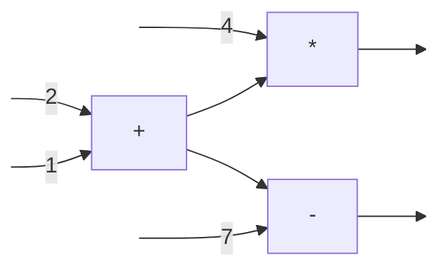

### Unified dataflow graph in TensorFlow
In TensorFlow, data flowing on edges are tensors. TensorFlow adds *mutable
state* into its dataflow graph. TF graph has four types of operators:

1. Stateless operators that take `k` tensors and output `l` tensors. An example
is matrix multiplication.
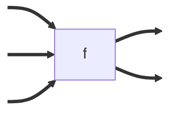

2. Variable operators that return a reference to the variable. In ML training,
variables are model parameters.
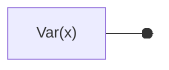

3. Read operators that read a variable reference and output a tensor that is
the current value of the variable.
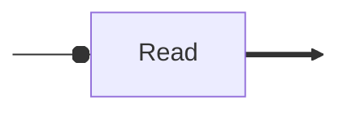

4. Assign-F operators that takes a variable reference, say `x`, and an input
tensor, say `T`, and does `x = F(x, T)`. It does not output anything.

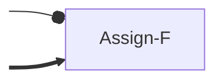

In addition to variable reference edges and data edges, the graph can have
*control edges*. These edges are just there to control order of firing among
operators. They fire with just one value `GO`. For example, the control edge
from write to read in the following example constrains the `Read` to read `B`.

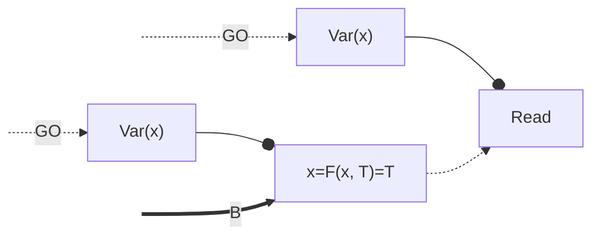

The advantage of `AssignF` operators instead of a `Write` operator is that it
allows for skipping control edges between `AssignF` operators (if `F` is
commutative). Consider the following graph:

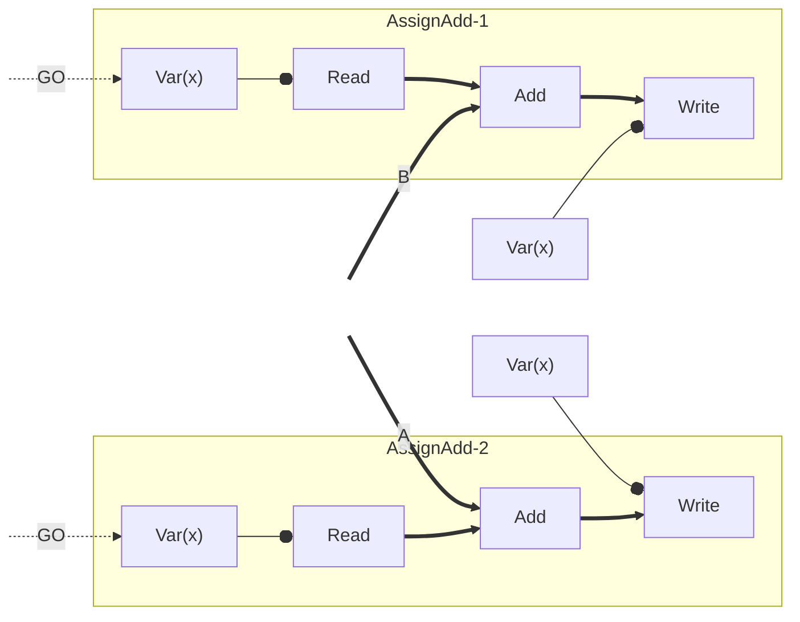

Starting from $x=X$, the possible outcomes are $x=\{X+A, X+B, X+A+B\}$.
`AssignAdd` makes `Read`+`Add`+`Write` as one *atomic operation*. Therefore, the
only possible outcome is $x=X+A+B$.

Continued [here](./compute-tf.md).
# TensorFlow

Let us now build the TensorFlow's dataflow graph for a very simple
*single-layer* ML model training task. Let us say we have an ML model with one
layer that repeatedly takes a single input vector $x$ and outputs a single
output vector $z=f(wx+b)$.  The ground truth output vector is $y$. This can be
expressed in TensorFlow as:

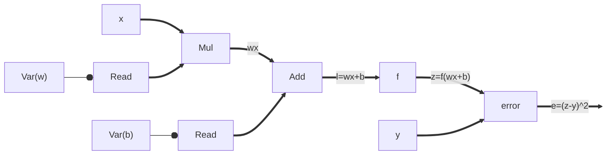

### Automatic differentiation

All operators in TensorFlow are *primitive* like multiplication and addition
with well-known differentiations. TensorFlow can apply chain rule on the
dataflow graph to find gradients:

$\frac{\partial e}{\partial b} = \frac{\partial e}{\partial z}*\frac{\partial z}{\partial l}*\frac{\partial l}{\partial b};\frac{\partial e}{\partial w} = \frac{\partial e}{\partial z}*\frac{\partial z}{\partial l}*\frac{\partial l}{\partial w}$

$\frac{\partial e}{\partial b} = 2(z-y)*f'(l)*1;\frac{\partial e}{\partial w} = 2(z-y)*f'(l)*x$

$\frac{\partial e}{\partial w} = \frac{\partial e}{\partial b}*x$

Gradient calculation operators are auto-generated and added to the dataflow
graph (highlighted in orange). Gradients are used to update model parameters $w$
and $b$. 

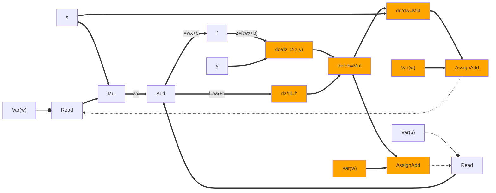

Notice that `AssignAdd` has a control edge to `Read` to start next iteration.

### Heterogenous execution
After preparing the unified dataflow graph, TensorFlow *lowers* the graph on
available heterogenous devices. While lowering, operators using the same
variable reference such as `Read` and `Assign-f` must come to the same *device*.
In other words, variable edges never cross device boundaries. Doing so enables
making `Assign-f`s and `Read`s to the same variable atomic without any
additional synchronization.

If there is a data edge crossing device boundary, special `Send` and `Recv`
operators are inserted.  These operators have customized implementations for
fast data transfer: `cudaMemCpyAsync` if workers are CPU/GPU on same machine,
DMA to transfer between two GPUs on same machine, and TCP/RDMA for transfer
between remote machines.

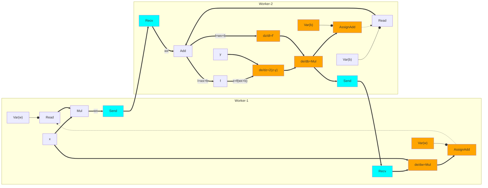

### Concurrent execution
For illustration, we have shown a single input `x` with a single ground truth
`y` and the same input is read repeatedly into two different workers.  In a real
setting, there will be many more workers reading different shuffled batches of
inputs $<x,y>$ and applying updates to model parameters $<w, b>$. This is what
the paper calls *concurrent execution*: multiple subgraphs are running
completely asynchronously with respect to each other.

Workers `Read` model parameter values, locally compute nudges according to their
gradients with their own batch of input, and send `AssignAdd`s. As per the
control edge in the above figure, a `Read` starts as soon as an `AssignAdd`
finishes. We can draw this worker behaviour as an event timeline. 


Each color represents a different value read for the model parameters.
1. Workers 1 and 2 read the same value (red)
2. Workers 1 updates the value and immediately reads a new value (orange)
3. Worker 2 updates the value and immediately reads a new value (yellow)
4. and so on.

Because of no synchronization, this easily scales to 1000s of workers (Figure
8b), but it hurts learning rate. It is important to note that for general
purpose computations, this would have been completely wrong. Because, ML
training is ok with *weak consistency*, this is fine. 

If our training job is only running on ~100 workers, then we could use
*synchronous training* since it has a better learning rate. Since, TensorFlow's
unified dataflow graph allows mixing mutable variables with stateless operators,
we can easily implement synchronous training by adding a counter/queue. We can
place a counter increment operator before an `AssignAdd` operator; only when the
counter has reached total number of workers, it unblocks next epoch's `Read`s. 


Asynchronous training is less affected by stragglers since the workers are
not waiting on each other to apply nudges and read next parameter values.
Synchronous training can scale to 100s of workers (Figure 8b) but
synchronization can easily become bottlenecked by stragglers. To overcome
stragglers, the idea is to unblock next `Read` as soon as we have received m/n
updates. This is again possible only because ML training is ok with *weak
consistency*. It is ok to miss model parameter nudges from some workers.


### Fault Tolerance

If a stateless worker, processing an input batch, crashes, we can easily
replace it by another worker. Doing FT for stateful workers holding model
parameters is more difficult. Spark's asynchronous checkpointing worked because
RDDs are immutable.  But in TF, model parameters are mutable. In the unified
dataflow, there is also no nice "source-to-sink" dataflow structure like in
Flink so the barrier-based algorithm will also not work. 

To get consistent checkpoints, we can create synchronous checkpoints: stop the
world, start checkpointing, wait for everyone to finish checkpointing, resume
the world. For synchronous training, a natural place to checkpoint is at the end
of an epoch. The world is already stopped waiting for new model parameters.
TensorFlow puts special checkpointing operator `Save` within its
unified dataflow to create periodic checkpoints.

Things are more difficult for asynchronous training. There is no natural place 
to stop the world. Further, stopping the world increases idling. We could use
the asynchronous checkpointing algorithm studied with vector clocks. But this
may end up saving lots of in-flight messages in the checkpoint. 

TensorFlow again exploits the weak consistency requirements of model training
and creates *inconsistent checkpoints*! When TF wants to create a checkpoint, it
just signals each stateful worker who in turn checkpoint their parameter
values without any further coordination. Different parameters may have seen
different set of nudges! The following shows additional `Save` operators for
asynchronous checkpointing.  As shown in this toy example, worker-1 may
checkpoint `w` *after* it has done `AssignAdd` whereas worker-2 may checkpoint
`b` *before* it has done `AssignAdd`.

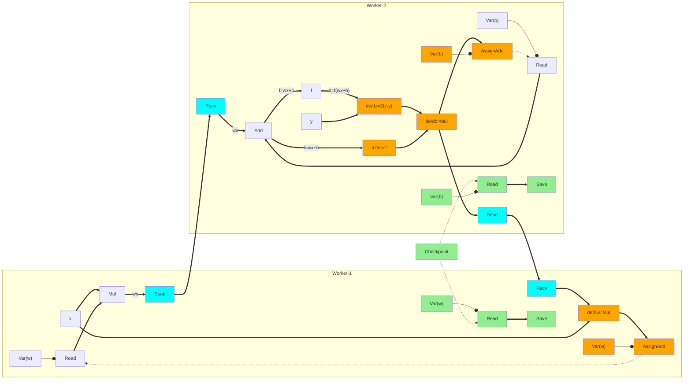

## Summary

At the time of training, ML model parameters require fine-grained updates unlike
Spark's coarse-grained transformations. Parameter servers create a strict
stateful<>stateless worker separation which reduces flexibility in placing
computations on stateful workers. TensorFlow extends dataflow with mutable state
by adding three new types of operators: variable operator that returns a
variable reference; Read operator that takes a variable reference and returns
the current value of the variable; and Assign-f operator that takes a variable
reference `x`, a tensor `T`, and assigns `x=f(x, T)`. Just like in standard
dataflow, an operator is ready if its inputs are ready; ready operators can
"fire" atomically in any order.

TF keeps only primitive operators in the dataflow graph whose differentiations
are well-known. It differentiates the input graph by applying chain rule and
extends the dataflow graph with auto-generated differentiation operators for
doing gradient descent.  The resulting graph is lowered on to heterogenous
workers while ensuring that variable reference edges never cross device
boundaries. 

TensorFlow exploits the fact that ML models can learn even under weak
consistency in various design decisions.  It allows asynchronous training where
workers do not block on each other to read and nudge model parameters. For fault
tolerance, it creates inconsistent checkpoints in a coordination-free manner.
Under synchronous training, it skips updates from a few workers to minimize the
performance hits due to stragglers.
